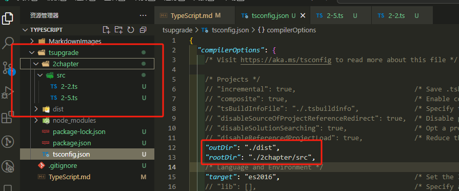

# TypeScript


# 1 环境搭建和基本语法
## 1.1 环境搭建
```bash
npm init -y
npm install typescript -D
npx tsc --init
```

## 1.2 基本语法
### 1.2.1 编译时静态类型检测
```typescript
// 创建一个变量，并指定类型
let str: string = "Hello, TypeScript!";
str = 3; // 此处会报错，因为 str 是 string 类型，而 3 是 number 类型
str = "Hello, JavaScript!"; // 正确
```

```typescript
// 创建一个数组，并指定类型
let arr: number[] = [1, 2, 3];
arr.push(4); // 正确

// 创建一个对象，并指定类型
let obj: { name: string; age: number } = { name: "Alice", age: 30 };
obj.name = "Bob"; // 正确
obj.age = "30"; // 此处会报错，因为 age 是 number 类型
```

### 1.2.2 类型注解
```typescript
let data: number // 这种写法就是类型注解
```

### 1.2.3 定义类型
```typescript
// 定义一个类型
type Person = {
  name: string;
  age: number;
};

// 使用定义的类型
const person: Person = {
  name: "Alice",
  age: 30,
};
```

# 2 TS编译和编译优化
## 2.1 TS编译
```typescript
let str: string = "abc"
console.log("str: ", str) // 在控制台中输入：npx tsc 文件名.ts 会编译成 文件名.js 放在当前目录下

export {}
/**
 * 为什么要在TypeScript文件末尾添加 export {} ?
 * 在TypeScript文件末尾添加 export {} 是一种常见做法，主要有以下原因：
 * 1. 避免全局作用域污染：使用 export {} 可以确保这个文件的内容不会与其他文件中的变量或类型冲突。
 *    -添加任何导出语句会将文件视为模块(module)而非脚本(script)
 *    -模块有自己的独立作用域，变量不会污染全局命名空间
 * 2. 避免命名冲突：没有export的情况下，同名变量在不同文件中会被视为同一个全局变量。
 *    -这会导致"Cannot redeclare block-scoped variable"错误
 * 3. 空导出技巧: export {}是一个空导出，不会实际导出任何内容, 仅用于将文件标记为模块
 * 4. 适用场景
 *    -特别适合单文件测试或示例代码
 *    -对于实际项目中需要被其他文件导入的模块，应该导出有意义的内容
 * 
 * 如果不添加export {}，TypeScript会将该文件视为全局脚本，变量可能与其他文件中的同名变量冲突。
 */
```

- **配置文件 tsconfig.json**
```json
{
  "compilerOptions": {
    "target": "ES5",           // 设置编译后的JavaScript代码版本
    "module": "CommonJS",      // 选择模块系统
    "outDir": "./dist",        // 输出目录(指定编译后文件的输出目录)
    "rootDir": "./src",        // 根目录(指定输入文件的根目录)
    "strict": true,            // 启用严格模式
    "esModuleInterop": true    // 允许默认导入非ES模块
  }
}
```
  1. **rootDir**: "./src"
     * 作用：指定输入文件的根目录
     *  说明：TypeScript将从src目录查找源文件，并保持相同的目录结构输出到outDir
  2. **outDir**: "./dist"
     * 作用：指定输出文件的目录
     * 说明：TypeScript将编译后的文件输出到dist目录
     * 


# 3 TS 常用类型
## 基本类型
  1. string
  2. number
  3. boolean
  4. null
  5. undefined
  6. symbol
  7. bigint
## 根类型（顶级类型 Top Types）
  1. Object
  2. {} (Object === {})
  ```typescript
  let obj: Object = {}; // 使用 Object 作为类型
  let obj2: {} = {}; // 使用 {} 作为类型
  // obj 和 obj2 都可以赋值为任意对象，除了 null 和 undefined
  
  // 顶级类型可以接受大多数类型的值
  obj = 42;          // 有效：数字可以赋给 Object 类型
  obj = "hello";     // 有效：字符串可以赋给 Object 类型
  obj = true;        // 有效：布尔值可以赋给 Object 类型
  obj = [1, 2, 3];   // 有效：数组可以赋给 Object 类型
  // obj = null;     // 错误：null 不可以赋给 Object 类型
  // obj = undefined; // 错误：undefined 不可以赋给 Object 类型
  ```
  > 注意：虽然 `any` 和 `unknown` 有时也被视为顶级类型，但它们有特殊的行为，通常单独分类为特殊类型。

## 对象类型
  1. Array
  2. object (object 不是上面的 Object 根类型哦, object 只能接收对象类型)
  3. function
## 枚举类型 (enum)  
>枚举允许开发者定义一组命名常量，使代码更具可读性和可维护性。
  
  ```typescript
  // 数字枚举 - 默认从0开始自动递增
  enum Direction {
      Up,    // 0
      Down,  // 1
      Left,  // 2
      Right  // 3
  }
  
  // 可以显式指定值
  enum HttpStatus {
      OK = 200,
      NotFound = 404,
      ServerError = 500
  }
  
  // 字符串枚举
  enum Color {
      Red = "RED",
      Green = "GREEN",
      Blue = "BLUE"
  }
  
  const move: Direction = Direction.Up;
  console.log(move); // 输出 0
  console.log(HttpStatus.NotFound); // 输出 404
  console.log(HttpStatus["OK"]); // 输出 200
  console.log(Color.Red); // 输出 RED

  // 反向映射
  console.log(Direction[0]); // 输出 Up
  console.log(HttpStatus[404]); // 输出 NotFound
  ```

## 特殊类型
  | 类型 | 描述 |
  |------|------|
  | `any` | 可以赋予任意类型的值，会绕过类型检查 |
  | `void` | 表示函数没有返回值，或返回 undefined |
  | `never` | 表示永远不会有返回值的函数类型，如抛出异常或无限循环 |
  | `unknown` | 比 any 更安全的类型，需要类型检查后才能使用 |
  | `元组(tuple)` | 固定长度、固定类型的数组 |
  | `可变元组` | 支持可选元素和剩余元素的元组 |

  ```typescript
  // any 类型
  let flexible: any = "hello";
  flexible = 100; // 有效，无类型检查
  
  // void 类型
  function logMessage(): void {
      console.log("This is a log");
      // 无需返回值
  }
  
  // never 类型
  function throwError(): never {
      throw new Error("An error occurred");
  }
  
  // unknown 类型
  let value: unknown = 30;
  // value.toFixed(2); // 错误：不能直接使用 unknown 类型的方法
  if (typeof value === "number") {
      value.toFixed(2); // 正确：已经进行了类型检查
  }
  
  // 元组类型
  let person: [string, number] = ["Alice", 30];
  
  // 可变元组
  let mixedTuple: [string, number, ...boolean[]] = ["hello", 42, true, false, true];
  ```

## 合成类型(unions 和 intersections)
  1. **联合类型(union)** - 表示一个值可以是多种类型之一
  2. **交叉类型(intersection)** - 将多个类型合并为一个类型

  ```typescript
  // 联合类型示例
  let value: string | number;
  value = "abc"; // 正确
  value = 123;   // 正确
  // value = true;  // 错误，因为 true 不是 string 或 number 类型
  
  // 联合类型与类型守卫
  function formatValue(value: string | number): string {
      if (typeof value === "string") {
          return value.toUpperCase();
      }
      return value.toFixed(2);
  }
  
  // 交叉类型示例
  type Person = { name: string; age: number };
  type Employee = { company: string; id: number };
  
  // 注：interface 定义类型不能使用交叉类型&，需要用 extends 实现
  type EmployedPerson = Person & Employee;
  
  const worker: EmployedPerson = {
      name: "Alice",
      age: 30,
      company: "TechCorp",
      id: 12345
  };
  ```

## 字面量数据类型
字面量类型是TypeScript的一个强大特性，允许你将变量的值限制为特定的常量值，而不仅仅是一种数据类型。

### 字符串字面量类型
```typescript
// 字符串字面量类型 - 只允许特定的字符串值
type Direction = "North" | "South" | "East" | "West";

let userDirection: Direction;
userDirection = "North"; // 正确
userDirection = "South"; // 正确
// userDirection = "northeast"; // 错误：不是允许的值

// 实际应用示例
function navigate(direction: Direction): void {
    console.log(`Moving ${direction}`);
}

navigate("East"); // 有效
// navigate("Up"); // 错误：'Up' 不是有效的方向
```

### 数字字面量类型
```typescript
// 数字字面量类型 - 只允许特定的数字值
type DiceValue = 1 | 2 | 3 | 4 | 5 | 6;

let roll: DiceValue;
roll = 6; // 正确
// roll = 7; // 错误：7不是允许的骰子值

// 实际应用示例
function rollDice(): DiceValue {
    return Math.floor(Math.random() * 6) + 1 as DiceValue;
}
```

### 布尔字面量类型
```typescript
// 布尔字面量类型
type TRUE = true;
let t: TRUE = true; // 正确
// let f: TRUE = false; // 错误：只能是true
```

### 对象字面量类型与字面量推断
```typescript
// 对象字面量类型
type User = {
    readonly id: number;
    name: string;
    role: "admin" | "user" | "guest";
};

const admin: User = {
    id: 1,
    name: "Admin",
    role: "admin" // 必须是"admin"、"user"或"guest"之一
};

// admin.id = 2; // 错误：id是只读属性

// 字面量推断
// TypeScript默认推断变量可能会改变
const obj = { counter: 0 }; // 推断为 { counter: number }
obj.counter = 1; // 正确

// 使用as const使对象所有属性成为字面量类型
const config = {
    endpoint: "api/data",
    method: "GET",
    timeout: 10000
} as const;

// config.method = "POST"; // 错误：无法修改只读属性
```

### 模板字面量类型
```typescript
// TypeScript 4.1+支持的模板字面量类型
type EmailLocaleIDs = "welcome_email" | "email_heading";
type FooterLocaleIDs = "footer_title" | "footer_sendoff";

// 使用模板字面量组合字面量类型
type AllLocaleIDs = `${EmailLocaleIDs | FooterLocaleIDs}_id`;
// 结果类型: "welcome_email_id" | "email_heading_id" | "footer_title_id" | "footer_sendoff_id"

// 实际应用示例
type Size = "small" | "medium" | "large";
type Color = "red" | "green" | "blue";
type Style = `${Size}-${Color}`;

let buttonStyle: Style = "small-red"; // 正确
// let invalidStyle: Style = "tiny-yellow"; // 错误：不匹配任何有效组合
```

字面量类型特别适合用于API设计，它们可以使代码更加类型安全，同时提供更好的IDE自动完成支持。当与联合类型和交叉类型结合使用时，它们可以创建非常精确的类型定义。


# 4 any 和 unknown 的区别与应用场景

## 4.1 基本概念

TypeScript 中的 `any` 和 `unknown` 都是顶级类型，但它们在类型安全性方面有重大差异。

### any 类型
`any` 类型表示"任意类型"，它允许你在编译时绕过类型检查，可以对其执行任何操作。

### unknown 类型
`unknown` 类型是 TypeScript 3.0 引入的，它也可以表示任何值，但比 `any` 更安全，因为你必须先进行类型检查或类型断言才能对其进行操作。

## 4.2 关键区别

| 特性 | any | unknown |
|------|-----|---------|
| 类型安全性 | 低（完全绕过类型检查） | 高（需要类型检查才能操作） |
| 可赋值性 | 可以赋值给任何类型 | 只能赋值给 any 或 unknown 类型 |
| 操作限制 | 无限制，可执行任何操作 | 有限制，需要类型检查或断言 |
| 属性访问 | 可以随意访问任何属性 | 必须先确认类型才能访问属性 |
| 方法调用 | 可以调用任何方法 | 必须先确认类型才能调用方法 |

## 4.3 代码示例

### any 类型示例

```typescript
// any 类型示例
let valueAny: any = 10;

// 不进行任何类型检查就可以执行任何操作
valueAny.foo();           // 不会在编译时报错
valueAny.bar = 100;       // 不会在编译时报错 
valueAny = "hello";       // 可以更改类型
valueAny = true;          // 可以更改类型

// any 类型可以赋值给任何其他类型（污染类型系统）
let str: string = valueAny;  // 不会报错！
```

### unknown 类型示例

```typescript
// unknown 类型示例
let valueUnknown: unknown = 10;

// 以下操作在编译时会报错
// valueUnknown.foo();           // 错误：对象类型为 'unknown'
// valueUnknown.bar = 100;       // 错误：对象类型为 'unknown'
// valueUnknown = "hello";       // 正确：可以赋予任何值
// valueUnknown = true;          // 正确：可以赋予任何值

// unknown 类型不能直接赋值给其他类型
// let str: string = valueUnknown;  // 错误！

// 必须先进行类型检查
if (typeof valueUnknown === "string") {
    let str: string = valueUnknown;  // 现在可以了，因为已确认类型
    console.log(str.toUpperCase());  // 安全地使用字符串方法
}

// 或者使用类型断言
let str: string = valueUnknown as string;  // 显式类型断言
```

## 4.4 使用场景对比

### 何时使用 any

1. **迁移旧 JavaScript 代码**时的过渡方案
2. 处理**真正不确定的动态内容**
3. 使用**没有类型定义的第三方库**
4. **快速原型开发**，后续再添加类型

```typescript
// 没有类型定义的库
declare const thirdPartyLib: any;
thirdPartyLib.doSomething();

// 复杂JSON解析
const config: any = JSON.parse(rawConfig);
```

### 何时使用 unknown

1. **API 返回值类型不确定**但需要安全处理
2. **函数参数接受任意值**但需要类型检查
3. **类型断言前的中间类型**
4. **替代 any 来增强类型安全**

```typescript
// API 返回类型不确定
async function fetchData(): Promise<unknown> {
    const response = await fetch('https://api.example.com/data');
    return response.json();
}

// 安全地处理返回值
const data = await fetchData();
if (typeof data === 'object' && data && 'name' in data) {
    console.log((data as { name: string }).name);
}

// 通用错误处理
function handleError(error: unknown) {
    if (error instanceof Error) {
        console.log(error.message);  // 安全：已确认是 Error 类型
    } else {
        console.log('Unknown error:', error);
    }
}
```

## 4.5 类型守卫与 unknown 类型

使用类型守卫可以安全地处理 unknown 类型：

```typescript
function processValue(value: unknown): string {
    // 类型守卫
    if (typeof value === "string") {
        return value.toUpperCase();
    } else if (typeof value === "number") {
        return value.toFixed(2);
    } else if (value instanceof Date) {
        return value.toISOString();
    }
    
    return String(value);
}

// 自定义类型守卫
interface User {
    id: number;
    name: string;
}

function isUser(value: unknown): value is User {
    return (
        typeof value === "object" && 
        value !== null && 
        "id" in value && 
        "name" in value
    );
}

function processUser(value: unknown) {
    if (isUser(value)) {
        console.log(value.name);  // 安全：已确认是 User 类型
    }
}
```

## 4.6 最佳实践

1. **优先使用明确的类型**（string、number 等）
2. **优先使用 unknown 而非 any**，只在必要时使用 any
3. 使用 unknown 时**始终搭配类型守卫**
4. 为**提高代码质量逐步替换项目中的 any**
5. 配置 **tsconfig.json 中的 noImplicitAny 为 true**，禁止隐式 any
6. 对外暴露的 API 使用 unknown 取代 any，增加类型安全

```typescript
// 不好的实践
function processInput(input: any) {
    return input.toLowerCase(); // 不安全：假定输入是字符串
}

// 好的实践
function processInput(input: unknown) {
    if (typeof input === "string") {
        return input.toLowerCase(); // 安全：已确认是字符串
    }
    throw new Error("Input must be a string");
}
```

# 5 接口（Interface）详解

## 5.1 接口基础概念

接口是 TypeScript 中一个核心概念，用于定义对象的结构和类型。接口定义了对象应该具有的属性和方法，但不提供实现。

```typescript
// 基础接口定义
interface Person {
  name: string;
  age: number;
}

// 使用接口
const alice: Person = {
  name: "Alice",
  age: 30
};

// 以下代码会报错，因为缺少必须的属性
// const bob: Person = {
//   name: "Bob"
// };

// 以下代码会报错，因为包含未在接口中声明的属性
// const charlie: Person = {
//   name: "Charlie",
//   age: 25,
//   address: "123 Main St" // 多余的属性
// };
```

## 5.2 可选属性和只读属性

### 5.2.1 可选属性

使用问号（?）标记属性为可选的。

```typescript
interface User {
  id: number;
  name: string;
  email?: string; // 可选属性
  phone?: string; // 可选属性
}

// 有效，email是可选的
const user1: User = {
  id: 1,
  name: "User One"
};

// 有效，提供了可选属性
const user2: User = {
  id: 2,
  name: "User Two",
  email: "user2@example.com"
};
```

### 5.2.2 只读属性

使用 readonly 关键字使属性只能在创建时被赋值。

```typescript
interface Config {
  readonly apiKey: string;
  readonly apiUrl: string;
  timeout?: number;
}

const config: Config = {
  apiKey: "abc123",
  apiUrl: "https://api.example.com"
};

// 以下代码会报错，因为apiKey是只读的
// config.apiKey = "xyz456";

// 可以修改非只读的可选属性
config.timeout = 3000;
```

## 5.3 接口的属性检查绕过

TypeScript 对接口有"严格属性检查"，但有几种方法可以绕过这种检查：

```typescript
interface SubmitFormData {
  name: string;
  email: string;
}

// 方式1: 使用类型断言
const data1 = {
  name: "Alice",
  email: "alice@example.com",
  extraField: true
} as SubmitFormData; // 类型断言绕过多余属性检查

// 方式2: 使用中间变量
const rawData = {
  name: "Bob",
  email: "bob@example.com",
  extraField: 123
};
const data2: SubmitFormData = rawData; // 变量赋值绕过检查

// 方式3: 使用索引签名（推荐方式）
interface FlexibleFormData {
  name: string;
  email: string;
  [key: string]: any; // 索引签名允许任意额外属性
}

const data3: FlexibleFormData = {
  name: "Charlie",
  email: "charlie@example.com",
  extraField1: true,
  extraField2: 123
};
```

## 5.4 接口的方法

接口可以包含方法定义：

```typescript
interface Calculator {
  add(x: number, y: number): number;
  subtract(x: number, y: number): number;
  multiply?(x: number, y: number): number; // 可选方法
}

// 实现接口方法
const basicCalculator: Calculator = {
  add(x, y) {
    return x + y;
  },
  subtract(x, y) {
    return x - y;
  }
};

// 完整实现
const advancedCalculator: Calculator = {
  add(x, y) {
    return x + y;
  },
  subtract(x, y) {
    return x - y;
  },
  multiply(x, y) {
    return x * y;
  }
};
```

## 5.5 函数类型接口

接口可以描述函数类型：

```typescript
// 函数接口定义
interface SearchFunction {
  (source: string, subString: string): boolean;
}

// 实现函数接口
const searchString: SearchFunction = function(src, sub) {
  return src.includes(sub);
};

console.log(searchString("Hello world", "world")); // 输出 true
```

## 5.6 索引类型接口

接口可以描述"可索引"的类型，如数组或对象：

```typescript
// 数组索引接口
interface StringArray {
  [index: number]: string;
}

const myArray: StringArray = ["Bob", "Alice", "Eve"];
const firstItem: string = myArray[0]; // "Bob"

// 对象索引接口
interface Dictionary {
  [key: string]: string | number;
}

const dict: Dictionary = {
  name: "John",
  age: 30,
  city: "New York"
};
```

## 5.7 接口继承

接口可以通过 extends 关键字继承其他接口的属性和方法：

```typescript
// 基础接口
interface Shape {
  color: string;
}

// 继承单个接口
interface Square extends Shape {
  sideLength: number;
}

const square: Square = {
  color: "blue",
  sideLength: 10
};

// 继承多个接口
interface Circle extends Shape {
  radius: number;
}

interface Colorful {
  borderColor: string;
}

// 多重继承
interface ColorfulCircle extends Circle, Colorful {
  fillOpacity: number;
}

const circle: ColorfulCircle = {
  color: "red",
  radius: 15,
  borderColor: "black",
  fillOpacity: 0.5
};
```

## 5.8 类实现接口

接口可以被类实现，确保类包含特定的属性和方法：

```typescript
interface Vehicle {
  brand: string;
  speed: number;
  accelerate(speed: number): void;
  brake(): void;
}

class Car implements Vehicle {
  // 实现接口的属性
  brand: string;
  speed: number = 0;
  
  constructor(brand: string) {
    this.brand = brand;
  }
  
  // 实现接口的方法
  accelerate(amount: number): void {
    this.speed += amount;
    console.log(`${this.brand} accelerating to ${this.speed}mph`);
  }
  
  brake(): void {
    this.speed = 0;
    console.log(`${this.brand} stopped`);
  }
  
  // 类可以有额外的方法
  honk(): void {
    console.log("Beep beep!");
  }
}

const myCar = new Car("Toyota");
myCar.accelerate(30);  // Toyota accelerating to 30mph
myCar.brake();         // Toyota stopped
myCar.honk();          // Beep beep!

// 一个类可以实现多个接口
interface Lockable {
  lock(): void;
  unlock(): void;
  isLocked: boolean;
}

class SecureCar extends Car implements Lockable {
  isLocked: boolean = false;
  
  lock(): void {
    this.isLocked = true;
    console.log(`${this.brand} is now locked`);
  }
  
  unlock(): void {
    this.isLocked = false;
    console.log(`${this.brand} is unlocked`);
  }
}
```

## 5.9 接口合并

TypeScript 允许声明同名接口，它们会自动合并：

```typescript
// 第一个接口声明
interface API {
  getUsers(): Promise<string[]>;
}

// 第二个接口声明（会与第一个合并）
interface API {
  getPosts(): Promise<string[]>;
}

// 使用合并后的接口
const api: API = {
  getUsers: async () => ["user1", "user2"],
  getPosts: async () => ["post1", "post2"]
};

// 合并接口时的注意事项
interface Box {
  height: number;
  width: number;
  // color: string;  // 假设后面会定义
}

interface Box {
  scale: number;
  color: string;  // 提供之前声明的类型
}

// 最终的Box接口包含所有属性
const box: Box = {
  height: 10,
  width: 20,
  scale: 2,
  color: "red"
};
```

## 5.10 接口与类型别名(type)的区别

TypeScript 中，接口（interface）和类型别名（type）有很多相似之处，但也有一些关键区别：

```typescript
// 接口定义
interface Person {
  name: string;
  age: number;
}

// 等效的类型别名
type PersonType = {
  name: string;
  age: number;
};

// 相似点：两者都可以扩展
interface Animal {
  name: string;
}

interface Dog extends Animal {
  breed: string;
}

// 类型别名的扩展
type AnimalType = {
  name: string;
};

type DogType = AnimalType & {
  breed: string;
};

// 区别1: 接口可以被合并，类型别名不行
interface API {
  get(): void;
}
interface API {
  post(): void;
}
// API 现在有 get 和 post 方法

// 区别2: 类型别名可以用于其他类型，而不仅仅是对象
type ID = string | number;
type Callback = (data: string) => void;
type Pair<T> = [T, T];
type TreeNode<T> = {
  value: T;
  left?: TreeNode<T>;
  right?: TreeNode<T>;
};

// 区别3: 类实现时的差异
interface Clickable {
  click(): void;
}

class Button implements Clickable {
  click() {
    console.log("Button clicked");
  }
}

// 接口的优势：在大型项目中更容易进行声明合并
// 类型别名的优势：可以表达更复杂的类型组合
```

## 5.11 接口的实际应用场景

### 5.11.1 API 类型定义

```typescript
interface User {
  id: number;
  username: string;
  email: string;
  createdAt: Date;
}

interface CreateUserRequest {
  username: string;
  email: string;
  password: string;
}

interface UpdateUserRequest {
  username?: string;
  email?: string;
}

interface UserResponse {
  id: number;
  username: string;
  email: string;
  createdAt: string; // API返回的是字符串格式的日期
}

// 在API函数中使用这些接口
async function fetchUsers(): Promise<UserResponse[]> {
  const response = await fetch('/api/users');
  return response.json();
}

async function createUser(user: CreateUserRequest): Promise<UserResponse> {
  const response = await fetch('/api/users', {
    method: 'POST',
    headers: { 'Content-Type': 'application/json' },
    body: JSON.stringify(user)
  });
  return response.json();
}
```

### 5.11.2 组件 Props 定义

```typescript
// React组件的Props接口
interface ButtonProps {
  text: string;
  onClick: () => void;
  disabled?: boolean;
  variant?: 'primary' | 'secondary' | 'danger';
  size?: 'small' | 'medium' | 'large';
}

// 在组件中使用
function Button(props: ButtonProps) {
  const { text, onClick, disabled = false, variant = 'primary', size = 'medium' } = props;
  
  return (
    <button 
      onClick={onClick}
      disabled={disabled}
      className={`btn btn-${variant} btn-${size}`}
    >
      {text}
    </button>
  );
}
```

### 5.11.3 配置对象

```typescript
interface DatabaseConfig {
  host: string;
  port: number;
  username: string;
  password: string;
  database: string;
  ssl?: boolean;
  connectionTimeoutMs?: number;
}

interface AppConfig {
  environment: 'development' | 'staging' | 'production';
  logLevel: 'debug' | 'info' | 'warn' | 'error';
  server: {
    port: number;
    host: string;
  };
  database: DatabaseConfig;
}

// 使用配置接口
function initializeApp(config: AppConfig) {
  // 使用配置初始化应用
  const { environment, logLevel, server, database } = config;
  
  console.log(`Starting app in ${environment} mode`);
  console.log(`Server listening on ${server.host}:${server.port}`);
  
  // 连接数据库
  connectToDatabase(database);
}
```

### 5.11.4 策略模式实现

```typescript
interface PaymentProcessor {
  processPayment(amount: number): Promise<boolean>;
  refund(paymentId: string, amount: number): Promise<boolean>;
  getBalance(): Promise<number>;
}

// 实现不同的支付处理器
class StripePaymentProcessor implements PaymentProcessor {
  async processPayment(amount: number): Promise<boolean> {
    console.log(`Processing ${amount} via Stripe`);
    // 调用Stripe API进行处理
    return true;
  }
  
  async refund(paymentId: string, amount: number): Promise<boolean> {
    console.log(`Refunding ${amount} for payment ${paymentId} via Stripe`);
    return true;
  }
  
  async getBalance(): Promise<number> {
    // 获取Stripe账户余额
    return 1000;
  }
}

class PayPalPaymentProcessor implements PaymentProcessor {
  async processPayment(amount: number): Promise<boolean> {
    console.log(`Processing ${amount} via PayPal`);
    // 调用PayPal API进行处理
    return true;
  }
  
  async refund(paymentId: string, amount: number): Promise<boolean> {
    console.log(`Refunding ${amount} for payment ${paymentId} via PayPal`);
    return true;
  }
  
  async getBalance(): Promise<number> {
    // 获取PayPal账户余额
    return 2000;
  }
}

// 使用支付处理器接口
class PaymentService {
  private processor: PaymentProcessor;
  
  constructor(processor: PaymentProcessor) {
    this.processor = processor;
  }
  
  async makePayment(amount: number): Promise<boolean> {
    // 验证余额
    const balance = await this.processor.getBalance();
    if (balance < amount) {
      return false;
    }
    
    // 处理付款
    return this.processor.processPayment(amount);
  }
  
  changeProcessor(processor: PaymentProcessor): void {
    this.processor = processor;
  }
}

// 使用示例
const stripeProcessor = new StripePaymentProcessor();
const paypalProcessor = new PayPalPaymentProcessor();

const paymentService = new PaymentService(stripeProcessor);
paymentService.makePayment(500);  // 使用Stripe处理付款

// 切换到PayPal
paymentService.changeProcessor(paypalProcessor);
paymentService.makePayment(300);  // 使用PayPal处理付款
```

### 5.11.5 泛型接口

```typescript
// 泛型接口定义
interface Repository<T> {
  findAll(): Promise<T[]>;
  findById(id: string): Promise<T | null>;
  create(item: Omit<T, 'id'>): Promise<T>;
  update(id: string, item: Partial<T>): Promise<T | null>;
  delete(id: string): Promise<boolean>;
}

// 具体实体
interface Product {
  id: string;
  name: string;
  price: number;
  category: string;
}

// 实现泛型接口
class ProductRepository implements Repository<Product> {
  private products: Product[] = [];
  
  async findAll(): Promise<Product[]> {
    return this.products;
  }
  
  async findById(id: string): Promise<Product | null> {
    const product = this.products.find(p => p.id === id);
    return product || null;
  }
  
  async create(item: Omit<Product, 'id'>): Promise<Product> {
    const product = {
      ...item,
      id: Date.now().toString()
    };
    this.products.push(product);
    return product;
  }
  
  async update(id: string, item: Partial<Product>): Promise<Product | null> {
    const index = this.products.findIndex(p => p.id === id);
    if (index === -1) return null;
    
    this.products[index] = {
      ...this.products[index],
      ...item
    };
    
    return this.products[index];
  }
  
  async delete(id: string): Promise<boolean> {
    const initialLength = this.products.length;
    this.products = this.products.filter(p => p.id !== id);
    return initialLength > this.products.length;
  }
}

// 使用该仓库
const productRepo = new ProductRepository();
productRepo.create({ name: "Laptop", price: 1299, category: "Electronics" });
```

## 5.12 接口声明合并的高级用法

```typescript
// 为第三方库扩展接口
declare global {
  interface String {
    capitalize(): string;
  }
}

// 实现扩展的接口
String.prototype.capitalize = function() {
  return this.charAt(0).toUpperCase() + this.slice(1);
};

// 现在可以在任何字符串上使用这个方法
const greeting = "hello world";
console.log(greeting.capitalize()); // "Hello world"

// 为模块扩展接口
declare module 'express' {
  interface Request {
    currentUser?: {
      id: string;
      username: string;
      roles: string[];
    };
  }
}

// 这样在Express请求处理中可以安全地访问currentUser
// app.get('/profile', (req, res) => {
//   const user = req.currentUser;
//   // TypeScript 知道 user 可能是 undefined 或有 id, username, roles
// });
```

通过以上详细讲解，你应该对 TypeScript 接口有了全面的了解，包括其基本用法、高级特性以及实际应用场景。接口是 TypeScript 中非常强大的工具，能帮助你定义代码的结构和契约，提高代码的可读性和可维护性。

# 6 TypeScript中的索引访问类型

索引访问类型（Indexed Access Types）是TypeScript中的一种高级类型操作，它允许你通过索引访问其他类型的特定属性，从现有类型中提取特定的子类型。

## 6.1 基本用法

索引访问类型的语法使用方括号 `[]` 进行属性访问，与在运行时访问对象属性的语法类似：

```typescript
type Person = {
  name: string;
  age: number;
  address: {
    street: string;
    city: string;
    country: string;
  };
};

// 使用索引访问类型提取属性类型
type Age = Person['age']; // type Age = number
type Address = Person['address']; // type Address = { street: string; city: string; country: string; }
type Street = Person['address']['street']; // type Street = string
```

### 使用 symbol 作为索引访问类型也是有效的：
```typescript
const symid = Symbol();
interface Product {
  [symid]: number | string;
  name: string;
  price: number;
  account: number;
  buy(): void;
}
type A = Product["price"] // number
type B = Product[typeof symid] // number | string
```
> 1. const symid = Symbol() 创建了一个唯一的 Symbol 值
> 2. typeof symid 作为**类型操作符**，获取变量 symid 的静态类型，即 symbol
> 3. 当在索引访问类型中使用 Product[typeof symid] 时，TypeScript 会查找接口中使用 Symbol 类型键的属性  

为什么需要使用 typeof ?
在索引访问类型表达式中，方括号 [] 内必须是一个类型而不是一个值。因此：
- 在接口定义中，[symid] 使用的是变量值（这是 TypeScript 的特殊语法允许的）
- 在类型索引 Product[typeof symid] 中，必须使用 typeof 将变量转换为类型
```typescript
// 不使用 typeof 会导致错误
// type C = Product[symid]; // ❌ 错误：'symid' 表示值，但在类型位置使用

// 正确使用 typeof 获取类型
type B = Product[typeof symid]; // ✓ 正确：number | string
```

## 6.2 使用联合类型进行索引访问

你可以使用联合类型作为索引，获取多个属性类型的联合：

```typescript
type Person = {
  name: string;
  age: number;
  email: string;
};

// 使用联合类型作为索引
type ContactInfo = Person['name' | 'email']; // type ContactInfo = string
type NameOrAge = Person['name' | 'age']; // type NameOrAge = string | number
```

## 6.3 使用索引类型查询操作符 `keyof`

`keyof` 操作符与索引访问类型结合使用效果很好：

```typescript
type Person = {
  name: string;
  age: number;
  address: string;
};

// 获取所有属性名的联合类型
type PersonKeys = keyof Person; // type PersonKeys = 'name' | 'age' | 'address'

// 获取所有属性值的联合类型
type PersonValues = Person[keyof Person]; // type PersonValues = string | number
```

## 6.4 在泛型中使用索引访问类型

索引访问类型在泛型中特别有用，可以创建更灵活的通用工具类型：

```typescript
// 创建一个提取对象特定属性的泛型函数
function getProperty<T, K extends keyof T>(obj: T, key: K): T[K] {
  return obj[key];
}

const person = {
  name: "Alice",
  age: 30,
  isAdmin: true
};

const name = getProperty(person, "name"); // 推断类型为 string
const age = getProperty(person, "age");   // 推断类型为 number
const admin = getProperty(person, "isAdmin"); // 推断类型为 boolean
// const error = getProperty(person, "jobTitle"); // 编译错误：'jobTitle' 不存在于 person 对象中
```

## 6.5 数组和元组的索引访问

索引访问类型也适用于数组和元组：

```typescript
// 对数组的索引访问
type StringArray = string[];
type Item = StringArray[number]; // type Item = string

// 对元组的索引访问
type Tuple = [string, number, boolean];
type First = Tuple[0]; // type First = string
type Second = Tuple[1]; // type Second = number
type Third = Tuple[2]; // type Third = boolean

// 获取元组所有元素类型的联合
type TupleValues = Tuple[number]; // type TupleValues = string | number | boolean
```

## 6.6 高级用法和实际应用场景

### 6.6.1 映射类型与索引访问结合

索引访问类型与映射类型结合可以创建强大的类型转换：

```typescript
interface User {
  id: number;
  name: string;
  email: string;
  role: "admin" | "user";
}

// 创建一个所有属性都变为可选的类型
type PartialUser = {
  [K in keyof User]?: User[K];
};

// 创建一个只读版本
type ReadonlyUser = {
  readonly [K in keyof User]: User[K];
};

// 创建一个只包含特定属性的类型
type UserCredentials = {
  [K in 'name' | 'email']: User[K];
}; // 等同于 { name: string; email: string; }
```

### 6.6.2 条件类型与索引访问结合

结合条件类型和索引访问类型可以创建更复杂的类型工具：

```typescript
type NonNullableProperties<T> = {
  [K in keyof T]: NonNullable<T[K]>;
};

interface UserWithOptional {
  id: number;
  name: string | null;
  email: string | undefined;
}

type RequiredUser = NonNullableProperties<UserWithOptional>;
// 结果等同于:
// {
//   id: number;
//   name: string;
//   email: string;
// }
```

### 6.6.3 提取特定类型的属性

创建一个工具类型来提取对象中特定类型的属性：

```typescript
type ExtractPropertyByType<T, U> = {
  [K in keyof T as T[K] extends U ? K : never]: T[K]
};

interface Product {
  id: number;
  name: string;
  price: number;
  inStock: boolean;
  tags: string[];
  category: string;
}

type StringProperties = ExtractPropertyByType<Product, string>;
// 结果等同于: { name: string; category: string; }

type NumberProperties = ExtractPropertyByType<Product, number>;
// 结果等同于: { id: number; price: number; }
```

### 6.6.4 类型安全的对象操作函数

使用索引访问类型创建类型安全的对象操作函数：

```typescript
// 类型安全的 pick 实现
function pick<T, K extends keyof T>(obj: T, keys: K[]): Pick<T, K> {
  const result = {} as Pick<T, K>;
  keys.forEach(key => {
    if (key in obj) {
      result[key] = obj[key];
    }
  });
  return result;
}

const user = {
  id: 1,
  name: "John",
  email: "john@example.com",
  age: 30,
  role: "admin"
};

const userBasicInfo = pick(user, ["name", "email"]);
// 类型为: { name: string; email: string; }
```

### 6.6.5 深度索引访问和路径类型

创建一个类型来表示嵌套属性的访问路径：

```typescript
type NestedPaths<T> = {
  [K in keyof T]: T[K] extends object
    ? K | `${K & string}.${NestedPaths<T[K]> & string}`
    : K;
}[keyof T] & string;

type NestedValues<T, P extends string> = 
  P extends `${infer K}.${infer Rest}`
    ? K extends keyof T
      ? Rest extends NestedPaths<T[K]>
        ? NestedValues<T[K], Rest>
        : never
      : never
    : P extends keyof T
      ? T[P]
      : never;

// 一个嵌套对象结构
interface DeepObject {
  user: {
    basicInfo: {
      name: string;
      age: number;
    };
    contactInfo: {
      email: string;
      phone?: string;
    };
  };
  settings: {
    theme: "light" | "dark";
    notifications: boolean;
  };
}

// 获取所有可能的路径
type AllPaths = NestedPaths<DeepObject>;
// 例如: "user" | "user.basicInfo" | "user.basicInfo.name" | ...

// 根据路径获取值类型
type NameType = NestedValues<DeepObject, "user.basicInfo.name">; // string
type ThemeType = NestedValues<DeepObject, "settings.theme">; // "light" | "dark"
```

## 6.7 最佳实践和性能考虑

在使用索引访问类型时，以下是一些最佳实践和注意事项：

1. **类型安全**：索引访问类型可以帮助保持类型安全，特别是在处理复杂对象结构时。

2. **避免过度嵌套**：过度嵌套的索引访问类型可能会影响TypeScript的编译性能，并使类型错误难以理解。

3. **与工具类型结合**：将索引访问类型与TypeScript的内置工具类型（如`Pick`、`Omit`、`Partial`等）结合使用可以创建强大的类型转换。

4. **文档化复杂类型**：当创建复杂的索引访问类型时，添加注释来解释类型的用途和工作方式。

```typescript
// 添加注释解释复杂类型
/**
 * 从对象中提取所有返回类型为R的方法
 * @template T 对象类型
 * @template R 返回类型
 */
type ExtractMethodsByReturnType<T, R> = {
  [K in keyof T as T[K] extends (...args: any[]) => R ? K : never]: T[K]
};
```

5. **考虑使用类型别名**：对于复杂的索引访问类型，使用类型别名可以提高可读性。

```typescript
// 不使用类型别名
type ComplexType = {
  [K in keyof SomeType as SomeType[K] extends Function ? K : never]: SomeType[K]
}[keyof SomeType];

// 使用类型别名提高可读性
type MethodKeys<T> = {
  [K in keyof T as T[K] extends Function ? K : never]: K
}[keyof T];

type ComplexTypeBetter = MethodKeys<SomeType>;
```

索引访问类型是TypeScript类型系统中非常强大的一个特性，掌握它可以帮助你创建更灵活、更类型安全的代码。它与其他高级类型特性（如泛型、映射类型、条件类型）结合使用时尤其强大。

# 7 TypeScript 的类型操作符 typeof 详解

TypeScript 中的 `typeof` 操作符是一个强大的类型工具，它允许我们从现有的变量或属性中提取类型信息。这与 JavaScript 中的 `typeof` 运算符不同，后者是在运行时确定值的类型。

## 7.1 JavaScript 中的 typeof 与 TypeScript 中的 typeof 区别

重要的是要区分这两种不同的 `typeof` 用法：

```typescript
// JavaScript 的 typeof（运行时操作符）
let x = 42;
console.log(typeof x); // 输出: "number"

// TypeScript 的 typeof（类型操作符）
let y = 42;
type T = typeof y; // T 的类型为 number
```

## 7.2 基本用法

### 7.2.1 从变量推断类型

```typescript
// 从变量推断类型
const message = "Hello, TypeScript!";
type MessageType = typeof message; // type MessageType = "Hello, TypeScript!"（字符串字面量类型）

// 更复杂的例子
const user = {
  name: "Alice",
  age: 30,
  isAdmin: false,
  roles: ["editor", "reviewer"] as const
};

type User = typeof user;
/* 结果类型：
{
  name: string;
  age: number;
  isAdmin: boolean;
  roles: readonly ["editor", "reviewer"];
}
*/
```

### 7.2.2 从函数推断类型

```typescript
// 从函数推断类型
function greet(name: string, age: number) {
  return `Hello, ${name}! You are ${age} years old.`;
}

type GreetFunction = typeof greet;
// type GreetFunction = (name: string, age: number) => string

// 从函数返回类型推断类型
type GreetReturn = ReturnType<typeof greet>;
// type GreetReturn = string

// 从函数参数推断类型
type GreetParams = Parameters<typeof greet>;
// type GreetParams = [name: string, age: number]
```

### 7.2.3 从类推断类型

```typescript
// 从类推断类型
class Point {
  x: number;
  y: number;

  constructor(x: number, y: number) {
    this.x = x;
    this.y = y;
  }

  distanceFromOrigin() {
    return Math.sqrt(this.x * this.x + this.y * this.y);
  }
}

type PointClass = typeof Point;
// 结果是类的构造函数类型

type PointInstance = InstanceType<typeof Point>;
/* 结果类型：
{
  x: number;
  y: number;
  distanceFromOrigin(): number;
}
*/
```

## 7.3 高级用法

### 7.3.1 提取枚举类型

```typescript
// 枚举值类型提取
enum Direction {
  Up,
  Down,
  Left,
  Right
}

type DirectionType = typeof Direction;
// 结果是枚举对象的类型

const directionValue = Direction.Up;
type DirectionValueType = typeof directionValue;
// type DirectionValueType = Direction (枚举类型)
```

### 7.3.2 提取模块导出类型

```typescript
// 假设有一个模块 myModule.ts
// export const pi = 3.14159;
// export function calculateArea(radius: number) { return pi * radius * radius; }

// 在另一个文件中
import * as MyModule from './myModule';
type MyModuleType = typeof MyModule;
/* 结果类型：
{
  pi: number;
  calculateArea: (radius: number) => number;
}
*/
```

### 7.3.3 与索引访问类型结合使用

```typescript
const config = {
  api: {
    baseUrl: 'https://api.example.com',
    timeout: 5000,
    endpoints: {
      users: '/users',
      posts: '/posts'
    }
  },
  features: {
    darkMode: true,
    notifications: false
  }
};

type ApiConfig = typeof config['api'];
/* 结果类型：
{
  baseUrl: string;
  timeout: number;
  endpoints: {
    users: string;
    posts: string;
  }
}
*/

type Endpoints = typeof config['api']['endpoints'];
// type Endpoints = { users: string; posts: string; }
```

### 7.3.4 与映射类型结合使用

```typescript
const defaultTheme = {
  primaryColor: '#0078d4',
  secondaryColor: '#2b88d8',
  textColor: '#333333',
  backgroundColor: '#ffffff'
};

// 创建一个可选的主题配置类型
type ThemeConfig = Partial<typeof defaultTheme>;

// 用户可以只提供部分配置
const userTheme: ThemeConfig = {
  primaryColor: '#ff0000',
  // 其他属性是可选的
};
```

## 7.4 实际应用场景

### 7.4.1 类型安全的配置管理

```typescript
// 定义默认配置
const DEFAULT_CONFIG = {
  theme: 'light',
  fontSize: 16,
  showSidebar: true,
  animationSpeed: 300,
  features: {
    comments: true,
    sharing: true,
    notifications: {
      email: false,
      push: true
    }
  }
} as const;

// 创建一个基于默认配置的类型
type AppConfig = typeof DEFAULT_CONFIG;

// 用户配置必须符合此类型，但值可以更改
function initializeApp(config: AppConfig) {
  // 安全地使用配置
  console.log(`Theme: ${config.theme}`);
  console.log(`Push notifications: ${config.features.notifications.push ? 'enabled' : 'disabled'}`);
}
```

### 7.4.2 自动创建类型匹配的模拟对象

```typescript
// 定义API接口类型
interface UserAPI {
  getUser(id: number): Promise<User>;
  updateUser(id: number, data: Partial<User>): Promise<User>;
  deleteUser(id: number): Promise<boolean>;
}

// 创建模拟实现
const mockUserAPI: typeof mockImplementation extends UserAPI ? UserAPI : never = {
  getUser: async (id) => ({ id, name: "Test User", email: "test@example.com" }),
  updateUser: async (id, data) => ({ id, name: "Updated User", email: "test@example.com", ...data }),
  deleteUser: async (id) => true
};
```

### 7.4.3 Redux/状态管理中的类型推断

```typescript
// 定义初始状态
const initialState = {
  user: {
    loggedIn: false,
    data: null as { id: string; name: string } | null
  },
  ui: {
    theme: 'light' as 'light' | 'dark',
    sidebarOpen: false
  },
  todos: [] as { id: string; text: string; completed: boolean }[]
};

// 自动推断状态类型
type State = typeof initialState;

// 定义动作创建函数
const actions = {
  login: (userData: NonNullable<State['user']['data']>) => ({ 
    type: 'LOGIN' as const, 
    payload: userData 
  }),
  toggleTheme: () => ({ 
    type: 'TOGGLE_THEME' as const 
  }),
  addTodo: (text: string) => ({
    type: 'ADD_TODO' as const,
    payload: { text }
  })
};

// 推断动作类型
type Action = ReturnType<typeof actions[keyof typeof actions]>;

// 类型安全的reducer
function reducer(state: State = initialState, action: Action): State {
  switch (action.type) {
    case 'LOGIN':
      return {
        ...state,
        user: {
          loggedIn: true,
          data: action.payload
        }
      };
    case 'TOGGLE_THEME':
      return {
        ...state,
        ui: {
          ...state.ui,
          theme: state.ui.theme === 'light' ? 'dark' : 'light'
        }
      };
    case 'ADD_TODO':
      return {
        ...state,
        todos: [
          ...state.todos,
          {
            id: Date.now().toString(),
            text: action.payload.text,
            completed: false
          }
        ]
      };
    default:
      return state;
  }
}
```

## 7.5 typeof 的限制与注意事项

### 7.5.1 typeof 只能推断已经存在的变量和属性的类型

```typescript
// 可以推断已定义变量的类型
const x = 42;
type T1 = typeof x; // number

// 不能用于直接推断值的类型
// type T2 = typeof 42; // 语法错误
```

### 7.5.2 与具体值和引用的关系

```typescript
// 基本类型会推断为类型
const num = 123;
type NumType = typeof num; // number，而不是 123

// 字符串字面量会保留字面量类型
const str = "hello";
type StrType = typeof str; // "hello"

// 对于对象，推断结构，但会丢失具体值
const obj = { x: 1, y: 2 };
type ObjType = typeof obj; // { x: number, y: number }

// 使用 as const 可以保留具体字面量值
const objLiteral = { x: 1, y: 2 } as const;
type ObjLiteralType = typeof objLiteral; // { readonly x: 1; readonly y: 2; }
```

### 7.5.3 不能推断内部实现细节

```typescript
class PrivateImplementation {
  private secret = "hidden";
  public visible = "seen";
}

type ClassType = typeof PrivateImplementation; // 构造函数类型
type InstanceType = InstanceType<typeof PrivateImplementation>;
// 只能访问公有成员: { visible: string }
```

## 7.6 与其他类型操作符结合使用

```typescript
// 结合 keyof 获取对象的键
const user = {
  name: "Alice",
  age: 30,
  email: "alice@example.com"
};

type UserKeys = keyof typeof user; // "name" | "age" | "email"

// 结合 ReturnType 获取函数返回值类型
function createUser(name: string, age: number) {
  return { name, age, createdAt: new Date() };
}

type User = ReturnType<typeof createUser>; // { name: string; age: number; createdAt: Date; }

// 结合条件类型检查函数返回类型
type IsStringFunction<T> = T extends (...args: any[]) => string ? true : false;

function getString() { return "string"; }
function getNumber() { return 42; }

type StringCheck1 = IsStringFunction<typeof getString>; // true
type StringCheck2 = IsStringFunction<typeof getNumber>; // false
```

## 7.7 最佳实践

1. **适当使用 as const**：当你需要保留字面量类型信息时，使用 `as const` 断言。

```typescript
// 不使用 as const
const config = {
  env: "development",
  port: 3000
};
// typeof config: { env: string; port: number }

// 使用 as const
const configLiteral = {
  env: "development",
  port: 3000
} as const;
// typeof configLiteral: { readonly env: "development"; readonly port: 3000 }
```

2. **结合工具类型增强功能**：与内置工具类型结合使用，获得更强大的类型转换能力。

```typescript
const point = { x: 10, y: 20 };
type ReadonlyPoint = Readonly<typeof point>;
type PartialPoint = Partial<typeof point>;
```

3. **避免不必要的重复定义**：利用 typeof 从值中提取类型，避免维护类型和值的不一致。

```typescript
// 不好的做法：重复定义
interface User {
  name: string;
  age: number;
  email: string;
}

const defaultUser: User = {
  name: "Guest",
  age: 0,
  email: ""
};

// 好的做法：从值推断类型
const defaultUser = {
  name: "Guest",
  age: 0,
  email: ""
};

type User = typeof defaultUser;
```

4. **注意上下文类型的影响**：TypeScript 有时会因上下文推断出更通用的类型。

```typescript
// 没有上下文，推断为字面量类型
const x = "hello"; // typeof x: "hello"

// 有上下文，可能推断为更通用类型
let arr = ["a", "b"]; // typeof arr: string[]
```

TypeScript 的 typeof 类型操作符是连接值和类型的重要桥梁，它使我们能够以更少的类型定义编写更类型安全的代码，特别是在处理已有的 JavaScript 代码或动态数据时尤为有用。通过本章的学习，你应该能够熟练地使用 typeof 来从现有代码中提取和利用类型信息。

# 8 null 和 undefined 相关细节
```javascript
// 1. javascript 中 null 表示什么都没有，表示一个空对象引用
let obj = null;
console.log(typeof obj); // object
console.log(obj === null); // true

// 2. 声明一个变量但不赋值，它的值就是 undefined
let a; // a 的值为 undefined
console.log(a); // undefined
console.log(typeof a); // undefined
console.log(a === undefined); // true
console.log(typeof undefined); // undefined
```

但是在 TypeScript 中，null 和 undefined 是所有类型的子类型，也就是说你可以把 null 和 undefined 赋值给任何类型的变量。

```typescript
// 在 TypeScript 中，null 和 undefined 是所有类型的子类型
let nullableString: string | null = null;
let undefinedVariable: string | undefined;

nullableString = "hello"; // 可以赋值为字符串
undefinedVariable = "world"; // 也可以赋值为字符串

// 你可以把 null 和 undefined 赋值给任何类型的变量
// 此操作需要在 tsconfig.json 中设置 "strictNullChecks": false 或 "strict": false （不提倡）
let number: number = null;
let str: string = undefined;

// 但是在 strictNullChecks 严格空值检查模式下，null 和 undefined 只能赋值给对应的类型
let number: number = null; // 报错
let str: string = undefined; // 报错（在严格模式下）
```

# 9 TS函数和TS函数类型，rest参数

## 9.1 函数声明和类型注解

TypeScript允许我们为函数参数和返回值添加类型注解，使函数的输入和输出类型更加明确。

```typescript
// 基本函数声明与类型注解
function greet(name: string): string {
  return `Hello, ${name}!`;
}

// 函数表达式
const greetAgain = function(name: string): string {
  return `Hello again, ${name}!`;
};

// 箭头函数
const greetArrow = (name: string): string => {
  return `Hello arrow, ${name}!`;
};

// 简化的箭头函数（隐式返回）
const greetSimple = (name: string): string => `Hello simple, ${name}!`;
```

## 9.2 函数类型表达式

我们可以使用函数类型表达式来定义函数的类型。

```typescript
// 函数类型表达式
type GreetFunction = (name: string) => string;

// 使用类型
const greet: GreetFunction = (name) => `Hello, ${name}!`;

// 另一个例子 - 计算函数
type MathOperation = (x: number, y: number) => number;

const add: MathOperation = (a, b) => a + b;
const subtract: MathOperation = (a, b) => a - b;
```

## 9.3 可选参数和默认参数

TypeScript支持可选参数和默认参数值：

```typescript
// 可选参数（使用?标记）
function buildName(firstName: string, lastName?: string): string {
  if (lastName) {
    return `${firstName} ${lastName}`;
  } else {
    return firstName;
  }
}

console.log(buildName("Bob"));        // 输出: Bob
console.log(buildName("Bob", "Adams")); // 输出: Bob Adams

// 默认参数
function greeting(name: string, greeting: string = "Hello"): string {
  return `${greeting}, ${name}!`;
}

console.log(greeting("Alice"));         // 输出: Hello, Alice!
console.log(greeting("Alice", "Hi"));   // 输出: Hi, Alice!

// 注意：带默认值的参数不需要放在必选参数后面，但如果这样做，调用时必须传入undefined以获取默认值
function welcome(greeting: string = "Welcome", name: string): string {
  return `${greeting}, ${name}!`;
}

console.log(welcome(undefined, "guest")); // 输出: Welcome, guest!
```

## 9.4 REST参数详解

Rest参数允许我们将不定数量的参数表示为一个数组。在TypeScript中，我们可以为rest参数指定类型：

```typescript
// 基本的rest参数
function sum(...numbers: number[]): number {
  return numbers.reduce((total, n) => total + n, 0);
}

console.log(sum(1, 2));       // 输出: 3
console.log(sum(1, 2, 3, 4)); // 输出: 10

// 结合普通参数和rest参数
function greetPeople(greeting: string, ...names: string[]): string {
  return `${greeting}, ${names.join(" and ")}!`;
}

console.log(greetPeople("Hello", "Alice"));                 // 输出: Hello, Alice!
console.log(greetPeople("Welcome", "Bob", "Charlie", "Dave")); // 输出: Welcome, Bob and Charlie and Dave!

// Rest参数必须是最后一个参数
function processItems(processor: (item: any) => void, ...items: any[]): void {
  items.forEach(item => processor(item));
}
```

## 9.5 函数重载(reverse)

TypeScript的函数重载允许我们为同一个函数提供多种类型定义：

```typescript
// 函数重载声明
function reverse(str: string): string;
function reverse(arr: any[]): any[];

// 函数实现
function reverse(stringOrArray: string | any[]): string | any[] {
  if (typeof stringOrArray === "string") {
    return stringOrArray.split("").reverse().join("");
  } else {
    return stringOrArray.slice().reverse();
  }
}

const hello = reverse("hello");   // 类型为string
const numbers = reverse([1, 2, 3]); // 类型为number[]

console.log(hello);   // 输出: "olleh"
console.log(numbers); // 输出: [3, 2, 1]
```

## 9.6 函数中的this类型

TypeScript允许我们在函数的第一个参数位置显式声明`this`的类型：

```typescript
interface User {
  name: string;
  greet(this: User): void;
}

const user: User = {
  name: "Alice",
  greet() {
    console.log(`Hello, my name is ${this.name}`);
  }
};

user.greet(); // 正确使用this

// 错误的this使用（如果启用了noImplicitThis）
const greetFunction = user.greet;
// greetFunction(); // 错误：this的上下文丢失

// 正确的做法是绑定this
const boundGreet = user.greet.bind(user);
boundGreet(); // 正常工作
```

## 9.7 调用签名与构造签名

TypeScript中有两种主要的函数类型表示法：调用签名和构造签名。

```typescript
// 调用签名（在对象类型中定义函数）
type ClickHandler = {
  (event: MouseEvent): void;
};

// 同时具有属性和调用签名的类型
interface SubmitButton {
  (event: Event): boolean;  // 调用签名
  disabled: boolean;        // 属性
  style: CSSStyleDeclaration; // 属性
}

// 构造签名（描述构造函数）
interface DateConstructor {
  new (value: number): Date; // 构造签名
  new (year: number, month: number, day: number): Date; // 重载的构造签名
  (): string; // 调用签名 - 不使用new调用时
}
```

## 9.8 泛型函数

泛型使函数能够适应多种类型，增强代码的可复用性：

```typescript
// 基础泛型函数
function identity<T>(arg: T): T {
  return arg;
}

const stringOutput = identity("hello"); // 类型推断为string
const numberOutput = identity(123);     // 类型推断为number

// 泛型函数类型
type GenericFunc<T> = (arg: T) => T;

const identityFn: GenericFunc<number> = (n) => n;

// 泛型rest参数
function merge<T, U>(first: T, ...rest: U[]): [T, ...U[]] {
  return [first, ...rest];
}

const merged = merge(1, "hello", true); // 类型为[number, string, boolean]
```

## 9.9 函数类型的高级应用

### 回调函数模式

```typescript
// 回调函数类型
type FetchCallback = (error: Error | null, data?: any) => void;

function fetchData(url: string, callback: FetchCallback) {
  try {
    // 模拟获取数据
    callback(null, { id: 1, name: "Product" });
  } catch (error) {
    callback(error instanceof Error ? error : new Error(String(error)));
  }
}

fetchData("https://api.example.com/products", (error, data) => {
  if (error) {
    console.error("Failed to fetch:", error);
    return;
  }
  console.log("Data received:", data);
});
```

### 函数组合

```typescript
// 函数组合辅助工具
function compose<T>(...functions: Array<(arg: T) => T>): (arg: T) => T {
  return (arg: T) => functions.reduceRight((result, fn) => fn(result), arg);
}

const addOne = (n: number) => n + 1;
const double = (n: number) => n * 2;
const square = (n: number) => n * n;

// 创建一个复合函数
const computeValue = compose(square, double, addOne);
console.log(computeValue(3)); // (3+1)*2^2 = 8^2 = 64
```

### 函数柯里化

```typescript
// 简单的柯里化函数类型
type CurriedFunction<T, U, V> = (a: T) => (b: U) => V;

function curry<T, U, V>(fn: (a: T, b: U) => V): CurriedFunction<T, U, V> {
  return (a: T) => (b: U) => fn(a, b);
}

const add = (x: number, y: number) => x + y;
const curriedAdd = curry(add);

console.log(curriedAdd(5)(3)); // 输出: 8
```

## 9.10 函数类型的最佳实践

1. **始终为函数添加返回类型**：即使TypeScript能够推断返回类型，显式声明返回类型可以防止意外的返回值变化。

2. **使用联合类型处理多类型参数**：如果函数接受多种类型的参数，考虑使用联合类型。

3. **优先使用类型别名定义函数类型**：对于复杂的函数类型，使用类型别名可提高可读性。

4. **合理使用泛型**：当函数逻辑适用于多种类型时，使用泛型而不是`any`。

5. **考虑函数的null/undefined处理**：明确函数如何处理null或undefined参数。

```typescript
// 类型别名示例
type ErrorHandler = (error: Error) => void;
type DataProcessor<T> = (data: T[]) => T[];
type APIRequest = <T>(url: string, options?: RequestOptions) => Promise<T>;

// 处理null/undefined
function process(value: string | null | undefined): string {
  return value ?? "default value";
}
```

通过掌握这些TypeScript函数的高级特性，你可以编写出类型安全且灵活的函数，充分利用TypeScript的类型系统提供的优势。

# 10 元组(Tuple)

元组是TypeScript中的一种特殊数组类型，它允许我们定义**固定长度、固定类型顺序**的数组。与普通数组不同，元组中每个位置的元素类型可以不同。

## 10.1 元组的基本概念与定义

元组类型允许表示一个已知元素数量和类型的数组，各元素的类型不必相同。

```typescript
// 基本元组定义
let person: [string, number] = ["Alice", 25];

// 正确使用
person[0] = "Bob";    // 可以赋值为字符串
person[1] = 30;       // 可以赋值为数字

// 错误使用
// person[0] = 100;   // 类型错误：不能将number类型赋值给string
// person[1] = "30";  // 类型错误：不能将string类型赋值给number
// person[2] = true;  // 错误：索引超出范围
```

## 10.2 元组与数组的区别

元组与数组的主要区别在于类型约束和长度：

```typescript
// 数组 - 同类型元素，长度可变
const numbersArray: number[] = [1, 2, 3];
numbersArray.push(4);  // 合法操作
// numbersArray.push("5"); // 类型错误：不能将string添加到number数组中

// 元组 - 不同类型元素，固定结构
const tuple: [string, number, boolean] = ["hello", 42, true];
// tuple[3] = "world"; // 错误：索引超出范围

// 但注意：通过push方法可以绕过长度检查（不推荐）
tuple.push("extra"); // TypeScript不会阻止这种操作
console.log(tuple); // ["hello", 42, true, "extra"]
```

## 10.3 元组类型推断

TypeScript在类型推断时通常会推断为数组而非元组，除非我们使用`as const`断言：

```typescript
// 推断为数组
const array = ["hello", 42]; // 类型为 (string | number)[]

// 推断为只读元组
const tuple = ["hello", 42] as const; // 类型为 readonly ["hello", 42]

// 元组类型声明
let namedTuple: [firstName: string, age: number] = ["Alice", 30];
```

## 10.4 元组解构

元组可以很方便地进行解构赋值：

```typescript
// 元组解构
const point: [number, number] = [10, 20];
const [x, y] = point;
console.log(x); // 10
console.log(y); // 20

// 结合函数返回值
function getUser(): [string, number, boolean] {
  return ["Bob", 25, true];
}

const [name, age, isAdmin] = getUser();
```

## 10.5 可选元素的元组

元组中的元素可以是可选的，使用问号标记：

```typescript
// 可选元素的元组
type OptionalTuple = [string, number, boolean?];

const complete: OptionalTuple = ["hello", 42, true]; // 有3个元素
const partial: OptionalTuple = ["hello", 42];        // 有2个元素，第3个是可选的

// 多个可选元素
type ContactInfo = [name: string, phone: string, email?: string, address?: string];

const minimalContact: ContactInfo = ["Alice", "123-456-7890"];
const fullContact: ContactInfo = ["Bob", "098-765-4321", "bob@example.com", "123 Main St"];
```

## 10.6 只读元组

可以使用`readonly`修饰符创建不可修改的元组：

```typescript
// 只读元组
const point: readonly [number, number] = [10, 20];
// point[0] = 100; // 错误：索引签名在类型"readonly [number, number]"中为只读

// 或使用ReadonlyArray包装
const coordinates: ReadonlyArray<[number, number]> = [
  [10, 20],
  [30, 40]
];
// coordinates[0][0] = 15; // 错误：无法分配到索引签名，因为它是只读属性
```

## 10.7 Rest元素的可变长度元组

TypeScript 4.0引入了带有rest元素的可变长度元组：

```typescript
// 带有rest元素的元组类型
type StringNumberBooleans = [string, number, ...boolean[]];
const snb: StringNumberBooleans = ["hello", 42, true, false, true];

// 前缀和后缀rest元素
type NumbersAndStrings = [...number[], ...string[]];
const mix: NumbersAndStrings = [1, 2, 3, "a", "b", "c"];

// 固定部分和可变部分
type HeaderAndRows = [header: string, ...rows: string[]];
const data: HeaderAndRows = ["Title", "Row1", "Row2", "Row3"];
```

## 10.8 具名元组元素

TypeScript 4.0还引入了元组元素的命名功能，提高了代码可读性：

```typescript
// 具名元组元素
type Person = [name: string, age: number, employed: boolean];
const person: Person = ["Alice", 30, true];

type Salary = [name: string, salary: number, ...rest: any[]];
const salary: Salary = ["Bob", 50000, "Software Engineer"];

// 在函数参数和返回值中非常有用
function getCoordinates(): [x: number, y: number] {
  return [10, 20];
}

// 具名但不影响解构
const [coordX, coordY] = getCoordinates();
```

## 10.9 元组类型操作

可以对元组类型进行各种操作：

```typescript
// 获取元组长度
type Length<T extends any[]> = T['length'];
type TupleLength = Length<[string, number, boolean]>; // 3

// 获取元组元素类型
type Point = [x: number, y: number, z: number];
type XCoordinate = Point[0]; // number
type YCoordinate = Point[1]; // number

// 元组的联合和交叉
type Tuple1 = [string, number];
type Tuple2 = [boolean, object];

// 联合
type TupleUnion = Tuple1 | Tuple2; // [string, number] | [boolean, object]
// 无法直接进行元组类型的交叉，但可以对元组的每个位置进行操作
```

## 10.10 元组的实际应用场景

### 10.10.1 坐标和向量表示

```typescript
// 2D和3D点表示
type Point2D = [x: number, y: number];
type Point3D = [x: number, y: number, z: number];

function distance(p1: Point2D, p2: Point2D): number {
  const [x1, y1] = p1;
  const [x2, y2] = p2;
  return Math.sqrt(Math.pow(x2 - x1, 2) + Math.pow(y2 - y1, 2));
}

// 计算两点间距离
const pointA: Point2D = [10, 20];
const pointB: Point2D = [30, 40];
console.log(distance(pointA, pointB)); // 计算欧几里得距离
```

### 10.10.2 键值对表示

```typescript
// 键值对表示
type KeyValuePair<K, V> = [key: K, value: V];

function setEntry<K, V>(map: Map<K, V>, entry: KeyValuePair<K, V>): Map<K, V> {
  const [key, value] = entry;
  return map.set(key, value);
}

// 使用对象记录
const userProperties: KeyValuePair<string, any>[] = [
  ["name", "Alice"],
  ["age", 30],
  ["isAdmin", true]
];
```

### 10.10.3 函数参数和返回值

```typescript
// React Hooks风格的useState
function useState<T>(initialValue: T): [T, (newValue: T) => void] {
  let value = initialValue;
  const setValue = (newValue: T) => {
    value = newValue;
    console.log(`Value updated to: ${value}`);
  };
  return [value, setValue];
}

// 使用示例
const [count, setCount] = useState(0);
setCount(count + 1); // "Value updated to: 1"
```

### 10.10.4 CSV数据处理

```typescript
// CSV行表示
type CSVRow = [id: number, name: string, email: string, age: number];

function parseCSVLine(line: string): CSVRow {
  const [idStr, name, email, ageStr] = line.split(',');
  return [parseInt(idStr), name, email, parseInt(ageStr)];
}

const csvLine = "1,John Doe,john@example.com,30";
const parsedRow = parseCSVLine(csvLine);
console.log(`User ${parsedRow[1]} is ${parsedRow[3]} years old`);
```

## 10.11 元组的最佳实践

1. **限制元组大小**：元组最适合表示少量、固定数量的项目。对于大型数据结构，考虑使用接口或类。

2. **使用具名元组元素**：添加元素名称可以提高代码可读性和自文档性。

   ```typescript
   // 不推荐
   type UserData = [string, number, boolean];
   
   // 推荐
   type UserData = [name: string, age: number, isPremium: boolean];
   ```

3. **考虑使用对象代替大型元组**：当元素数量增加时，对象提供更好的可读性和维护性。

   ```typescript
   // 元组方式
   type ComplexTuple = [string, number, boolean, Date, string[]];
   
   // 对象方式（更清晰）
   interface ComplexObject {
     name: string;
     age: number;
     active: boolean;
     createdAt: Date;
     tags: string[];
   }
   ```

4. **使用readonly防止意外修改**：对不应修改的元组应用readonly修饰符。

5. **理解元组限制**：记住元组长度检查不会阻止使用push等方法添加额外元素。

通过本章的学习，你应该了解了TypeScript中元组的核心概念、用法和最佳实践。元组在处理固定结构的数据时非常有用，特别是当这些数据包含不同类型的元素时。

# 11 TS 中的类详解

TypeScript 完全支持 ES6 中引入的类的概念，同时通过静态类型和其他特性增强了类的功能。类将对象的数据和行为封装在一起，使代码更加组织化和可重用。

## 11.1 类的基本语法

TypeScript 中定义类的基本语法如下：

```typescript
// 基本类定义
class Person {
  // 属性声明
  name: string;
  age: number;

  // 构造函数
  constructor(name: string, age: number) {
    this.name = name;
    this.age = age;
  }

  // 方法
  greet(): string {
    return `Hello, my name is ${this.name} and I am ${this.age} years old.`;
  }
}

// 创建类实例
const alice = new Person("Alice", 30);
console.log(alice.greet()); // "Hello, my name is Alice and I am 30 years old."
```

## 11.2 类的属性和构造函数

TypeScript 支持多种声明和初始化属性的方式：

```typescript
class Product {
  // 1. 属性声明
  id: number;
  name: string;
  
  // 2. 带默认值的属性声明
  price: number = 0;
  
  // 3. 只读属性
  readonly sku: string;
  
  // 4. 可选属性
  description?: string;

  // 构造函数
  constructor(id: number, name: string, sku: string, price?: number) {
    this.id = id;
    this.name = name;
    this.sku = sku;
    
    if (price !== undefined) {
      this.price = price;
    }
  }
}

// 使用类
const phone = new Product(1, "Smartphone", "PHN-123", 599.99);
console.log(phone.name); // "Smartphone"
// phone.sku = "PHN-456"; // 错误：无法分配到"sku"，因为它是只读属性
```

## 11.3 构造函数参数属性

TypeScript 提供了一种简洁的语法，可以通过构造函数参数直接声明和初始化类属性：

```typescript
// 使用构造函数参数属性简化代码
class User {
  // 通过构造函数参数自动创建和初始化属性
  constructor(
    public username: string,
    public email: string,
    private password: string,
    readonly id: number,
    protected lastLogin?: Date
  ) {
    // 不需要额外的赋值代码
  }
  
  checkPassword(pwd: string): boolean {
    return this.password === pwd;
  }
}

const user = new User("johndoe", "john@example.com", "secret123", 1);
console.log(user.username); // "johndoe"
// console.log(user.password); // 错误：'password' 是私有的
```

## 11.4 访问修饰符

TypeScript 提供了三种访问修饰符来控制类成员的可访问性：

```typescript
class BankAccount {
  // public：默认修饰符，可从任何位置访问
  public accountNumber: string;
  
  // private：只能在声明类内访问
  private balance: number;
  
  // protected：只能在声明类及其子类中访问
  protected transactions: { date: Date; amount: number }[] = [];
  
  constructor(accountNumber: string, initialBalance: number) {
    this.accountNumber = accountNumber;
    this.balance = initialBalance;
  }
  
  // 公共方法可以访问私有属性
  public getBalance(): number {
    return this.balance;
  }
  
  public deposit(amount: number): void {
    if (amount <= 0) {
      throw new Error("Deposit amount must be positive");
    }
    
    this.balance += amount;
    this.transactions.push({ date: new Date(), amount });
  }
  
  public withdraw(amount: number): void {
    if (amount <= 0) {
      throw new Error("Withdrawal amount must be positive");
    }
    
    if (amount > this.balance) {
      throw new Error("Insufficient funds");
    }
    
    this.balance -= amount;
    this.transactions.push({ date: new Date(), amount: -amount });
  }
}

const account = new BankAccount("123456789", 1000);
account.deposit(500);
account.withdraw(200);
console.log(account.getBalance()); // 1300
// console.log(account.balance); // 错误：'balance' 是私有的
// console.log(account.transactions); // 错误：'transactions' 是受保护的
```

## 11.5 getter 和 setter

TypeScript 支持 getter 和 setter 方法，使属性访问更加控制和灵活：

```typescript
class Temperature {
  private _celsius: number = 0;
  
  // getter
  get celsius(): number {
    return this._celsius;
  }
  
  // setter
  set celsius(value: number) {
    if (value < -273.15) {
      throw new Error("Temperature below absolute zero is not possible");
    }
    this._celsius = value;
  }
  
  // 计算属性的getter
  get fahrenheit(): number {
    return this._celsius * 9 / 5 + 32;
  }
  
  // 计算属性的setter
  set fahrenheit(value: number) {
    this.celsius = (value - 32) * 5 / 9;
  }
}

const temp = new Temperature();
temp.celsius = 25;
console.log(temp.celsius); // 25
console.log(temp.fahrenheit); // 77

temp.fahrenheit = 68;
console.log(temp.celsius); // 20
// temp.celsius = -300; // 运行时错误：Temperature below absolute zero is not possible
```

## 11.6 静态成员

类可以包含静态成员，这些成员属于类本身而不是类的实例：

```typescript
class MathUtils {
  // 静态属性
  static readonly PI: number = 3.14159265359;
  static readonly E: number = 2.71828182846;
  
  // 静态方法
  static square(x: number): number {
    return x * x;
  }
  
  static cube(x: number): number {
    return x * x * x;
  }
  
  // 实例方法不能直接访问静态属性（需要通过类名）
  calculateCircleArea(radius: number): number {
    return MathUtils.PI * MathUtils.square(radius);
  }
  
  // 静态方法不能直接访问实例成员
  static createPoint(x: number, y: number) {
    return { x, y, distanceFromOrigin: Math.sqrt(x*x + y*y) };
  }
}

// 访问静态成员不需要创建类实例
console.log(MathUtils.PI); // 3.14159265359
console.log(MathUtils.square(4)); // 16

// 实例方法需要实例
const utils = new MathUtils();
console.log(utils.calculateCircleArea(2)); // 约12.57
```

## 11.7 继承

TypeScript 支持类继承，使用 `extends` 关键字：

```typescript
// 基类/父类
class Animal {
  name: string;
  
  constructor(name: string) {
    this.name = name;
  }
  
  move(distance: number = 0): void {
    console.log(`${this.name} moved ${distance} meters.`);
  }
}

// 子类继承基类
class Dog extends Animal {
  breed: string;
  
  constructor(name: string, breed: string) {
    // 调用父类构造函数
    super(name);
    this.breed = breed;
  }
  
  // 重写父类方法
  move(distance: number = 5): void {
    console.log(`${this.name} is wagging its tail.`);
    // 调用父类方法
    super.move(distance);
  }
  
  // 子类特有的方法
  bark(): void {
    console.log('Woof! Woof!');
  }
}

const dog = new Dog("Rex", "German Shepherd");
dog.move(); // "Rex is wagging its tail." 然后 "Rex moved 5 meters."
dog.bark(); // "Woof! Woof!"
```

## 11.8 抽象类和方法

抽象类作为其他派生类的基类使用，它们不能被直接实例化：

```typescript
// 抽象类
abstract class Shape {
  color: string;
  
  constructor(color: string) {
    this.color = color;
  }
  
  // 普通方法
  displayColor(): void {
    console.log(`This shape is ${this.color}`);
  }
  
  // 抽象方法（没有实现，必须在派生类中实现）
  abstract calculateArea(): number;
  abstract calculatePerimeter(): number;
}

// 圆形实现抽象类
class Circle extends Shape {
  radius: number;
  
  constructor(color: string, radius: number) {
    super(color);
    this.radius = radius;
  }
  
  // 实现抽象方法
  calculateArea(): number {
    return Math.PI * this.radius * this.radius;
  }
  
  calculatePerimeter(): number {
    return 2 * Math.PI * this.radius;
  }
}

// 矩形实现抽象类
class Rectangle extends Shape {
  width: number;
  height: number;
  
  constructor(color: string, width: number, height: number) {
    super(color);
    this.width = width;
    this.height = height;
  }
  
  calculateArea(): number {
    return this.width * this.height;
  }
  
  calculatePerimeter(): number {
    return 2 * (this.width + this.height);
  }
}

// const shape = new Shape("red"); // 错误：无法创建抽象类的实例
const circle = new Circle("blue", 5);
const rectangle = new Rectangle("green", 4, 6);

console.log(circle.calculateArea()); // 约78.54
console.log(rectangle.calculateArea()); // 24
```

## 11.9 类实现接口

类可以实现一个或多个接口，保证类拥有特定的结构：

```typescript
// 接口定义
interface Printable {
  print(): void;
}

interface Serializable {
  serialize(): string;
}

// 类实现多个接口
class Document implements Printable, Serializable {
  title: string;
  content: string;
  
  constructor(title: string, content: string) {
    this.title = title;
    this.content = content;
  }
  
  // 实现 Printable 接口
  print(): void {
    console.log(`Printing: ${this.title}`);
    console.log(this.content);
  }
  
  // 实现 Serializable 接口
  serialize(): string {
    return JSON.stringify({
      title: this.title,
      content: this.content
    });
  }
}

const doc = new Document("TypeScript Classes", "TypeScript classes are powerful...");
doc.print();
console.log(doc.serialize());
```

## 11.10 类与泛型

类可以使用泛型来创建可重用的组件：

```typescript
// 泛型类
class Queue<T> {
  private items: T[] = [];
  
  // 添加元素到队列尾部
  enqueue(item: T): void {
    this.items.push(item);
  }
  
  // 从队列头部移除元素并返回
  dequeue(): T | undefined {
    return this.items.shift();
  }
  
  // 查看队列头部元素但不移除
  peek(): T | undefined {
    return this.items[0];
  }
  
  // 获取队列长度
  get size(): number {
    return this.items.length;
  }
  
  // 判断队列是否为空
  isEmpty(): boolean {
    return this.items.length === 0;
  }
}

// 创建字符串队列
const stringQueue = new Queue<string>();
stringQueue.enqueue("first");
stringQueue.enqueue("second");
console.log(stringQueue.dequeue()); // "first"
console.log(stringQueue.peek()); // "second"

// 创建数字队列
const numberQueue = new Queue<number>();
numberQueue.enqueue(1);
numberQueue.enqueue(2);
```

## 11.11 类型守卫与类

TypeScript 提供了几种用于类的类型守卫机制：

```typescript
// 使用 instanceof 作为类型守卫
class Animal {
  name: string;
  
  constructor(name: string) {
    this.name = name;
  }
  
  makeSound(): void {
    console.log("Some generic sound");
  }
}

class Dog extends Animal {
  breed: string;
  
  constructor(name: string, breed: string) {
    super(name);
    this.breed = breed;
  }
  
  makeSound(): void {
    console.log("Woof! Woof!");
  }
  
  fetch(): void {
    console.log(`${this.name} is fetching the ball!`);
  }
}

class Cat extends Animal {
  livesLeft: number = 9;
  
  constructor(name: string) {
    super(name);
  }
  
  makeSound(): void {
    console.log("Meow!");
  }
  
  purr(): void {
    console.log(`${this.name} is purring.`);
  }
}

// 使用类型守卫处理不同类型的动物
function handleAnimal(animal: Animal) {
  animal.makeSound(); // 所有动物都有此方法
  
  if (animal instanceof Dog) {
    // TypeScript 知道这里 animal 是 Dog 类型
    animal.fetch(); // 只有 Dog 有此方法
  } else if (animal instanceof Cat) {
    // TypeScript 知道这里 animal 是 Cat 类型
    animal.purr(); // 只有 Cat 有此方法
    console.log(`Lives left: ${animal.livesLeft}`);
  }
}

const dog = new Dog("Rex", "German Shepherd");
const cat = new Cat("Whiskers");

handleAnimal(dog);
handleAnimal(cat);
```

## 11.12 装饰器

TypeScript 实验性地支持装饰器，它们是用来修改类及其成员的特殊声明：

```typescript
// 注意：使用装饰器需要在tsconfig.json中启用 "experimentalDecorators": true

// 类装饰器
function sealed(constructor: Function) {
  Object.seal(constructor);
  Object.seal(constructor.prototype);
}

// 方法装饰器
function log(target: any, propertyKey: string, descriptor: PropertyDescriptor) {
  const originalMethod = descriptor.value;
  
  descriptor.value = function(...args: any[]) {
    console.log(`Calling ${propertyKey} with arguments: ${JSON.stringify(args)}`);
    const result = originalMethod.apply(this, args);
    console.log(`Method ${propertyKey} returned: ${JSON.stringify(result)}`);
    return result;
  };
  
  return descriptor;
}

// 属性装饰器
function validatePositive(target: any, propertyKey: string) {
  let value: number;
  
  const getter = function() {
    return value;
  };
  
  const setter = function(newVal: number) {
    if (newVal < 0) {
      throw new Error(`${propertyKey} cannot be negative`);
    }
    value = newVal;
  };
  
  Object.defineProperty(target, propertyKey, {
    get: getter,
    set: setter,
    enumerable: true,
    configurable: true
  });
}

@sealed
class Product {
  @validatePositive
  price: number;
  
  constructor(price: number) {
    this.price = price;
  }
  
  @log
  calculateDiscount(percentage: number): number {
    return this.price * (percentage / 100);
  }
}

const product = new Product(100);
product.calculateDiscount(20); // 应记录方法调用
// product.price = -10; // 应抛出错误
```

## 11.13 类的混入模式

TypeScript 不直接支持多重继承，但可以通过混入模式实现类似功能：

```typescript
// 混入类的声明
class Timestamped {
  timestamp: Date = new Date();
  
  getTimestamp(): Date {
    return this.timestamp;
  }
}

class Activatable {
  isActive: boolean = false;
  
  activate(): void {
    this.isActive = true;
  }
  
  deactivate(): void {
    this.isActive = false;
  }
}

// 目标类
class User {
  name: string;
  
  constructor(name: string) {
    this.name = name;
  }
}

// 混入函数
function applyMixins(derivedCtor: any, baseCtors: any[]) {
  baseCtors.forEach(baseCtor => {
    Object.getOwnPropertyNames(baseCtor.prototype).forEach(name => {
      if (name !== 'constructor') {
        derivedCtor.prototype[name] = baseCtor.prototype[name];
      }
    });
  });
}

// 将类型信息接口化
interface User extends Timestamped, Activatable {}

// 应用混入
applyMixins(User, [Timestamped, Activatable]);

// 使用混入后的类
const user = new User("Alice");
user.activate();
console.log(user.isActive); // true
console.log(user.getTimestamp()); // 当前日期时间
```

## 11.14 实际应用场景

### 11.14.1 创建可重用的 UI 组件

```typescript
// 组件基类
abstract class Component {
  protected element: HTMLElement;
  
  constructor(protected container: HTMLElement) {
    this.element = document.createElement('div');
    this.container.appendChild(this.element);
  }
  
  abstract render(): void;
  
  show(): void {
    this.element.style.display = 'block';
  }
  
  hide(): void {
    this.element.style.display = 'none';
  }
  
  destroy(): void {
    this.container.removeChild(this.element);
  }
}

// 按钮组件
class Button extends Component {
  private _text: string;
  private isDisabled: boolean = false;
  
  constructor(container: HTMLElement, text: string) {
    super(container);
    this._text = text;
    this.element = document.createElement('button');
    this.container.appendChild(this.element);
    
    // 设置事件监听
    this.element.addEventListener('click', this.handleClick.bind(this));
  }
  
  get text(): string {
    return this._text;
  }
  
  set text(value: string) {
    this._text = value;
    this.render();
  }
  
  render(): void {
    const button = this.element as HTMLButtonElement;
    button.textContent = this._text;
    button.disabled = this.isDisabled;
  }
  
  disable(): void {
    this.isDisabled = true;
    this.render();
  }
  
  enable(): void {
    this.isDisabled = false;
    this.render();
  }
  
  private handleClick(event: MouseEvent): void {
    if (!this.isDisabled && this.onClick) {
      this.onClick(event);
    }
  }
  
  onClick: ((event: MouseEvent) => void) | null = null;
}

// 模态框组件
class Modal extends Component {
  private _title: string;
  private _content: string;
  private headerElement: HTMLElement;
  private bodyElement: HTMLElement;
  private footerElement: HTMLElement;
  private closeButton: Button;
  
  constructor(container: HTMLElement, title: string, content: string) {
    super(container);
    this._title = title;
    this._content = content;
    
    // 创建模态框结构
    this.element.className = 'modal';
    
    this.headerElement = document.createElement('div');
    this.headerElement.className = 'modal-header';
    this.element.appendChild(this.headerElement);
    
    this.bodyElement = document.createElement('div');
    this.bodyElement.className = 'modal-body';
    this.element.appendChild(this.bodyElement);
    
    this.footerElement = document.createElement('div');
    this.footerElement.className = 'modal-footer';
    this.element.appendChild(this.footerElement);
    
    // 添加关闭按钮
    this.closeButton = new Button(this.footerElement, 'Close');
    this.closeButton.onClick = () => this.hide();
  }
  
  render(): void {
    this.headerElement.textContent = this._title;
    this.bodyElement.textContent = this._content;
  }
}

// 使用示例
/*
const container = document.getElementById('app');
if (container) {
  const myButton = new Button(container, 'Click me');
  myButton.onClick = () => alert('Button clicked!');
  myButton.render();
  
  const myModal = new Modal(container, 'Information', 'This is important information.');
  myModal.render();
  
  myButton.onClick = () => myModal.show();
}
*/
```

### 11.14.2 数据模型与服务

```typescript
// 通用CRUD服务基类
abstract class EntityService<T extends { id: number | string }> {
  protected items: T[] = [];
  
  async getAll(): Promise<T[]> {
    return [...this.items];
  }
  
  async getById(id: number | string): Promise<T | undefined> {
    return this.items.find(item => item.id === id);
  }
  
  async create(item: Omit<T, 'id'> & { id?: T['id'] }): Promise<T> {
    const newItem = { ...item } as T;
    
    if (newItem.id === undefined) {
      // 生成新ID（实际应用中可能由后端生成）
      const newId = this.items.length > 0 
        ? Math.max(...this.items.map(i => typeof i.id === 'number' ? i.id as number : 0)) + 1 
        : 1;
      newItem.id = newId as T['id'];
    }
    
    this.items.push(newItem);
    return newItem;
  }
  
  async update(id: number | string, changes: Partial<T>): Promise<T | undefined> {
    const index = this.items.findIndex(item => item.id === id);
    if (index !== -1) {
      this.items[index] = { ...this.items[index], ...changes };
      return this.items[index];
    }
    return undefined;
  }
  
  async delete(id: number | string): Promise<boolean> {
    const initialLength = this.items.length;
    this.items = this.items.filter(item => item.id !== id);
    return initialLength > this.items.length;
  }
}

// 特定实体类型
interface User {
  id: number;
  name: string;
  email: string;
  isActive: boolean;
}

// 特定服务实现
class UserService extends EntityService<User> {
  // 特定于用户的方法
  async findByEmail(email: string): Promise<User | undefined> {
    return this.items.find(user => user.email === email);
  }
  
  async activateUser(id: number): Promise<User | undefined> {
    return this.update(id, { isActive: true });
  }
  
  async deactivateUser(id: number): Promise<User | undefined> {
    return this.update(id, { isActive: false });
  }
  
  // 重写基类方法，添加验证
  async create(item: Omit<User, 'id'> & { id?: number }): Promise<User> {
    // 验证邮箱格式
    if (!item.email || !item.email.includes('@')) {
      throw new Error('Invalid email format');
    }
    
    // 检查邮箱是否已存在
    if (await this.findByEmail(item.email)) {
      throw new Error('Email already exists');
    }
    
    // 调用基类实现
    return super.create({
      ...item,
      isActive: item.isActive !== undefined ? item.isActive : true // 默认激活
    });
  }
}

// 使用示例
const userService = new UserService();

async function demo() {
  // 创建用户
  const user1 = await userService.create({
    name: "Alice",
    email: "alice@example.com",
    isActive: true
  });
  
  const user2 = await userService.create({
    name: "Bob",
    email: "bob@example.com",
    isActive: false
  });
  
  console.log(await userService.getAll()); // 显示所有用户
  
  // 更新用户
  await userService.update(user1.id, { name: "Alice Smith" });
  
  // 查找特定用户
  const alice = await userService.findByEmail("alice@example.com");
  console.log(alice); // { id: 1, name: "Alice Smith", email: "alice@example.com", isActive: true }
  
  // 激活/停用用户
  await userService.deactivateUser(user1.id);
  
  // 删除用户
  await userService.delete(user2.id);
  
  console.log(await userService.getAll()); // 只显示 Alice（停用状态）
}

// demo();
```

## 11.15 最佳实践和注意事项

1. **遵循单一职责原则**：每个类应该只有一个职责，避免创建"上帝类"。

2. **优先使用组合而非继承**：通过组合复用功能，而不是创建深层继承层次。

   ```typescript
   // 避免深层继承
   class Animal {}
   class Mammal extends Animal {}
   class Dog extends Mammal {}
   class Labrador extends Dog {}
   
   // 优先使用组合
   class Barker {
     bark() { console.log("Woof!"); }
   }
   
   class Runner {
     run(speed: number) { console.log(`Running at ${speed}mph`); }
   }
   
   class Dog {
     name: string;
     barker = new Barker(); // 组合
     runner = new Runner(); // 组合
     
     constructor(name: string) {
       this.name = name;
     }
     
     bark() {
       this.barker.bark();
     }
     
     run(speed: number) {
       this.runner.run(speed);
     }
   }
   ```

3. **使用访问修饰符保护数据**：适当使用`private`和`protected`修饰符封装实现细节。

4. **避免使用`public`修饰构造函数参数属性**：为了更好的可读性，对于复杂类，考虑明确声明属性。

5. **使用接口定义类的公共API**：通过接口描述类的公共接口，增强代码的可维护性。

6. **谨慎使用静态成员**：静态成员可能导致全局状态，使测试和调试困难。

7. **使用类型守卫**：在处理类层次结构时，使用instanceof和自定义类型守卫。

8. **考虑不可变性**：使用只读属性和方法创建不可变的类，减少副作用。

通过本章的学习，你应该对TypeScript中类的特性和最佳实践有了全面的理解。类是面向对象编程的核心概念，TypeScript通过静态类型检查和额外的语言特性，进一步增强了类的功能和安全性。

# 12 TS 单例模式的两种实现

单例模式是一种常用的设计模式，它能够确保一个类在整个应用程序中只有一个实例，并提供一个全局访问点来获取该实例。这种模式在需要协调系统中各个部分的行为时特别有用。

## 12.1 单例模式的基本概念

单例模式的核心思想是限制一个类只能创建一个实例，这个实例在整个应用程序生命周期内是唯一的。该模式包含以下特点：

1. **单一实例**：确保类只有一个实例
2. **全局访问点**：提供访问该实例的全局点
3. **延迟初始化**（通常）：实例通常在首次请求时才被创建

## 12.2 为什么使用单例模式？

单例模式适用于以下场景：

1. **资源共享**：当需要控制对共享资源的访问时（数据库连接、文件系统等）
2. **配置管理**：全局配置信息在应用中只需一个实例
3. **状态管理**：管理应用的全局状态
4. **日志记录**：应用程序的日志记录通常只需要一个日志实例
5. **缓存机制**：实现应用级的缓存

## 12.3 在 TypeScript 中实现单例模式的方式

在 TypeScript 中，有多种实现单例模式的方法。以下介绍两种最常用的方式：

### 12.3.1 方式一：使用静态属性和方法

这种方式利用类的静态成员来维护单例实例：

```typescript
class Singleton {
  // 私有静态实例变量
  private static instance: Singleton;
  
  // 私有构造函数，防止外部直接创建实例
  private constructor() {
    console.log('Singleton instance created');
  }
  
  // 公共静态方法，提供全局访问点
  public static getInstance(): Singleton {
    // 如果实例不存在，则创建实例
    if (!Singleton.instance) {
      Singleton.instance = new Singleton();
    }
    
    // 返回单例实例
    return Singleton.instance;
  }
  
  // 示例方法
  public someMethod(): void {
    console.log('Method of the singleton');
  }
}

// 使用单例
const instance1 = Singleton.getInstance();
const instance2 = Singleton.getInstance();

// 验证两个引用指向同一个实例
console.log(instance1 === instance2); // 输出: true

// 调用实例方法
instance1.someMethod(); // 输出: Method of the singleton
```

这种实现方式简单明了，但它不是完全安全的，因为 TypeScript 的私有成员（private）在编译成 JavaScript 后并不会强制执行私有性。

### 12.3.2 方式二：使用模块模式

这种方法使用闭包和 IIFE (立即调用函数表达式) 来创建单例：

```typescript
// singleton.ts
export interface DatabaseConnection {
  connect(): void;
  query(sql: string): any[];
  close(): void;
}

// 模块内部保持单例
const DatabaseSingleton = (() => {
  let instance: DatabaseConnection | null = null;
  
  // 创建数据库连接的内部函数
  function createInstance(): DatabaseConnection {
    // 实际应用中，这里可能是真正的数据库连接逻辑
    const connection: DatabaseConnection = {
      connect() {
        console.log('Connected to database');
      },
      query(sql: string) {
        console.log(`Executing query: ${sql}`);
        return [{ id: 1, name: 'Example' }];
      },
      close() {
        console.log('Database connection closed');
      }
    };
    
    return connection;
  }
  
  // 返回获取实例的对象
  return {
    getInstance: (): DatabaseConnection => {
      if (!instance) {
        instance = createInstance();
      }
      return instance;
    }
  };
})();

// 导出获取单例的函数
export const getDatabaseConnection = (): DatabaseConnection => {
  return DatabaseSingleton.getInstance();
};
```

使用示例：

```typescript
// 在应用的不同部分使用相同的数据库连接
import { getDatabaseConnection } from './singleton';

const db1 = getDatabaseConnection();
const db2 = getDatabaseConnection();

console.log(db1 === db2); // 输出: true

db1.connect();
const results = db1.query('SELECT * FROM users');
console.log(results);
db1.close();
```

这种实现方式利用了模块系统和闭包，更接近原生 JavaScript 的实现方式，且能更好地隐藏内部实现。

## 12.4 单例模式的线程安全考虑

在 JavaScript/TypeScript 中，由于单线程特性，通常不需要担心创建单例时的线程安全问题。但在某些情况下（如 Worker 线程或 Node.js 集群），可能需要考虑并发问题：

```typescript
class ThreadSafeSingleton {
  private static instance: ThreadSafeSingleton;
  
  private constructor() {
    // 私有构造函数
  }
  
  public static getInstance(): ThreadSafeSingleton {
    // 双重检查锁定模式（在JS中不是必需的，但在多线程环境中是一种好习惯）
    if (!ThreadSafeSingleton.instance) {
      // 在多线程环境中，这里可能需要某种形式的锁定机制
      ThreadSafeSingleton.instance = new ThreadSafeSingleton();
    }
    return ThreadSafeSingleton.instance;
  }
}
```

## 12.5 实际应用场景

### 12.5.1 配置管理器

```typescript
class ConfigManager {
  private static instance: ConfigManager;
  private config: Record<string, any> = {};
  
  private constructor() {
    // 从配置文件、环境变量或其他来源加载配置
    this.loadConfig();
  }
  
  private loadConfig(): void {
    // 示例：从环境变量加载配置
    this.config = {
      apiUrl: process.env.API_URL || 'https://api.default.com',
      timeout: parseInt(process.env.TIMEOUT || '3000'),
      debug: process.env.DEBUG === 'true'
    };
  }
  
  public static getInstance(): ConfigManager {
    if (!ConfigManager.instance) {
      ConfigManager.instance = new ConfigManager();
    }
    return ConfigManager.instance;
  }
  
  public get<T>(key: string, defaultValue?: T): T {
    return (this.config[key] !== undefined) ? this.config[key] : defaultValue;
  }
  
  public set(key: string, value: any): void {
    this.config[key] = value;
  }
}

// 使用配置管理器
const config = ConfigManager.getInstance();
const apiUrl = config.get<string>('apiUrl');
const timeout = config.get<number>('timeout', 5000); // 提供默认值
```

### 12.5.2 应用状态管理

```typescript
type AppState = {
  user: { id: number; name: string } | null;
  isAuthenticated: boolean;
  theme: 'light' | 'dark';
  notifications: { id: number; message: string }[];
};

class StateManager {
  private static instance: StateManager;
  
  private state: AppState = {
    user: null,
    isAuthenticated: false,
    theme: 'light',
    notifications: []
  };
  
  private listeners: Map<string, Set<(state: Partial<AppState>) => void>> = new Map();
  
  private constructor() {}
  
  public static getInstance(): StateManager {
    if (!StateManager.instance) {
      StateManager.instance = new StateManager();
    }
    return StateManager.instance;
  }
  
  public getState(): Readonly<AppState> {
    // 返回只读状态，防止直接修改
    return Object.freeze({ ...this.state });
  }
  
  public setState(partialState: Partial<AppState>): void {
    // 更新状态
    this.state = {
      ...this.state,
      ...partialState
    };
    
    // 通知监听器
    Object.keys(partialState).forEach(key => {
      if (this.listeners.has(key)) {
        this.listeners.get(key)!.forEach(listener => {
          listener({ [key]: this.state[key as keyof AppState] });
        });
      }
    });
  }
  
  public subscribe(key: keyof AppState, listener: (state: Partial<AppState>) => void): () => void {
    // 添加监听器
    if (!this.listeners.has(key)) {
      this.listeners.set(String(key), new Set());
    }
    
    this.listeners.get(String(key))!.add(listener);
    
    // 返回取消订阅的函数
    return () => {
      const keyListeners = this.listeners.get(String(key));
      if (keyListeners) {
        keyListeners.delete(listener);
      }
    };
  }
}

// 使用状态管理器
const state = StateManager.getInstance();

// 监听状态变化
const unsubscribe = state.subscribe('user', (partialState) => {
  console.log('User changed:', partialState.user);
});

// 更新状态
state.setState({ 
  user: { id: 1, name: 'John' }, 
  isAuthenticated: true 
});

// 获取当前状态
const currentState = state.getState();
console.log('Current theme:', currentState.theme);

// 取消订阅
unsubscribe();
```

## 12.6 单例模式的优缺点

### 优点

1. **全局访问点**：提供对实例的全局控制点
2. **资源节约**：避免重复创建实例，节约系统资源
3. **协调行为**：方便协调整个系统中的行为
4. **延迟初始化**：实例只在需要时创建，提高启动性能

### 缺点

1. **违反单一职责原则**：单例类同时负责业务逻辑和自身的实例管理
2. **难以测试**：单例模式可能导致代码耦合度增高，使单元测试变得困难
3. **全局状态**：单例本质上是全局状态，可能导致不可预测的行为
4. **难以扩展**：单例类的子类化可能出现问题

## 12.7 单例模式的替代方案

在一些现代应用程序中，尤其是使用依赖注入的系统中，单例模式可以通过以下方式替代：

1. **依赖注入容器**：使用 InversifyJS 等依赖注入框架管理单一实例
2. **模块系统**：利用 ES 模块的特性，导出单一实例
3. **上下文模式**：通过 React Context 等上下文机制管理全局状态
4. **服务定位器**：使用服务定位器模式管理系统中的服务实例

```typescript
// 使用依赖注入容器示例
import { Container, injectable } from 'inversify';

@injectable()
class Logger {
  log(message: string): void {
    console.log(`[LOG]: ${message}`);
  }
}

// 设置容器
const container = new Container();
container.bind<Logger>(Logger).toSingleton();

// 在需要的地方获取实例
const logger1 = container.get<Logger>(Logger);
const logger2 = container.get<Logger>(Logger);

// 两者是同一个实例
console.log(logger1 === logger2); // true
```

通过理解单例模式及其在 TypeScript 中的实现方式，你能在适当的场景中正确应用这一设计模式，同时也能意识到它的局限性和可能的替代方案。

# 13 tsconfig.json 核心配置详解

`tsconfig.json` 文件是 TypeScript 项目的配置文件，它指定了编译 TypeScript 文件的根文件和编译选项。本章将详细介绍 tsconfig.json 的核心配置和常见用法，帮助你充分利用 TypeScript 的强大功能。

## 13.1 tsconfig.json 的作用与基础知识

`tsconfig.json` 文件有以下几个主要作用：

1. **指定编译选项**：确定如何将 TypeScript 代码转换为 JavaScript
2. **定义项目上下文**：指定哪些文件是项目的一部分
3. **启用项目特定功能**：如严格类型检查、装饰器支持等
4. **配置模块解析**：决定如何查找和加载导入的模块
5. **提供编辑器支持**：为 VS Code 等编辑器提供智能提示和类型检查

### 创建 tsconfig.json

可以通过以下方式生成基础的 tsconfig.json 文件：

```bash
npx tsc --init
```

### 基本结构

一个基本的 tsconfig.json 文件结构如下：

```json
{
  "compilerOptions": {
    // 编译器选项
  },
  "include": [
    // 要包含的文件
  ],
  "exclude": [
    // 要排除的文件
  ],
  "files": [
    // 明确指定的文件
  ],
  "extends": "基础配置路径",
  "references": [
    // 项目引用
  ]
}
```

## 13.2 compilerOptions 核心配置详解

`compilerOptions` 是 tsconfig.json 中最重要的部分，它控制 TypeScript 编译器的行为。以下是关键配置选项：

### 13.2.1 目标 ECMAScript 版本与模块系统

```json
{
  "compilerOptions": {
    "target": "es2016", // 编译目标 ES 版本
    "module": "commonjs", // 模块系统
    "lib": ["dom", "es2016"], // 包含的库定义文件
    "moduleResolution": "node", // 模块解析策略
    "esModuleInterop": true, // 启用 ES 模块互操作性
    "resolveJsonModule": true // 允许导入 JSON 模块
  }
}
```

- **target**: 指定生成的 JavaScript 的 ECMAScript 目标版本
  - 常见值：`es5`, `es6`/`es2015`, `es2016`, `es2017`, `es2018`, `es2019`, `es2020`, `es2021`, `es2022`, `esnext`
  - 影响：更高版本允许使用更新的 JavaScript 特性，但可能不兼容旧浏览器

- **module**: 指定生成的模块系统
  - 常见值：`commonjs`, `umd`, `amd`, `es6`/`es2015`, `esnext`, `node16`, `nodenext`
  - 影响：决定编译后的代码如何组织模块

- **lib**: 指定需要包含的库文件
  - 常见值组合：`["dom", "es2016"]`, `["es6", "dom", "dom.iterable", "scripthost"]`
  - 影响：控制可用的内置类型定义（如 Array, Promise, DOM API 等）

- **moduleResolution**: 指定模块解析策略
  - 常见值：`node`, `classic`, `node16`, `nodenext`, `bundler`
  - 影响：决定如何解析导入语句中的模块

### 13.2.2 严格类型检查选项

```json
{
  "compilerOptions": {
    "strict": true, // 启用所有严格类型检查选项
    "noImplicitAny": true, // 禁止隐式 any 类型
    "strictNullChecks": true, // 严格的 null 检查
    "strictFunctionTypes": true, // 严格的函数参数类型检查
    "strictBindCallApply": true, // 严格的 bind/call/apply 方法类型检查
    "strictPropertyInitialization": true, // 严格的类属性初始化检查
    "noImplicitThis": true, // 禁止 this 有隐式 any 类型
    "useUnknownInCatchVariables": true, // 在 catch 子句中使用 unknown 类型
    "alwaysStrict": true // 在生成的 JavaScript 中使用严格模式
  }
}
```

- **strict**: 启用所有严格类型检查选项
  - 推荐值：`true`（适用于新项目）
  - 影响：打开所有严格类型检查，显著提高代码质量和类型安全

### 13.2.3 文件输出配置

```json
{
  "compilerOptions": {
    "outDir": "./dist", // 输出目录
    "rootDir": "./src", // 源文件目录
    "sourceMap": true, // 生成源映射文件
    "inlineSources": true, // 将源码内联到源映射中
    "declaration": true, // 生成 .d.ts 类型声明文件
    "declarationMap": true, // 为声明文件生成源映射
    "removeComments": false, // 保留注释
    "newLine": "lf" // 行尾序列 (lf 或 crlf)
  }
}
```

- **outDir**: 指定输出目录
  - 示例值：`"./dist"`, `"./build"`, `"./out"`
  - 影响：所有编译后的 JavaScript 文件将输出到该目录

- **rootDir**: 指定源文件的根目录
  - 示例值：`"./src"`, `"./app"`
  - 影响：TypeScript 会保留 rootDir 下的目录结构到 outDir

- **sourceMap**: 是否生成源映射文件
  - 推荐值：开发环境 `true`，生产环境视情况决定
  - 影响：生成 .js.map 文件，方便调试

### 13.2.4 JavaScript 支持选项

```json
{
  "compilerOptions": {
    "allowJs": true, // 允许编译 JavaScript 文件
    "checkJs": true, // 对 JavaScript 文件进行类型检查
    "maxNodeModuleJsDepth": 1, // JavaScript 模块的最大依赖深度
    "jsx": "react", // JSX 支持模式
    "jsxFactory": "React.createElement", // 指定 JSX 工厂函数
    "jsxFragmentFactory": "React.Fragment" // 指定 JSX Fragment 工厂函数
  }
}
```

- **allowJs**: 是否允许编译 JavaScript 文件
  - 使用场景：逐步迁移 JavaScript 项目到 TypeScript

- **jsx**: JSX 编译方式
  - 常见值：`"react"`, `"preserve"`, `"react-native"`, `"react-jsx"`, `"react-jsxdev"`
  - 影响：控制如何处理 JSX 语法

### 13.2.5 类型检查选项

```json
{
  "compilerOptions": {
    "noUnusedLocals": true, // 报告未使用的本地变量错误
    "noUnusedParameters": true, // 报告未使用的参数错误
    "noImplicitReturns": true, // 报告函数未返回值错误
    "noFallthroughCasesInSwitch": true, // 报告 switch 语句贯穿错误
    "noUncheckedIndexedAccess": true, // 索引签名结果包含 undefined
    "allowUnreachableCode": false, // 不允许不可到达的代码
    "allowUnusedLabels": false // 不允许未使用的标签
  }
}
```

- **noUnusedLocals/noUnusedParameters**: 检查未使用的变量和参数
  - 推荐值：`true`
  - 影响：帮助保持代码整洁

### 13.2.6 高级选项

```json
{
  "compilerOptions": {
    "experimentalDecorators": true, // 启用装饰器
    "emitDecoratorMetadata": true, // 为装饰器生成元数据
    "skipLibCheck": true, // 跳过对声明文件的类型检查
    "forceConsistentCasingInFileNames": true, // 强制文件名大小写一致性
    "isolatedModules": true, // 每个文件单独编译
    "preserveConstEnums": true, // 保留 const 枚举声明
    "composite": true, // 启用项目合成，用于项目引用
    "incremental": true, // 启用增量编译
    "tsBuildInfoFile": "./buildcache", // 增量编译信息文件
    "assumeChangesOnlyAffectDirectDependencies": false // 假设更改只影响直接依赖
  }
}
```

- **experimentalDecorators**: 启用装饰器支持
  - 使用场景：使用 Angular、TypeORM 等依赖装饰器的库

- **skipLibCheck**: 是否跳过对声明文件的类型检查
  - 推荐值：通常为 `true`
  - 影响：可以显著加快编译速度，但可能忽略库中的类型错误

## 13.3 文件包含与排除配置

除了 `compilerOptions` 外，tsconfig.json 的其他顶级选项也非常重要：

```json
{
  "include": [
    "src/**/*" // 包含 src 目录下的所有文件
  ],
  "exclude": [
    "node_modules", // 排除 node_modules
    "**/*.spec.ts", // 排除测试文件
    "src/temp" // 排除特定目录
  ],
  "files": [
    "src/main.ts", // 明确包含特定文件
    "src/globals.d.ts"
  ]
}
```

- **include**: 指定要包含的文件或模式
  - 使用 glob 模式：`**/*` 匹配任意数量的目录和所有文件
  - 常见设置：`["src/**/*"]`, `["**/*.ts", "**/*.tsx"]`

- **exclude**: 指定要排除的文件或模式
  - 默认排除：`node_modules`, `bower_components`, `jspm_packages`
  - 常见排除：测试文件、临时文件、构建输出

- **files**: 明确指定包含的文件列表
  - 适用于小型项目或需要精确控制的情况
  - 不支持 glob 模式，必须列出具体文件

## 13.4 扩展配置

通过 `extends` 选项，可以基于其他配置文件构建并覆盖特定选项：

```json
{
  "extends": "./tsconfig.base.json",
  "compilerOptions": {
    "strict": true // 覆盖基础配置的选项
  }
}
```

常见扩展场景：
- 基于官方预设配置：`"extends": "@tsconfig/node16/tsconfig.json"`
- 不同环境的配置：`"extends": "./tsconfig.common.json"`
- 不同构建目标的配置：生产环境、开发环境、测试环境

## 13.5 项目引用

对于大型项目或 monorepo，可以使用项目引用来划分项目结构：

```json
{
  "compilerOptions": {
    "composite": true, // 启用合成功能，用于项目引用
    "declaration": true, // 项目引用需要生成声明文件
    "declarationMap": true, // 为声明文件生成源映射
    "rootDir": "."
  },
  "references": [
    { "path": "../common" }, // 引用其他项目
    { "path": "../api" }
  ]
}
```

项目引用的优势：
- 提高类型检查和编译速度
- 实施模块边界和代码组织
- 支持增量构建

## 13.6 常见配置模板

### 13.6.1 Node.js 项目配置

```json
{
  "compilerOptions": {
    "target": "es2020",
    "module": "commonjs",
    "lib": ["es2020"],
    "moduleResolution": "node",
    "outDir": "./dist",
    "rootDir": "./src",
    "strict": true,
    "esModuleInterop": true,
    "skipLibCheck": true,
    "forceConsistentCasingInFileNames": true,
    "resolveJsonModule": true
  },
  "include": ["src/**/*"],
  "exclude": ["node_modules", "**/*.spec.ts"]
}
```

### 13.6.2 React 项目配置

```json
{
  "compilerOptions": {
    "target": "es5",
    "lib": ["dom", "dom.iterable", "esnext"],
    "allowJs": true,
    "skipLibCheck": true,
    "esModuleInterop": true,
    "allowSyntheticDefaultImports": true,
    "strict": true,
    "forceConsistentCasingInFileNames": true,
    "noFallthroughCasesInSwitch": true,
    "module": "esnext",
    "moduleResolution": "node",
    "resolveJsonModule": true,
    "isolatedModules": true,
    "noEmit": true,
    "jsx": "react-jsx"
  },
  "include": ["src"]
}
```

### 13.6.3 库项目配置

```json
{
  "compilerOptions": {
    "target": "es2015",
    "module": "esnext",
    "lib": ["es2020", "dom"],
    "declaration": true,
    "declarationMap": true,
    "sourceMap": true,
    "outDir": "./dist",
    "rootDir": "./src",
    "strict": true,
    "noImplicitAny": true,
    "strictNullChecks": true,
    "noImplicitThis": true,
    "moduleResolution": "node",
    "esModuleInterop": true,
    "skipLibCheck": true
  },
  "include": ["src/**/*"],
  "exclude": ["node_modules", "**/*.test.ts"]
}
```

## 13.7 实际应用场景

### 13.7.1 路径别名配置

```json
{
  "compilerOptions": {
    "baseUrl": ".",
    "paths": {
      "@app/*": ["src/app/*"],
      "@shared/*": ["src/shared/*"],
      "@environments/*": ["src/environments/*"]
    }
  }
}
```

这种配置允许你使用别名导入模块：

```typescript
// 使用别名导入
import { UserService } from '@app/services/user.service';
import { Logger } from '@shared/utils/logger';
```

### 13.7.2 多目标构建配置

使用多个 tsconfig 文件为不同目标环境构建：

**tsconfig.json** (基础配置)
```json
{
  "compilerOptions": {
    "strict": true,
    "declaration": true,
    "sourceMap": true,
    "rootDir": "./src"
  }
}
```

**tsconfig.esm.json** (ESM 模块)
```json
{
  "extends": "./tsconfig.json",
  "compilerOptions": {
    "target": "es2020",
    "module": "esnext",
    "outDir": "./dist/esm"
  }
}
```

**tsconfig.cjs.json** (CommonJS 模块)
```json
{
  "extends": "./tsconfig.json",
  "compilerOptions": {
    "target": "es2015",
    "module": "commonjs",
    "outDir": "./dist/cjs"
  }
}
```

### 13.7.3 通过引用管理 monorepo

在 monorepo 中使用项目引用优化构建过程：

**根 tsconfig.json**
```json
{
  "files": [],
  "references": [
    { "path": "packages/common" },
    { "path": "packages/server" },
    { "path": "packages/client" }
  ]
}
```

**packages/server/tsconfig.json**
```json
{
  "compilerOptions": {
    "composite": true,
    "rootDir": "./src",
    "outDir": "./dist"
  },
  "references": [
    { "path": "../common" }
  ]
}
```

## 13.8 tsconfig.json 最佳实践

1. **始终启用 strict 模式**：在新项目中启用严格模式，提高代码质量

2. **谨慎配置 include 和 exclude**：只包含必要的文件，排除不需要编译的文件

3. **使用 extends 避免重复配置**：创建基础配置文件，然后在不同环境中扩展

4. **为不同用途维护多个配置文件**：如 `tsconfig.build.json`、`tsconfig.test.json`

5. **适当开启增量编译**：通过 `incremental` 提高大型项目的编译速度

6. **考虑项目特性选择适当选项**：
   - 对于 React 项目，设置 `jsx` 为 `react-jsx`
   - 对于 API 或库项目，启用 `declaration`
   - 对于正在迁移的项目，使用 `allowJs` 和 `checkJs`

7. **根据目标环境设置适当的 target 和 lib**：
   - 现代浏览器可以使用 `es2020` 或更高
   - 支持旧浏览器时考虑使用 `es5`

8. **使用 sourceMap 增强开发体验**：在开发环境中始终启用源映射

通过全面了解和正确配置 tsconfig.json，你可以充分发挥 TypeScript 的强大功能，同时保持良好的开发体验和构建性能。不同项目和团队可能需要不同的配置，因此了解这些选项的含义和影响非常重要。

# 14 类型断言、类型转换和应用场景

类型断言和类型转换是 TypeScript 中处理类型关系的重要机制。它们帮助开发者在特定情况下绕过或增强类型系统的限制，使代码更加灵活和实用。本章将详细探讨类型断言的不同形式、应用场景以及最佳实践。

## 14.1 类型断言基础

类型断言是一种告诉编译器"相信我，我知道我在做什么"的方式，它允许你覆盖 TypeScript 的类型推断，并以你认为更准确的方式处理类型。

### 14.1.1 类型断言的两种语法形式

TypeScript 提供了两种语法形式来进行类型断言：

1. **尖括号语法**：较早的语法形式，在 JSX 中可能会产生冲突
2. **as 语法**：更现代的方式，与 JSX 兼容，推荐使用

```typescript
// 尖括号语法
let someValue: unknown = "this is a string";
let strLength: number = (<string>someValue).length;

// as 语法（推荐）
let someValue: unknown = "this is a string";
let strLength: number = (someValue as string).length;
```

### 14.1.2 类型断言的基本规则

类型断言有一些基本限制：

1. 只能断言为更具体或更不具体的类型（在 `--strictNullChecks` 关闭时）
2. 在 `--strictNullChecks` 开启时，只能断言为联合类型中的一个成员

```typescript
// 有效的断言 - 从不具体到具体
let value: any = "string value";
let length: number = (value as string).length;

// 有效的断言 - 联合类型到特定类型
let id: string | number = "abc123";
let idStr: string = id as string;

// 无效的断言 - 不相关类型之间不能直接断言
// let value: string = "string value";
// let num: number = value as number; // 错误：'string' 和 'number' 之间不存在重叠
```

## 14.2 类型断言的常见应用场景

### 14.2.1 处理 DOM 元素

使用类型断言处理 DOM 操作是一个常见场景：

```typescript
// 获取特定类型的 DOM 元素
const myCanvas = document.getElementById('main_canvas') as HTMLCanvasElement;

// 或者更安全的方式
const myCanvas = document.getElementById('main_canvas');
if (myCanvas instanceof HTMLCanvasElement) {
  const ctx = myCanvas.getContext('2d');
  // 使用 canvas 上下文
}
```

### 14.2.2 处理事件对象

类型断言在处理事件时非常有用：

```typescript
// 处理事件对象
document.addEventListener('click', (event) => {
  const mouseEvent = event as MouseEvent;
  console.log(`Mouse clicked at: ${mouseEvent.clientX}, ${mouseEvent.clientY}`);
});

// 处理表单元素
document.addEventListener('submit', (event) => {
  const formEvent = event as SubmitEvent;
  const form = formEvent.target as HTMLFormElement;
  
  // 获取表单数据
  const formData = new FormData(form);
  const username = formData.get('username') as string;
  // 进行处理
});
```

### 14.2.3 API 响应处理

当处理 API 响应时，类型断言可以帮助你指定预期的数据结构：

```typescript
interface User {
  id: number;
  name: string;
  email: string;
}

// 获取用户数据
async function fetchUser(id: number): Promise<User> {
  const response = await fetch(`/api/users/${id}`);
  const data = await response.json();
  
  // 断言 API 返回的数据符合 User 接口
  return data as User;
}

// 更安全的做法是添加运行时验证
async function fetchUserSafely(id: number): Promise<User> {
  const response = await fetch(`/api/users/${id}`);
  const data = await response.json();
  
  // 添加运行时检查
  if (typeof data.id !== 'number' || typeof data.name !== 'string' || typeof data.email !== 'string') {
    throw new Error('Invalid user data received');
  }
  
  return data as User;
}
```

### 14.2.4 处理 unknown 类型

`unknown` 类型需要类型断言或类型守卫才能安全使用：

```typescript
function processData(data: unknown): string {
  // 使用类型断言处理 unknown 类型
  if (typeof data === 'string') {
    return data.toUpperCase();
  }
  
  if (typeof data === 'number') {
    return (data as number).toFixed(2);
  }
  
  if (data instanceof Date) {
    return (data as Date).toISOString();
  }
  
  return String(data);
}
```

## 14.3 双重断言

有时需要使用双重断言来绕过类型系统的安全检查。这种做法应该谨慎使用，因为它会完全绕过类型系统的保护。

```typescript
// 双重断言示例
let value: string = "hello";

// 直接断言会出错
// let num: number = value as number; // 错误

// 双重断言 - 先断言为 unknown，再断言为目标类型
let num: number = value as unknown as number; // 可以编译，但运行时可能有问题
```

## 14.4 常量断言

TypeScript 3.4 引入了常量断言，它可以将表达式的类型转换为更具体的字面量类型：

```typescript
// 没有断言 - 类型被推断为 string
let s1 = "hello";  // 类型: string

// 常量断言 - 类型被锁定为特定的字符串字面量
let s2 = "hello" as const;  // 类型: "hello"

// 对象的常量断言
const obj = { 
  name: "Alice",
  age: 30
} as const;

// obj 的类型为: { readonly name: "Alice"; readonly age: 30; }
// obj.name = "Bob"; // 错误：无法分配到 'name' ，因为它是只读属性

// 数组的常量断言
const arr = [1, 2, 3] as const; // 类型: readonly [1, 2, 3]
// arr.push(4); // 错误：属性'push'在类型'readonly [1, 2, 3]'上不存在
```

常量断言特别适合用于定义不可变的配置对象或常量值。

## 14.5 非空断言

TypeScript 2.0 引入了非空断言操作符 `!`，用于从类型中移除 `null` 和 `undefined`：

```typescript
// 非空断言示例
function processElement(id: string) {
  // '!' 告诉编译器该元素一定存在
  const element = document.getElementById(id)!;
  element.textContent = 'Hello'; // 无需检查 null
}

// 在可选链之后使用非空断言
type Person = { name: string; address?: { street: string } };

function getStreet(person: Person): string {
  // 断言 address 一定存在
  return person.address!.street;
}

// 更安全的方式是使用条件检查
function getStreetSafely(person: Person): string | undefined {
  return person.address?.street;
}
```

非空断言在你确定值不会为 null 或 undefined 时很有用，但应谨慎使用，因为它可能导致运行时错误。

## 14.6 类型守卫与类型断言

类型守卫通常比类型断言更安全，因为它们在运行时执行类型检查：

```typescript
// 基于 typeof 的类型守卫
function processValue(value: string | number) {
  if (typeof value === 'string') {
    // 这里 TypeScript 知道 value 是 string 类型
    return value.toUpperCase();
  }
  
  // 这里 TypeScript 知道 value 是 number 类型
  return value.toFixed(2);
}

// 基于 instanceof 的类型守卫
function getArea(shape: Circle | Rectangle) {
  if (shape instanceof Circle) {
    // 这里 TypeScript 知道 shape 是 Circle 类型
    return Math.PI * shape.radius ** 2;
  }
  
  // 这里 TypeScript 知道 shape 是 Rectangle 类型
  return shape.width * shape.height;
}

// 自定义类型守卫
interface Fish { swim(): void; }
interface Bird { fly(): void; }

// 在 TypeScript 中，pet is Fish 这种写法称为类型谓词（Type Predicate）格式: parameterName is Type
function isFish(pet: Fish | Bird): pet is Fish {
  return (pet as Fish).swim !== undefined;
}

function feedPet(pet: Fish | Bird) {
  if (isFish(pet)) {
    // 这里 TypeScript 知道 pet 是 Fish 类型
    pet.swim();
    return 'fish food';
  } else {
    // 这里 TypeScript 知道 pet 是 Bird 类型
    pet.fly();
    return 'bird food';
  }
}
```

## 14.7 const 类型参数 (TypeScript 5.0+)

TypeScript 5.0 引入了 `const` 类型参数，这是一种在泛型函数调用中应用 `as const` 的便捷方式：

```typescript
// 不使用 const 类型参数
function createUser<T>(name: T) {
  return { name };
}

// name 的类型是 string
const user1 = createUser("Alice");

// 使用常量断言
const user2 = createUser("Alice" as const);

// 使用 const 类型参数 (TypeScript 5.0+)
const user3 = createUser<const>("Alice");
// user3 的类型是 { name: "Alice" }
```

## 14.8 satisfies 操作符 (TypeScript 4.9+)

TypeScript 4.9 引入了 `satisfies` 操作符，它允许你验证表达式的类型符合某个类型，同时保留表达式的精确类型：

```typescript
type ColorRGB = { r: number; g: number; b: number };
type ColorHSL = { h: number; s: number; l: number };
type Color = ColorRGB | ColorHSL;

// 使用 satisfies 操作符
const redRGB = { r: 255, g: 0, b: 0 } satisfies ColorRGB;
// redRGB 的类型是 { r: number; g: number; b: number }

// 不使用 satisfies 时
const blueRGB: ColorRGB = { r: 0, g: 0, b: 255 };
// blueRGB 的类型是 ColorRGB

// satisfies 的优势：保留字面量类型
const palette = {
  red: { r: 255, g: 0, b: 0 },
  green: { h: 120, s: 100, l: 50 },
  blue: { r: 0, g: 0, b: 255 }
} satisfies Record<string, Color>;

// 可以访问特定属性
const redComponent = palette.red.r; // OK
const greenHue = palette.green.h;   // OK

// 如果使用类型标注，就无法访问特定属性
// const paletteLessAccurate: Record<string, Color> = {
//   red: { r: 255, g: 0, b: 0 },
//   green: { h: 120, s: 100, l: 50 },
//   blue: { r: 0, g: 0, b: 255 }
// };
// paletteLessAccurate.green.h // 错误：属性 'h' 不存在于类型 'Color' 上
```

## 14.9 安全地使用类型断言的最佳实践

类型断言是一个强大的工具，但不当使用可能导致运行时错误。以下是一些最佳实践：

1. **优先使用类型守卫**：尽可能使用 `typeof`、`instanceof` 或自定义类型守卫，而不是类型断言。

2. **添加运行时检查**：特别是处理外部数据时，结合类型断言和运行时验证。

3. **限制使用非空断言**：使用条件检查或可选链（`?.`）代替非空断言（`!`）。

4. **避免双重断言**：除非绝对必要，否则避免使用 `as unknown as T` 这样的双重断言。

5. **使用 `satisfies` 而非纯类型断言**：在 TypeScript 4.9+ 中，优先考虑使用 `satisfies` 操作符。

6. **为断言添加注释**：当使用类型断言时，用注释解释为什么断言是安全的。

```typescript
// 示例：组合类型守卫和断言的安全模式
interface ApiResponse {
  data: unknown;
  status: number;
}

function processApiResponse(response: ApiResponse): string[] {
  if (
    response.status === 200 &&
    Array.isArray(response.data) &&
    response.data.every(item => typeof item === "string")
  ) {
    // 安全的断言，因为我们已经验证了数据类型
    return response.data as string[];
  }
  
  return [];
}
```

## 14.10 实际应用案例

### 14.10.1 状态管理中的类型断言

```typescript
// Redux-like状态管理
type State = {
  user: {
    id: number;
    name: string;
  } | null;
  posts: Array<{
    id: number;
    title: string;
  }>;
  ui: {
    theme: 'light' | 'dark';
    sidebar: boolean;
  };
};

// 处理深层嵌套状态
function getUserName(state: State): string {
  // 使用类型守卫
  if (state.user) {
    return state.user.name;
  }
  
  return 'Guest';
}

// 状态更新函数
function updateState(state: State, path: string, value: unknown): State {
  const newState = { ...state };
  const parts = path.split('.');
  let current: any = newState;
  
  // 遍历路径，直到倒数第二部分
  for (let i = 0; i < parts.length - 1; i++) {
    const part = parts[i];
    current[part] = { ...current[part] };
    current = current[part];
  }
  
  // 设置最终值
  const lastPart = parts[parts.length - 1];
  current[lastPart] = value;
  
  return newState;
}

// 使用示例
let appState: State = {
  user: null,
  posts: [],
  ui: { theme: 'light', sidebar: false }
};

// 更新嵌套状态
appState = updateState(appState, 'user', { id: 1, name: 'Alice' });
appState = updateState(appState, 'ui.theme', 'dark');
```

### 14.10.2 表单处理

```typescript
interface FormData {
  username: string;
  email: string;
  age: number;
  preferences: {
    newsletter: boolean;
    theme: 'light' | 'dark';
  };
}

// 处理表单提交
function handleSubmit(event: Event) {
  event.preventDefault();
  
  // 类型断言获取表单元素
  const form = event.target as HTMLFormElement;
  const formData = new FormData(form);
  
  // 创建类型化数据对象
  const data: FormData = {
    username: formData.get('username') as string,
    email: formData.get('email') as string,
    age: parseInt(formData.get('age') as string),
    preferences: {
      newsletter: formData.get('newsletter') === 'on',
      theme: formData.get('theme') as 'light' | 'dark'
    }
  };
  
  // 更安全的方式包括验证
  if (!data.username || !data.email || isNaN(data.age)) {
    alert('Please fill all required fields correctly');
    return;
  }
  
  // 处理表单数据
  submitToApi(data);
}

// 添加表单监听器
document.querySelector('form')?.addEventListener('submit', handleSubmit);
```

### 14.10.3 插件系统

```typescript
// 插件系统中的类型断言
interface Plugin {
  name: string;
  version: string;
  init(): void;
}

class PluginManager {
  private plugins: Record<string, Plugin> = {};
  
  // 注册插件
  register(pluginData: unknown): void {
    try {
      // 进行类型检查
      if (
        typeof pluginData === 'object' && 
        pluginData !== null &&
        'name' in pluginData &&
        'version' in pluginData &&
        'init' in pluginData &&
        typeof (pluginData as any).init === 'function'
      ) {
        // 通过验证后进行安全断言
        const plugin = pluginData as Plugin;
        this.plugins[plugin.name] = plugin;
        plugin.init();
        console.log(`Plugin ${plugin.name} v${plugin.version} initialized`);
      } else {
        throw new Error('Invalid plugin format');
      }
    } catch (error) {
      console.error('Failed to register plugin:', error);
    }
  }
  
  // 获取插件
  getPlugin(name: string): Plugin | undefined {
    return this.plugins[name];
  }
}

// 使用示例
const manager = new PluginManager();

// 注册有效插件
manager.register({
  name: 'logger',
  version: '1.0.0',
  init() {
    console.log('Logger plugin initialized');
  }
});

// 获取插件并使用
const logger = manager.getPlugin('logger');
if (logger) {
  // 使用插件
}
```

通过理解并掌握类型断言和类型转换的各种技术，你可以在保持类型安全的同时，使 TypeScript 代码更加灵活和实用。记住，类型断言应该谨慎使用，并尽可能通过类型守卫和运行时检查来确保类型安全。

# 15 泛型

泛型是 TypeScript 中最强大的特性之一，它允许我们创建可重用的组件，使其能够适用于多种类型而非单一类型。通过泛型，我们可以编写灵活、可扩展且类型安全的代码。

## 15.1 泛型基础概念

泛型就像是类型的"函数"，它可以接受一个或多个类型参数，然后返回一个使用这些参数的类型。

### 15.1.1 为什么需要泛型？

考虑以下函数，它返回传入的参数：

```typescript
// 不使用泛型的情况
function identity(arg: any): any {
  return arg;
}

const value = identity("hello"); // 值的类型是 any，丢失了类型信息
```

使用 `any` 类型会导致我们丢失传入参数的类型信息。泛型可以解决这个问题：

```typescript
// 使用泛型
function identity<T>(arg: T): T {
  return arg;
}

const value = identity("hello"); // TypeScript 推断 value 的类型为 string
const num = identity(42);        // TypeScript 推断 num 的类型为 number
```

### 15.1.2 泛型类型参数

泛型使用尖括号 `<>` 语法来定义类型参数，通常使用单个大写字母（如 `T`, `U`, `V` 等）命名：

```typescript
// 单个类型参数
function first<T>(arr: T[]): T | undefined {
  return arr[0];
}

// 多个类型参数
function pair<T, U>(first: T, second: U): [T, U] {
  return [first, second];
}

const result = pair("hello", 42); // 类型为 [string, number]
```

### 15.1.3 泛型类型推断

TypeScript 通常能够从传入的参数自动推断出泛型的类型：

```typescript
// 类型推断示例
const numbers = [1, 2, 3];
const firstNumber = first(numbers); // TypeScript 自动推断 T 为 number

// 也可以显式指定类型
const firstString = first<string>(["a", "b", "c"]);
```

## 15.2 泛型函数

泛型函数使我们能够创建适用于多种类型的可重用函数。

### 15.2.1 基本泛型函数

```typescript
// 基本泛型函数
function swap<T, U>(tuple: [T, U]): [U, T] {
  return [tuple[1], tuple[0]];
}

const result = swap(["hello", 42]); // 类型为 [number, string]
```

### 15.2.2 泛型箭头函数

```typescript
// 泛型箭头函数
const getProperty = <T, K extends keyof T>(obj: T, key: K): T[K] => {
  return obj[key];
};

const person = { name: "Alice", age: 30 };
const name = getProperty(person, "name"); // 类型为 string
const age = getProperty(person, "age");   // 类型为 number
```

### 15.2.3 函数重载与泛型

泛型可以结合函数重载使用，创建更加灵活的 API：

```typescript
// 泛型函数重载
function convert<T extends number>(value: T): string;
function convert<T extends string>(value: T): number;
function convert<T extends string | number>(value: T): string | number {
  if (typeof value === "string") {
    return parseFloat(value);
  } else {
    return String(value);
  }
}

const str = convert(42);    // 类型为 string
const num = convert("3.14"); // 类型为 number
```

## 15.3 泛型接口

泛型可以用于接口定义，创建灵活且可重用的接口类型。

### 15.3.1 基本泛型接口

```typescript
// 基本泛型接口
interface Box<T> {
  value: T;
  getValue(): T;
}

const stringBox: Box<string> = {
  value: "hello",
  getValue() { return this.value; }
};

const numberBox: Box<number> = {
  value: 42,
  getValue() { return this.value; }
};
```

### 15.3.2 泛型接口作为函数类型

```typescript
// 泛型函数接口
interface Parser<T> {
  (input: string): T;
}

const numberParser: Parser<number> = (input) => parseFloat(input);
const booleanParser: Parser<boolean> = (input) => input === "true";

const num = numberParser("42");     // 类型为 number
const bool = booleanParser("true"); // 类型为 boolean
```

### 15.3.3 泛型索引类型接口

```typescript
// 泛型索引类型接口
interface Dictionary<T> {
  [key: string]: T;
}

const stringDict: Dictionary<string> = {
  name: "Alice",
  country: "Wonderland"
};

const numberDict: Dictionary<number> = {
  age: 30,
  score: 95
};
```

## 15.4 泛型类

泛型也可以用于类的定义，使类能够处理多种类型的数据。

### 15.4.1 基本泛型类

```typescript
// 基本泛型类
class Container<T> {
  private item: T;

  constructor(item: T) {
    this.item = item;
  }

  getItem(): T {
    return this.item;
  }

  setItem(item: T): void {
    this.item = item;
  }
}

const numberContainer = new Container<number>(123);
const stringContainer = new Container("hello");  // 类型推断为 Container<string>

numberContainer.setItem(456);
// numberContainer.setItem("wrong"); // 错误：类型不兼容
```

### 15.4.2 使用多个泛型参数

```typescript
// 多泛型参数的类
class KeyValuePair<K, V> {
  constructor(public key: K, public value: V) {}

  toString(): string {
    return `[${this.key}]: ${this.value}`;
  }
}

const pair1 = new KeyValuePair("name", "Alice");
const pair2 = new KeyValuePair(1, { x: 10, y: 20 });

console.log(pair1.toString()); // "[name]: Alice"
console.log(pair1.key);        // 类型为 string
console.log(pair2.value);      // 类型为 { x: number; y: number; }
```

### 15.4.3 在静态成员中使用泛型

需要注意的是，类的静态成员不能使用类的泛型参数：

```typescript
class StaticGeneric<T> {
  // 静态属性不能使用类型参数 T
  // static defaultValue: T; // 错误

  // 静态方法可以有自己的泛型参数
  static createInstance<U>(value: U): StaticGeneric<U> {
    return new StaticGeneric<U>(value);
  }

  constructor(public value: T) {}
}

const instance = StaticGeneric.createInstance("hello");
console.log(instance.value); // "hello"
```

## 15.5 泛型约束

有时我们需要限制泛型类型必须具有某些属性或行为，这时可以使用泛型约束。

### 15.5.1 使用 extends 关键字

```typescript
// 基本泛型约束
interface HasLength {
  length: number;
}

// 限制泛型参数必须满足某种类型要求（T 必须是 SomeType 的子类型）
// T 必须有 length 属性
function printLength<T extends HasLength>(arg: T): number {
  console.log(`Length: ${arg.length}`);
  return arg.length;
}

printLength("hello");      // 字符串有 length 属性
printLength([1, 2, 3]);    // 数组有 length 属性
printLength({ length: 5 }); // 对象有 length 属性
// printLength(123);       // 错误：number 没有 length 属性
```

### 15.5.2 多类型约束

```typescript
// 多类型约束
interface Printable {
  print(): void;
}

interface Loggable {
  log(): void;
}

// T 必须同时实现 Printable 和 Loggable 接口
function process<T extends Printable & Loggable>(item: T): void {
  item.print();
  item.log();
}

class Document implements Printable, Loggable {
  print() {
    console.log("Printing document...");
  }
  
  log() {
    console.log("Logging document...");
  }
}

process(new Document()); // 正常工作
// process({ print: () => {} }); // 错误：缺少 log 方法
```

### 15.5.3 使用 keyof 进行约束

`keyof` 操作符可以用于获取类型的所有属性名，结合泛型约束使用非常强大：

```typescript
// 使用 keyof 约束
function getProperty<T, K extends keyof T>(obj: T, key: K): T[K] {
  return obj[key];
}

const person = {
  name: "Alice",
  age: 30,
  location: "Wonderland"
};

const name = getProperty(person, "name"); // 类型为 string
const age = getProperty(person, "age");   // 类型为 number
// const invalid = getProperty(person, "job"); // 错误：person 没有 job 属性
```

## 15.6 泛型参数默认值

TypeScript 2.3+ 支持为泛型参数提供默认类型：

```typescript
// 泛型参数默认值
interface ApiResponse<T = any> {
  data: T;
  status: number;
  message: string;
}

// 不指定类型参数时，默认为 any
const response1: ApiResponse = {
  data: "hello",
  status: 200,
  message: "Success"
};

// 显式指定类型参数
const response2: ApiResponse<number[]> = {
  data: [1, 2, 3],
  status: 200,
  message: "Success"
};

// 多个泛型参数的默认值
interface Store<K extends string | number = string, V = any> {
  get(key: K): V | undefined;
  set(key: K, value: V): void;
}

// 使用默认类型参数
const stringStore: Store = {
  get(key) { return undefined; },
  set(key, value) {}
};

// 自定义类型参数
const numberStore: Store<number, string> = {
  get(key) { return undefined; },
  set(key, value) {}
};
```

## 15.7 泛型工具类型

TypeScript 内置了一些有用的泛型工具类型，用于常见的类型转换操作。

### 15.7.1 内置工具类型

```typescript
// Partial - 将所有属性变为可选
interface User {
  name: string;
  age: number;
  email: string;
}

type PartialUser = Partial<User>;
// 等同于：{ name?: string; age?: number; email?: string; }

// Required - 将所有属性变为必需
interface PartialAddress {
  street?: string;
  city?: string;
  country?: string;
}

type FullAddress = Required<PartialAddress>;
// 等同于：{ street: string; city: string; country: string; }

// Readonly - 将所有属性变为只读
type ReadonlyUser = Readonly<User>;
// 等同于：{ readonly name: string; readonly age: number; readonly email: string; }

// Record - 创建键值对类型
type UserRoles = Record<string, string[]>;
// 等同于：{ [key: string]: string[] }

// Pick - 从类型中选择特定属性
type UserBasicInfo = Pick<User, 'name' | 'email'>;
// 等同于：{ name: string; email: string; }

// Omit - 从类型中删除特定属性
type UserWithoutEmail = Omit<User, 'email'>;
// 等同于：{ name: string; age: number; }

// Exclude - 排除联合类型中的特定成员
type Numbers = 1 | 2 | 3 | 4 | 5;
type EvenNumbers = Exclude<Numbers, 1 | 3 | 5>;
// 等同于：2 | 4

// Extract - 提取联合类型中的特定成员
type ExtractedNumbers = Extract<Numbers, 1 | 2 | 6>;
// 等同于：1 | 2

// NonNullable - 排除 null 和 undefined
type MaybeString = string | null | undefined;
type DefinitelyString = NonNullable<MaybeString>;
// 等同于：string
```

### 15.7.2 条件类型

条件类型使用 `extends` 关键字进行类型判断，类似于三元运算符：

```typescript
// 条件类型基础
type IsString<T> = T extends string ? true : false;

type A = IsString<"hello">; // true
type B = IsString<123>;     // false

// 条件类型与联合类型分配
type ToArray<T> = T extends any ? T[] : never;

type NumberOrStringArray = ToArray<number | string>;
// 等同于：number[] | string[]

// infer 关键字用于提取类型
type ReturnType<T> = T extends (...args: any[]) => infer R ? R : any;

function greeting(name: string): string {
  return `Hello, ${name}!`;
}

type GreetingReturn = ReturnType<typeof greeting>; // string
```

### 15.7.3 映射类型

映射类型允许你从现有类型创建新类型，通过转换每个属性：

```typescript
// 基本映射类型
type Mutable<T> = {
  -readonly [P in keyof T]: T[P]
};

type ReadonlyPoint = {
  readonly x: number;
  readonly y: number;
};

type MutablePoint = Mutable<ReadonlyPoint>;
// 等同于：{ x: number; y: number; }

// 修改属性标志
type Nullable<T> = {
  [P in keyof T]: T[P] | null;
};

type UserWithNulls = Nullable<User>;
// 等同于：{ name: string | null; age: number | null; email: string | null; }

// 使用 as 重映射键
type Getters<T> = {
  [P in keyof T as `get${Capitalize<string & P>}`]: () => T[P]
};

type UserGetters = Getters<User>;
/* 等同于：{
  getName: () => string;
  getAge: () => number;
  getEmail: () => string;
} */
```

## 15.8 实际应用场景

### 15.8.1 类型安全的状态管理

```typescript
// 创建一个简单的状态管理器
class State<T> {
  private state: T;
  private listeners: ((state: T) => void)[] = [];

  constructor(initialState: T) {
    this.state = initialState;
  }

  getState(): T {
    return { ...this.state } as T;
  }

  setState(newState: Partial<T>): void {
    this.state = { ...this.state, ...newState };
    this.notify();
  }

  subscribe(listener: (state: T) => void): () => void {
    this.listeners.push(listener);
    
    // 返回取消订阅的函数
    return () => {
      const index = this.listeners.indexOf(listener);
      if (index > -1) {
        this.listeners.splice(index, 1);
      }
    };
  }

  private notify(): void {
    for (const listener of this.listeners) {
      listener(this.getState());
    }
  }
}

// 使用示例
interface AppState {
  user: { name: string } | null;
  theme: 'light' | 'dark';
  notifications: string[];
}

const initialState: AppState = {
  user: null,
  theme: 'light',
  notifications: []
};

const appState = new State<AppState>(initialState);

// 添加监听器
const unsubscribe = appState.subscribe(state => {
  console.log('State updated:', state);
});

// 更新状态
appState.setState({ user: { name: 'Alice' } });
appState.setState({ theme: 'dark' });

// 取消订阅
unsubscribe();
```

### 15.8.2 类型安全的 API 客户端

```typescript
// 类型安全的 API 客户端
interface ApiClient {
  get<T>(url: string): Promise<T>;
  post<T, U>(url: string, data: T): Promise<U>;
  put<T, U>(url: string, data: T): Promise<U>;
  delete<T>(url: string): Promise<T>;
}

// 实现
class HttpClient implements ApiClient {
  private baseUrl: string;

  constructor(baseUrl: string = '') {
    this.baseUrl = baseUrl;
  }

  async get<T>(url: string): Promise<T> {
    const response = await fetch(this.baseUrl + url);
    
    if (!response.ok) {
      throw new Error(`HTTP error! status: ${response.status}`);
    }
    
    return response.json() as Promise<T>;
  }

  async post<T, U>(url: string, data: T): Promise<U> {
    const response = await fetch(this.baseUrl + url, {
      method: 'POST',
      headers: {
        'Content-Type': 'application/json'
      },
      body: JSON.stringify(data)
    });
    
    if (!response.ok) {
      throw new Error(`HTTP error! status: ${response.status}`);
    }
    
    return response.json() as Promise<U>;
  }

  async put<T, U>(url: string, data: T): Promise<U> {
    const response = await fetch(this.baseUrl + url, {
      method: 'PUT',
      headers: {
        'Content-Type': 'application/json'
      },
      body: JSON.stringify(data)
    });
    
    if (!response.ok) {
      throw new Error(`HTTP error! status: ${response.status}`);
    }
    
    return response.json() as Promise<U>;
  }

  async delete<T>(url: string): Promise<T> {
    const response = await fetch(this.baseUrl + url, {
      method: 'DELETE'
    });
    
    if (!response.ok) {
      throw new Error(`HTTP error! status: ${response.status}`);
    }
    
    return response.json() as Promise<T>;
  }
}

// 使用示例
interface User {
  id: number;
  name: string;
  email: string;
}

interface CreateUserRequest {
  name: string;
  email: string;
  password: string;
}

const api = new HttpClient('https://api.example.com');

// 类型安全的 API 调用
async function fetchUsers(): Promise<User[]> {
  return api.get<User[]>('/users');
}

async function createUser(user: CreateUserRequest): Promise<User> {
  return api.post<CreateUserRequest, User>('/users', user);
}

async function updateUser(id: number, user: Partial<User>): Promise<User> {
  return api.put<Partial<User>, User>(`/users/${id}`, user);
}
```

### 15.8.3 泛型组件库

```typescript
// 泛型 React 组件示例（使用 JSX）
interface ListProps<T> {
  items: T[];
  renderItem: (item: T) => React.ReactNode;
  keyExtractor: (item: T) => string | number;
}

function List<T>(props: ListProps<T>): JSX.Element {
  const { items, renderItem, keyExtractor } = props;
  
  return (
    <ul>
      {items.map(item => (
        <li key={keyExtractor(item)}>
          {renderItem(item)}
        </li>
      ))}
    </ul>
  );
}

// 使用示例
interface Product {
  id: number;
  name: string;
  price: number;
}

const products: Product[] = [
  { id: 1, name: "iPhone", price: 999 },
  { id: 2, name: "iPad", price: 799 },
  { id: 3, name: "MacBook", price: 1299 }
];

// 使用组件
const ProductList = () => (
  <List<Product>
    items={products}
    renderItem={(product) => (
      <div>
        <strong>{product.name}</strong>: ${product.price}
      </div>
    )}
    keyExtractor={(product) => product.id}
  />
);
```

## 15.9 最佳实践

1. **保持类型参数简单**：通常使用单个大写字母（T, U, K 等）表示泛型类型参数，或者使用有意义的命名（TEntity, TKey 等）。

2. **尽量减少类型参数的数量**：如果可能，保持参数数量最小化，通常不超过 3 个。

3. **提供默认类型参数**：对可能的类型参数提供默认值，提高 API 的易用性。

4. **使用约束限制类型参数**：使用 `extends` 关键字约束类型参数，避免在实现中出现类型错误。

5. **优先使用接口来定义泛型约束**：接口比联合类型或交集更清晰，更易于扩展。

6. **考虑泛型工具类型**：熟悉并利用 TypeScript 内置的工具类型，避免重复实现。

7. **避免过度使用泛型**：只在需要类型重用或类型安全时使用泛型，不要仅为了"看起来高级"而使用。

泛型是 TypeScript 最强大的特性之一，掌握它可以帮助你编写更加灵活、可重用和类型安全的代码。通过实践和探索不同的应用场景，你将能够更加高效地利用泛型的优势。

# 16 函数重载

函数重载是 TypeScript 中的一个高级特性，它允许我们为同一个函数提供多个函数类型定义。通过函数重载，我们可以根据不同的参数类型和数量，实现不同的功能逻辑，同时保持类型安全。

## 16.1 函数重载基础

函数重载允许一个函数接受不同数量或类型的参数，作出不同的处理。在 TypeScript 中，我们通过多个函数声明来定义重载，但只能有一个实现。

```typescript
// 函数重载基础示例
// 重载签名
function greet(person: string): string;
function greet(persons: string[]): string[];

// 实现签名（不会直接对外暴露）
function greet(person: string | string[]): string | string[] {
  if (typeof person === 'string') {
    return `Hello, ${person}!`;
  } else {
    return person.map(name => `Hello, ${name}!`);
  }
}

// 使用重载函数
const greeting1 = greet('Alice');       // 类型为 string
const greeting2 = greet(['Bob', 'Charlie']); // 类型为 string[]
```

在上面的例子中，`greet` 函数有两个重载签名，分别接受 `string` 和 `string[]` 类型的参数。当我们调用这个函数时，TypeScript 会根据我们传入的参数类型来选择正确的重载版本。

## 16.2 函数重载的工作原理

TypeScript 中的函数重载遵循以下工作流程：

1. 定义多个函数声明（重载签名）
2. 提供一个函数实现（实现签名）
3. 编译器在调用点根据参数匹配最适合的重载版本
4. 实现签名必须与所有重载签名兼容

```typescript
// 检查重载的匹配过程
function process(x: number): number;
function process(x: string): string;
function process(x: number | string): number | string {
  if (typeof x === 'number') {
    return x * 2;
  } else {
    return x.repeat(2);
  }
}

const a = process(10);    // 匹配第一个重载，返回类型是 number
const b = process("hi");  // 匹配第二个重载，返回类型是 string
// const c = process(true); // 错误：调用签名不匹配任何重载签名
```

## 16.3 重载签名的排序

重载签名的顺序很重要，因为 TypeScript 会按照定义的顺序来尝试匹配重载。应该把更具体的重载签名放在前面，把更通用的放在后面：

```typescript
// 不良排序示例
function badly(x: any): void;
function badly(x: string): void;
function badly(x: any): void {
  console.log(x);
}

badly("hello"); // 匹配第一个重载（any 类型），而不是更具体的 string 类型

// 良好排序示例
function properly(x: string): void;
function properly(x: any): void;
function properly(x: any): void {
  console.log(x);
}

properly("hello"); // 正确匹配第一个重载（string 类型）
```

## 16.4 函数重载与泛型结合

函数重载和泛型可以结合使用，创建更加灵活的 API：

```typescript
// 泛型与函数重载结合
function convert<T extends Date>(value: T): string;
function convert<T extends string>(value: T): Date;
function convert<T extends string | Date>(value: T): string | Date {
  if (value instanceof Date) {
    return value.toISOString();
  } else {
    return new Date(value);
  }
}

const dateStr = convert(new Date());  // 类型为 string
const date = convert("2023-01-01");   // 类型为 Date
```

## 16.5 类方法重载

类中的方法也可以使用重载：

```typescript
class Calculator {
  // 方法重载
  add(a: number, b: number): number;
  add(a: string, b: string): string;
  add(a: number | string, b: number | string): number | string {
    if (typeof a === 'number' && typeof b === 'number') {
      return a + b;
    } else {
      return String(a) + String(b);
    }
  }
}

const calc = new Calculator();
const sum = calc.add(1, 2);      // 返回类型为 number
const text = calc.add("1", "2"); // 返回类型为 string
```

## 16.6 构造函数重载

类的构造函数也可以重载，允许使用不同的方式初始化对象：

```typescript
class User {
  name: string;
  age: number;
  email?: string;

  // 构造函数重载
  constructor(data: { name: string; age: number; email?: string });
  constructor(name: string, age: number, email?: string);
  constructor(nameOrData: string | { name: string; age: number; email?: string }, age?: number, email?: string) {
    if (typeof nameOrData === 'string') {
      this.name = nameOrData;
      this.age = age!;
      this.email = email;
    } else {
      this.name = nameOrData.name;
      this.age = nameOrData.age;
      this.email = nameOrData.email;
    }
  }
}

// 两种方式创建用户
const user1 = new User({ name: "Alice", age: 30, email: "alice@example.com" });
const user2 = new User("Bob", 25);
```

## 16.7 重载与 REST 参数

重载函数可以结合 REST 参数来处理可变数量的参数：

```typescript
// 使用 REST 参数的函数重载
function sum(a: number, b: number): number;
function sum(a: number, b: number, c: number): number;
function sum(...numbers: number[]): number;
function sum(...numbers: number[]): number {
  return numbers.reduce((total, n) => total + n, 0);
}

const result1 = sum(1, 2);      // 类型为 number
const result2 = sum(1, 2, 3);   // 类型为 number
const result3 = sum(1, 2, 3, 4); // 类型为 number
```

## 16.8 函数重载的限制

函数重载虽然强大，但也有一些限制：

1. 实现签名必须兼容所有重载签名
2. 只有函数声明可以创建函数重载，函数表达式不行（但有替代方案）
3. 无法在实现签名中根据参数的具体类型来获得返回类型

```typescript
// 函数表达式无法直接重载
// 但可以使用类型定义来模拟重载
type OverloadedFunction = {
  (a: number): number;
  (a: string): string;
};

const processValue: OverloadedFunction = function(a: number | string): number | string {
  if (typeof a === 'number') {
    return a * 2;
  } else {
    return a.repeat(2);
  }
};

const result1 = processValue(10);   // 类型为 number
const result2 = processValue("hi"); // 类型为 string
```

## 16.9 实际应用场景

### 16.9.1 DOM 元素创建与操作

```typescript
// DOM 元素创建函数重载
function createElement(tag: 'a'): HTMLAnchorElement;
function createElement(tag: 'button'): HTMLButtonElement;
function createElement(tag: 'div'): HTMLDivElement;
function createElement(tag: 'input'): HTMLInputElement;
function createElement(tag: string): HTMLElement {
  return document.createElement(tag);
}

const anchor = createElement('a');      // 类型为 HTMLAnchorElement
const button = createElement('button'); // 类型为 HTMLButtonElement
const div = createElement('div');       // 类型为 HTMLDivElement
const input = createElement('input');   // 类型为 HTMLInputElement

// 使用精确类型
anchor.href = "https://example.com";
button.disabled = true;
input.value = "Hello";
```

### 16.9.2 解析不同格式数据

```typescript
// 数据解析函数重载
function parse(data: string): string[];
function parse(data: string, separator: string): string[];
function parse<T>(data: string, reviver: (key: string, value: any) => T): T;
function parse(data: string, separatorOrReviver?: string | ((key: string, value: any) => any)): any {
  if (!separatorOrReviver) {
    return data.split(',');
  } else if (typeof separatorOrReviver === 'string') {
    return data.split(separatorOrReviver);
  } else {
    try {
      return JSON.parse(data, separatorOrReviver);
    } catch (e) {
      throw new Error('Invalid JSON string');
    }
  }
}

const simple = parse("a,b,c");                // 类型为 string[]
const custom = parse("a|b|c", "|");           // 类型为 string[]
const object = parse('{"name":"Alice"}', (_, v) => v); // 类型由 reviver 函数的返回类型决定
```

### 16.9.3 事件处理

```typescript
// 事件处理函数重载
type EventCallback<T> = (data: T) => void;

class EventManager {
  private handlers: Record<string, EventCallback<any>[]> = {};

  // 事件监听重载
  on<T>(event: string, handler: EventCallback<T>): void;
  on<T>(events: string[], handler: EventCallback<T>): void;
  on<T>(eventOrEvents: string | string[], handler: EventCallback<T>): void {
    if (Array.isArray(eventOrEvents)) {
      eventOrEvents.forEach(event => this.registerHandler(event, handler));
    } else {
      this.registerHandler(eventOrEvents, handler);
    }
  }

  private registerHandler<T>(event: string, handler: EventCallback<T>): void {
    if (!this.handlers[event]) {
      this.handlers[event] = [];
    }
    this.handlers[event].push(handler);
  }

  // 触发事件
  emit<T>(event: string, data: T): void {
    const eventHandlers = this.handlers[event] || [];
    eventHandlers.forEach(handler => handler(data));
  }
}

// 使用事件管理器
const events = new EventManager();

// 单个事件监听
events.on<string>("message", (data) => console.log(`Received message: ${data}`));

// 多个事件监听
events.on<number>(["update", "change"], (data) => console.log(`Value changed: ${data}`));

// 触发事件
events.emit("message", "Hello");  // Received message: Hello
events.emit("update", 42);        // Value changed: 42
```

### 16.9.4 工厂模式实现

```typescript
// 基于工厂模式的函数重载
interface Product {
  name: string;
  price: number;
}

interface DigitalProduct extends Product {
  downloadUrl: string;
  sizeInMB: number;
}

interface PhysicalProduct extends Product {
  weight: number;
  dimensions: {
    width: number;
    height: number;
    depth: number;
  };
}

// 工厂函数重载
function createProduct(type: 'digital', name: string, price: number, downloadUrl: string, sizeInMB: number): DigitalProduct;
function createProduct(type: 'physical', name: string, price: number, weight: number, dimensions: { width: number, height: number, depth: number }): PhysicalProduct;
function createProduct(type: 'digital' | 'physical', name: string, price: number, ...rest: any[]): Product {
  if (type === 'digital') {
    return {
      name,
      price,
      downloadUrl: rest[0],
      sizeInMB: rest[1]
    } as DigitalProduct;
  } else {
    return {
      name,
      price,
      weight: rest[0],
      dimensions: rest[1]
    } as PhysicalProduct;
  }
}

// 创建不同类型的产品
const ebook = createProduct('digital', 'Programming TypeScript', 29.99, 'https://example.com/downloads/typescript-ebook', 15.4);
const book = createProduct('physical', 'TypeScript Handbook', 39.99, 0.8, { width: 7, height: 10, depth: 1 });

console.log(ebook.downloadUrl); // 类型安全访问 DigitalProduct 属性
console.log(book.weight);       // 类型安全访问 PhysicalProduct 属性
```

## 16.10 最佳实践

1. **从最具体到最一般进行排序**：将更具体的重载签名放在前面，确保 TypeScript 选择最精确的匹配。

2. **保持重载签名的数量合理**：过多的重载会使代码难以理解和维护，考虑使用泛型和条件类型替代部分重载。

3. **实现签名应兼容所有重载**：确保实现签名足够宽泛以处理所有重载情况。

4. **添加明确的文档注释**：为每个重载签名添加 JSDoc 注释，说明不同重载的用途和行为差异。

   ```typescript
   /**
    * 将值格式化为字符串
    * @param value 要格式化的数值
    * @returns 格式化后的字符串，带两位小数
    */
   function format(value: number): string;
   /**
    * 将值格式化为字符串
    * @param value 要格式化的日期
    * @returns 格式化后的日期字符串（YYYY-MM-DD）
    */
   function format(value: Date): string;
   function format(value: number | Date): string {
     if (value instanceof Date) {
       return value.toISOString().split('T')[0];
     }
     return value.toFixed(2);
   }
   ```

5. **优先使用联合类型和类型守卫**：对于简单情况，可以使用联合类型和类型守卫代替函数重载。

6. **避免重载具有相同数量和类型的参数但返回类型不同的函数**：这种情况下，TypeScript 只会根据参数进行重载匹配，不考虑返回类型。

通过本章的学习，你应该对 TypeScript 中的函数重载有了全面的了解，包括其基本概念、工作原理和实际应用场景。函数重载是一种强大的类型系统特性，能够帮助我们构建类型安全且灵活的 API。

# 17 泛型工厂函数类型

泛型工厂函数类型是 TypeScript 中一种强大的模式，它结合了泛型和工厂设计模式的优点，使我们能够创建高度灵活且类型安全的组件创建系统。

## 17.1 泛型工厂函数的基础概念

泛型工厂函数是一种特殊的函数，它能够根据提供的类型参数创建特定类型的对象。这种模式结合了泛型的类型安全和工厂模式的灵活性。

```typescript
// 最基本的泛型工厂函数类型
type Factory<T> = () => T;

// 使用示例
const createString: Factory<string> = () => "Hello World";
const createNumber: Factory<number> = () => 42;

const str = createString(); // 类型为 string
const num = createNumber(); // 类型为 number
```

## 17.2 带参数的泛型工厂函数

大多数工厂函数需要接受参数来定制创建的对象：

```typescript
// 带参数的泛型工厂函数类型
type FactoryWithParams<T, P> = (params: P) => T;

interface User {
  id: number;
  name: string;
  email: string;
}

type UserParams = Omit<User, 'id'>;

// 实现用户工厂
const createUser: FactoryWithParams<User, UserParams> = (params) => ({
  id: Math.floor(Math.random() * 10000),
  ...params
});

const user = createUser({ name: "Alice", email: "alice@example.com" });
console.log(user); // { id: 1234, name: "Alice", email: "alice@example.com" }
```

## 17.3 类构造函数作为泛型工厂

在 TypeScript 中，类的构造函数本身就可以看作是工厂。我们可以利用泛型类型来处理类构造函数：

```typescript
// 类构造函数类型
type Constructor<T> = new (...args: any[]) => T;

// 使用构造函数类型
function createInstance<T>(ctor: Constructor<T>, ...args: any[]): T {
  return new ctor(...args);
}

class Person {
  name: string;
  age: number;

  constructor(name: string, age: number) {
    this.name = name;
    this.age = age;
  }

  greet() {
    return `Hello, my name is ${this.name}`;
  }
}

const person = createInstance(Person, "Bob", 30);
console.log(person.greet()); // "Hello, my name is Bob"
```

## 17.4 工厂模式与抽象类

结合泛型工厂和抽象类，我们可以创建强大的对象创建系统：

```typescript
// 抽象产品
abstract class Product {
  abstract getDescription(): string;
  abstract getPrice(): number;
}

// 具体产品
class Book extends Product {
  constructor(private title: string, private author: string, private price: number) {
    super();
  }

  getDescription() {
    return `Book: ${this.title} by ${this.author}`;
  }

  getPrice() {
    return this.price;
  }
}

class Electronics extends Product {
  constructor(private name: string, private brand: string, private price: number) {
    super();
  }

  getDescription() {
    return `Electronics: ${this.name} by ${this.brand}`;
  }

  getPrice() {
    return this.price;
  }
}

// 泛型工厂类型
type ProductFactory<T extends Product> = (config: any) => T;

// 工厂函数实现
const createBook: ProductFactory<Book> = (config) => {
  return new Book(config.title, config.author, config.price);
};

const createElectronics: ProductFactory<Electronics> = (config) => {
  return new Electronics(config.name, config.brand, config.price);
};

// 使用工厂
const book = createBook({ title: "TypeScript Design Patterns", author: "John Doe", price: 29.99 });
const laptop = createElectronics({ name: "Laptop", brand: "TechBrand", price: 999.99 });

console.log(book.getDescription()); // "Book: TypeScript Design Patterns by John Doe"
console.log(laptop.getDescription()); // "Electronics: Laptop by TechBrand"
```

## 17.5 基于映射类型的工厂注册表

我们可以创建一个类型安全的工厂注册表，使用映射类型确保类型安全：

```typescript
// 产品类型
interface Product {
  type: string;
  name: string;
  price: number;
}

interface Book extends Product {
  type: 'book';
  author: string;
  pages: number;
}

interface Electronics extends Product {
  type: 'electronics';
  brand: string;
  warranty: number; // in months
}

// 所有产品类型的联合
type AnyProduct = Book | Electronics;

// 基于产品类型创建对应的参数类型
type ProductParams<T extends AnyProduct> = Omit<T, 'type'>;

// 工厂函数类型
type ProductFactoryFn<T extends AnyProduct> = (params: ProductParams<T>) => T;

// 工厂注册表类型
type ProductFactories = {
  [K in AnyProduct['type']]: ProductFactoryFn<Extract<AnyProduct, { type: K }>>;
};

// 实现工厂注册表
const factories: ProductFactories = {
  book: (params) => ({
    type: 'book',
    ...params
  }),
  electronics: (params) => ({
    type: 'electronics',
    ...params
  })
};

// 创建产品实例
const myBook = factories.book({
  name: "TypeScript Advanced",
  price: 39.99,
  author: "Jane Smith",
  pages: 350
});

const myLaptop = factories.electronics({
  name: "UltraBook Pro",
  price: 1299.99,
  brand: "TechCorp",
  warranty: 24
});

console.log(myBook); // { type: 'book', name: 'TypeScript Advanced', ... }
console.log(myLaptop); // { type: 'electronics', name: 'UltraBook Pro', ... }
```

## 17.6 泛型工厂函数与依赖注入

泛型工厂函数可以与依赖注入模式结合，创建可测试和松耦合的组件：

```typescript
// 服务接口
interface Logger {
  log(message: string): void;
}

interface Database {
  save(data: unknown): void;
  find(query: unknown): unknown;
}

// 具体服务实现
class ConsoleLogger implements Logger {
  log(message: string): void {
    console.log(`[LOG]: ${message}`);
  }
}

class MongoDatabase implements Database {
  save(data: unknown): void {
    console.log(`Saving to MongoDB: ${JSON.stringify(data)}`);
  }

  find(query: unknown): unknown {
    console.log(`Finding in MongoDB with query: ${JSON.stringify(query)}`);
    return { result: "Data from MongoDB" };
  }
}

// 需要依赖的组件
class UserService {
  constructor(private logger: Logger, private db: Database) {}

  createUser(name: string, email: string): void {
    this.logger.log(`Creating user: ${name}`);
    this.db.save({ name, email });
  }

  findUser(email: string): unknown {
    this.logger.log(`Finding user with email: ${email}`);
    return this.db.find({ email });
  }
}

// 泛型工厂类型
type ServiceFactory<T> = (dependencies: any) => T;

// 服务工厂实现
type UserServiceDependencies = {
  logger: Logger;
  database: Database;
};

const createUserService: ServiceFactory<UserService> = (deps: UserServiceDependencies) => {
  return new UserService(deps.logger, deps.database);
};

// 创建服务并使用
const userService = createUserService({
  logger: new ConsoleLogger(),
  database: new MongoDatabase()
});

userService.createUser("Alice", "alice@example.com");
const user = userService.findUser("alice@example.com");
```

## 17.7 条件类型与泛型工厂函数

条件类型可以增强泛型工厂函数的灵活性：

```typescript
// 基于输入类型动态确定返回类型的工厂
type Response<T> = T extends { id: infer U } 
  ? { entity: T, id: U }
  : { entity: T & { id: string }, id: string };

// 泛型工厂函数
function processEntity<T>(data: T): Response<T> {
  if ('id' in data) {
    // @ts-ignore: 类型断言过于复杂，简化处理
    return { entity: data, id: data.id };
  }
  
  const id = crypto.randomUUID ? crypto.randomUUID() : Math.random().toString(36).substr(2, 9);
  // @ts-ignore: 类型断言过于复杂，简化处理
  return { entity: { ...data, id }, id };
}

// 使用示例
const withId = processEntity({ id: 1, name: "Product" });
const withoutId = processEntity({ name: "New Product" });

console.log(withId.id); // 1
console.log(withoutId.id); // 自动生成的ID
console.log(withoutId.entity.id); // 相同的自动生成的ID
```

## 17.8 可组合的泛型工厂函数

创建可组合的工厂函数，以提高代码复用性：

```typescript
// 基础接口
interface Entity {
  id: string;
}

// 装饰器工厂类型
type DecoratorFactory<T> = (instance: T) => T;

// 创建可组合的装饰器工厂
function withTimestamps<T extends object>(): DecoratorFactory<T & { createdAt: Date; updatedAt: Date }> {
  return (instance) => ({
    ...instance,
    createdAt: new Date(),
    updatedAt: new Date()
  });
}

function withVersion<T extends object>(): DecoratorFactory<T & { version: number }> {
  return (instance) => ({
    ...instance,
    version: 1
  });
}

function withLogging<T extends Entity>(): DecoratorFactory<T> {
  return (instance) => {
    // 代理原始对象，添加日志行为
    return new Proxy(instance, {
      set(target, prop, value) {
        console.log(`Setting ${String(prop)} to ${value} for entity ${target.id}`);
        target[prop as keyof T] = value;
        return true;
      }
    });
  };
}

// 组合工厂函数
function compose<T>(...factories: Array<DecoratorFactory<any>>): DecoratorFactory<T> {
  return (instance) => factories.reduce((acc, factory) => factory(acc), instance as any);
}

// 基础实体工厂
function createUser(name: string, email: string): Entity & { name: string; email: string } {
  return {
    id: Math.random().toString(36).substring(2, 11),
    name,
    email
  };
}

// 组合增强的工厂
const createEnhancedUser = (name: string, email: string) => {
  const baseUser = createUser(name, email);
  
  const enhancer = compose(
    withTimestamps(),
    withVersion(),
    withLogging()
  );
  
  return enhancer(baseUser);
};

// 使用增强工厂
const user = createEnhancedUser("Alice", "alice@example.com");
console.log(user); // 包含 id, name, email, createdAt, updatedAt, version
user.name = "Alicia"; // 触发日志: Setting name to Alicia for entity xxx
```

## 17.9 实际应用场景示例

### 17.9.1 UI 组件工厂

```typescript
// 基础组件接口
interface Component {
  render(): string;
}

// 具体组件类型
interface Button extends Component {
  type: 'button';
  label: string;
  onClick: () => void;
}

interface Input extends Component {
  type: 'input';
  value: string;
  onChange: (value: string) => void;
}

interface Select extends Component {
  type: 'select';
  options: string[];
  selected: string;
  onChange: (selected: string) => void;
}

// 组件联合类型
type AnyComponent = Button | Input | Select;

// 组件工厂类型
type ComponentFactory<T extends AnyComponent> = (props: Omit<T, 'type' | 'render'>) => T;

// 组件工厂实现
const createButton: ComponentFactory<Button> = (props) => ({
  type: 'button',
  ...props,
  render: () => `<button>${props.label}</button>`
});

const createInput: ComponentFactory<Input> = (props) => ({
  type: 'input',
  ...props,
  render: () => `<input value="${props.value}" />`
});

const createSelect: ComponentFactory<Select> = (props) => ({
  type: 'select',
  ...props,
  render: () => `
    <select>
      ${props.options.map(option => 
        `<option ${option === props.selected ? 'selected' : ''}>${option}</option>`
      ).join('')}
    </select>
  `
});

// 使用组件工厂
const submitButton = createButton({
  label: "Submit",
  onClick: () => console.log("Button clicked")
});

const nameInput = createInput({
  value: "",
  onChange: (val) => console.log(`Name changed: ${val}`)
});

const countrySelect = createSelect({
  options: ["USA", "Canada", "UK", "Australia"],
  selected: "USA",
  onChange: (val) => console.log(`Country selected: ${val}`)
});

// 渲染组件
console.log(submitButton.render()); // <button>Submit</button>
console.log(nameInput.render());    // <input value="" />
console.log(countrySelect.render()); // <select>...</select>
```

### 17.9.2 API 响应处理器工厂

```typescript
// API 响应类型
interface ApiResponse<T> {
  data: T;
  status: number;
  message: string;
  timestamp: string;
}

// 不同资源的数据类型
interface User {
  id: number;
  name: string;
  email: string;
}

interface Product {
  id: number;
  title: string;
  price: number;
  inventory: number;
}

// 响应处理器类型
interface ResponseHandler<T> {
  process(response: ApiResponse<T>): T;
  handleError(error: unknown): never;
}

// 响应处理器工厂类型
type ResponseHandlerFactory<T> = () => ResponseHandler<T>;

// 创建处理器的工厂函数
function createResponseHandler<T>(): ResponseHandler<T> {
  return {
    process(response: ApiResponse<T>): T {
      if (response.status >= 200 && response.status < 300) {
        return response.data;
      }
      throw new Error(`API Error: ${response.message}`);
    },
    
    handleError(error: unknown): never {
      if (error instanceof Error) {
        throw new Error(`Failed to process response: ${error.message}`);
      }
      throw new Error('Failed to process response: Unknown error');
    }
  };
}

// 创建特定资源的处理器
const userResponseHandler = createResponseHandler<User>();
const productResponseHandler = createResponseHandler<Product>();

// 模拟 API 调用
async function fetchUser(id: number): Promise<User> {
  try {
    // 模拟 API 调用
    const response: ApiResponse<User> = {
      data: { id, name: "Alice Smith", email: "alice@example.com" },
      status: 200,
      message: "OK",
      timestamp: new Date().toISOString()
    };
    
    return userResponseHandler.process(response);
  } catch (error) {
    return userResponseHandler.handleError(error);
  }
}

async function fetchProduct(id: number): Promise<Product> {
  try {
    // 模拟 API 调用
    const response: ApiResponse<Product> = {
      data: { id, title: "Smartphone", price: 699, inventory: 42 },
      status: 200,
      message: "OK",
      timestamp: new Date().toISOString()
    };
    
    return productResponseHandler.process(response);
  } catch (error) {
    return productResponseHandler.handleError(error);
  }
}

// 使用处理器
async function run() {
  const user = await fetchUser(1);
  console.log(user.name); // Alice Smith
  
  const product = await fetchProduct(101);
  console.log(product.title); // Smartphone
}

// run();
```

## 17.10 最佳实践

1. **使用具体的类型参数名称**：使用描述性的类型参数名称，而不仅仅是 `T`，例如 `TProduct` 或 `TEntity`。

2. **限制泛型参数**：使用约束（`extends`）来限制泛型参数的范围，提高类型安全性。

3. **提供类型推导帮助**：设计 API 使调用者不必总是显式指定类型参数。

4. **组合而不是继承**：优先使用组合模式而不是深层继承结构来创建灵活的工厂。

5. **使用条件类型处理复杂场景**：对于复杂的类型逻辑，利用条件类型和映射类型。

6. **为每个工厂提供明确的返回类型**：确保每个工厂函数都有明确定义的返回类型。

7. **考虑添加运行时验证**：对于关键数据，结合 Zod 或其他验证库进行运行时类型检查。

泛型工厂函数类型是 TypeScript 中一种强大的模式，它结合了泛型的类型安全和工厂模式的灵活性。通过掌握这种模式，你可以创建高度灵活、可扩展且类型安全的代码库，特别适用于构建大型应用程序的组件系统、插件架构和依赖注入框架。

# 18 infer 工具类型

`infer` 关键字是 TypeScript 中的强大功能，它允许我们在条件类型中推断和提取类型的一部分。这个关键字只能在条件类型的 `extends` 子句中使用，使我们能够捕获和重用类型的组成部分。  
> 只能在`extends`条件的右侧使用  
> 允许提取和捕获类型的某个部分  
> 捕获的类型可以在条件为真的分支中使用


> 泛型约束也用 extends，那么泛型约束的 extends 和 条件判断的 extends，我该怎么区分？  
> 在 TypeScript 中，extends 关键字有两种不同的用法，虽然拼写相同但概念和语法位置不同：
> - 泛型约束中的 `extends` 用于限制类型参数的范围。
> - 条件类型中的 `extends` 用于判断类型关系并提取类型的一部分。
> - 位置：在类型定义的表达式中使用
> - 语法结构：T extends U ? X : Y（三元表达式形式）
> - 含义：进行类型关系的条件判断
> - 必有问号和冒号，形成条件分支

## 18.1 infer 的基本概念

`infer` 关键字用于声明一个类型变量，该变量表示待推断的类型。它通常出现在条件类型的 `extends` 子句中：

```typescript
// infer 的基本语法
type ExtractType<T> = T extends infer R ? R : never;

// 使用示例
type Result = ExtractType<string>; // Result 类型为 string
```

在上述例子中，`infer R` 声明了一个名为 `R` 的类型变量，它代表我们想要从 `T` 中提取的类型。

## 18.2 infer 在条件类型中的应用

### 18.2.1 提取函数参数类型

```typescript
// 提取函数的第一个参数类型
type FirstParameter<T extends (...args: any[]) => any> = 
  T extends (first: infer First, ...rest: any[]) => any ? First : never;

// 示例
function greet(name: string, age: number): void {
  console.log(`Hello, ${name}! You are ${age} years old.`);
}

type NameType = FirstParameter<typeof greet>; // string
```

### 18.2.2 提取函数返回值类型

```typescript
// 提取函数返回值类型
type ReturnTypeCustom<T extends (...args: any[]) => any> =
  T extends (...args: any[]) => infer R ? R : any;

// 示例
function createUser(name: string, age: number) {
  return { name, age, createdAt: new Date() };
}

type User = ReturnTypeCustom<typeof createUser>; 
// { name: string; age: number; createdAt: Date; }
```

### 18.2.3 提取数组元素类型

```typescript
// 提取数组元素类型
type ArrayElement<T> = T extends Array<infer Element> ? Element : never;

// 示例
type Numbers = ArrayElement<number[]>; // number
type StringOrNumbers = ArrayElement<(string | number)[]>; // string | number
```

### 18.2.4 提取 Promise 包裹的类型

```typescript
// 提取 Promise 包裹的类型
type UnpackPromise<T> = T extends Promise<infer U> ? U : T;

// 示例
type ResolvedType = UnpackPromise<Promise<string>>; // string
type NonPromiseType = UnpackPromise<number>; // number，保持不变
```

## 18.3 递归使用 infer 处理嵌套类型

我们可以递归地使用 `infer` 来处理嵌套类型：

```typescript
// 递归提取多层嵌套的 Promise 类型
type DeepUnpackPromise<T> = 
  T extends Promise<infer U> ? DeepUnpackPromise<U> : T;

// 示例
type NestedPromise = Promise<Promise<Promise<string>>>;
type FinalType = DeepUnpackPromise<NestedPromise>; // string
```

## 18.4 infer 在元组类型中的应用

### 18.4.1 提取元组的第一个元素类型

```typescript
// 提取元组的第一个元素类型
type First<T extends any[]> = T extends [infer F, ...any[]] ? F : never;

// 示例
type FirstElement = First<[string, number, boolean]>; // string
type EmptyTuple = First<[]>; // never
```

### 18.4.2 提取元组的最后一个元素类型

```typescript
// 提取元组的最后一个元素类型
type Last<T extends any[]> = 
  T extends [...any[], infer L] ? L : never;

// 示例
type LastElement = Last<[string, number, boolean]>; // boolean
```

### 18.4.3 移除元组的第一个元素

```typescript
// 移除元组的第一个元素
type Tail<T extends any[]> = 
  T extends [any, ...infer Rest] ? Rest : never;

// 示例
type TailElements = Tail<[string, number, boolean]>; // [number, boolean]
```

## 18.5 高级 infer 应用场景

### 18.5.1 从对象中提取特定属性的类型

```typescript
// 从对象中提取指定键的类型
type PropertyType<T, K extends keyof T> = T extends { [P in K]: infer R } ? R : never;

// 示例
interface User {
  name: string;
  age: number;
  address: {
    street: string;
    city: string;
  };
}

type AddressType = PropertyType<User, 'address'>;
// 类型为 { street: string; city: string; }
```

### 18.5.2 提取构造函数的实例类型

```typescript
// 提取构造函数的实例类型
type InstanceType<T extends new (...args: any[]) => any> = 
  T extends new (...args: any[]) => infer R ? R : never;

// 示例
class Person {
  name: string;
  constructor(name: string) {
    this.name = name;
  }
}

type PersonInstance = InstanceType<typeof Person>; // Person
```

### 18.5.3 提取构造函数的参数类型

```typescript
// 提取构造函数的参数类型
type ConstructorParameters<T extends new (...args: any[]) => any> = 
  T extends new (...args: infer P) => any ? P : never;

// 示例
type PersonConstructorParams = ConstructorParameters<typeof Person>; // [name: string]
```

## 18.6 字符串操作与 infer

### 18.6.1 分割字符串字面量类型

```typescript
// 将字符串分割为前缀和后缀
type SplitString<S extends string, D extends string> = 
  S extends `${infer Prefix}${D}${infer Suffix}` ? [Prefix, Suffix] : [S, ""];

// 示例
type Parts = SplitString<"hello-world", "-">; // ["hello", "world"]
```

### 18.6.2 替换字符串字面量类型

```typescript
// 替换字符串中的子字符串
type ReplaceString<S extends string, From extends string, To extends string> = 
  S extends `${infer Prefix}${From}${infer Suffix}` 
    ? `${Prefix}${To}${Suffix}` 
    : S;

// 示例
type Replaced = ReplaceString<"hello world", "world", "TypeScript">; 
// "hello TypeScript"
```

## 18.7 条件类型分配与 infer

当我们将 `infer` 与联合类型结合使用时，需要了解条件类型分配的行为：

```typescript
// 从联合类型中提取字符串类型
type ExtractStringType<T> = T extends infer R 
  ? R extends string ? R : never 
  : never;

// 示例
type Mixed = string | number | boolean;
type OnlyStrings = ExtractStringType<Mixed>; // string
```

## 18.8 内置的使用 infer 的工具类型

TypeScript 内置了许多使用 `infer` 的工具类型，例如：

```typescript
// 内置的 ReturnType - 提取函数返回值类型
type MyFunc = () => string;
type MyFuncReturn = ReturnType<MyFunc>; // string

// 内置的 Parameters - 提取函数参数类型元组
type MyFunc2 = (a: string, b: number) => void;
type MyFuncParams = Parameters<MyFunc2>; // [string, number]

// 内置的 InstanceType - 提取构造函数实例类型
class Example {}
type ExampleInstance = InstanceType<typeof Example>; // Example
```

## 18.9 实际应用示例

### 18.9.1 类型安全的事件系统

```typescript
// 事件类型定义
interface EventMap {
  click: { x: number; y: number };
  change: { oldValue: string; newValue: string };
  submit: { data: Record<string, unknown> };
}

// 使用 infer 提取事件数据类型
type EventData<E extends keyof EventMap> = EventMap[E];

// 事件处理器类型
type EventHandler<E extends keyof EventMap> = (data: EventData<E>) => void;

// 事件系统
class EventEmitter {
  private handlers: Partial<{
    [E in keyof EventMap]: EventHandler<E>[];
  }> = {};

  // 添加事件监听器
  on<E extends keyof EventMap>(event: E, handler: EventHandler<E>): void {
    if (!this.handlers[event]) {
      this.handlers[event] = [];
    }
    (this.handlers[event] as EventHandler<E>[]).push(handler);
  }

  // 触发事件
  emit<E extends keyof EventMap>(event: E, data: EventData<E>): void {
    const handlers = this.handlers[event] as EventHandler<E>[] | undefined;
    if (handlers) {
      handlers.forEach(handler => handler(data));
    }
  }
}

// 使用事件系统
const emitter = new EventEmitter();

// 类型安全的事件监听
emitter.on("click", ({ x, y }) => {
  console.log(`Clicked at (${x}, ${y})`);
});

emitter.on("change", ({ oldValue, newValue }) => {
  console.log(`Value changed from '${oldValue}' to '${newValue}'`);
});

// 类型安全的事件触发
emitter.emit("click", { x: 100, y: 200 });
emitter.emit("change", { oldValue: "old", newValue: "new" });

// 类型错误示例 - 会在编译时捕获
// emitter.emit("click", { oldValue: "old", newValue: "new" }); // 错误！
// emitter.emit("submit", { x: 100, y: 200 }); // 错误！
```

### 18.9.2 API 响应类型提取

```typescript
// API 响应类型
interface ApiResponse<T> {
  data: T;
  status: number;
  message: string;
}

// 使用 infer 提取 API 响应中的数据类型
type ExtractApiData<T> = T extends ApiResponse<infer Data> ? Data : never;

// 具体响应类型
interface UserResponse extends ApiResponse<{ id: number; name: string }> {}
interface ProductResponse extends ApiResponse<{ id: number; title: string; price: number }> {}

// 提取数据类型
type UserData = ExtractApiData<UserResponse>; // { id: number; name: string }
type ProductData = ExtractApiData<ProductResponse>; // { id: number; title: string; price: number }

// 类型安全的 API 处理函数
function processApiResponse<T>(response: ApiResponse<T>): T {
  if (response.status >= 200 && response.status < 300) {
    return response.data;
  }
  throw new Error(`API Error: ${response.message}`);
}

// 使用示例
const userResponse: UserResponse = {
  data: { id: 1, name: "John" },
  status: 200,
  message: "OK"
};

const userData = processApiResponse(userResponse);
console.log(userData.name); // 类型安全访问
```

## 18.10 最佳实践与注意事项

1. **使用描述性名称**：为使用 `infer` 声明的类型变量使用描述性名称，例如 `infer ReturnType` 而不是 `infer R`。

2. **避免过度嵌套的条件类型**：过于复杂的嵌套条件类型可能难以理解和维护。

3. **结合类型约束**：将 `infer` 与类型约束结合使用，可以更精确地提取所需类型。

4. **测试边缘情况**：确保类型工具能够正确处理空类型、联合类型等边缘情况。

5. **适当使用递归条件类型**：对于嵌套或递归数据结构，递归条件类型可能是必要的，但要注意可能的类型计算限制。

6. **了解分配条件类型**：当条件类型与联合类型一起使用时，条件类型会分配到联合的每个成员上。

通过掌握 `infer` 关键字，你可以创建强大的类型工具来提取、转换和操作类型，使 TypeScript 代码更加类型安全和表达力更强。无论是处理函数类型、对象类型、字符串操作还是复杂的嵌套数据结构，`infer` 都是一个不可或缺的工具。

# 19 扁平模块化属性名

扁平模块化属性名是 TypeScript 中一种强大的类型操作技术，它允许我们将嵌套的属性结构转换为扁平化的字符串路径。这在处理大型模块化状态管理、事件系统或配置对象时特别有用。

## 19.1 基本概念

扁平模块化属性名使用模板字面量类型和映射类型，将多层嵌套的对象结构转换成单层的字符串键路径，通常使用分隔符（如 "/"）连接。

```typescript
// 扁平模块化属性名
type Modules = {
  menu: {
    setActiveIndex: (index: string) => string
    setCollapse: (index: string) => string
  }
  tabs: {
    seteditableTabsValue: (editValue: string) => void
    setTabs: (index: string) => void
    setTabsList: (index: string) => void
  }
}

type MB<T, U> = `${T & string}/${U & string}`

type ModulesSpliceKeys<T> = {
  [key in keyof T]: MB<key, keyof T[key]>
}[keyof T]
// 这是关键点，[keyof T] 是在从上面创建的映射类型中提取所有属性值，并将它们合并为一个联合类型。

type TestResult = ModulesSpliceKeys<Modules>
// 结果：type TestResult = "menu/setActiveIndex" | "menu/setCollapse" | "tabs/seteditableTabsValue" | "tabs/setTabs" | "tabs/setTabsList"

type Test = {
  a: '1' | '2'
  b: '3' | '4'
}

type Test1 = Test[keyof Test] // 结果：type Test1 = "1" | "2" | "3" | "4"
```

## 19.2 核心理解

上面示例的核心工作原理是：

1. `MB<T, U>` 是一个模板字面量类型，用于连接两个类型参数，使用 `/` 作为分隔符
2. `ModulesSpliceKeys<T>` 定义了一个映射类型，它遍历 T 的每个键
3. 对于每个键，使用 `MB<key, keyof T[key]>` 来生成模块化路径
4. `[keyof T]` 索引访问语法从映射类型中提取所有值，得到一个联合类型

这样，原本的嵌套结构就被转换成了扁平化的路径字符串联合类型。

## 19.3 扩展示例

### 19.3.1 处理更深层次的嵌套

我们可以扩展这个技术来处理更深层次的嵌套结构：

```typescript
// 处理任意深度的嵌套结构
type NestedModules = {
  user: {
    profile: {
      update: (data: any) => void
      view: (id: string) => void
    }
    settings: {
      theme: {
        change: (theme: string) => void
      }
    }
  }
  products: {
    list: (filter: any) => void
    details: (id: string) => void
  }
}

// 处理两层嵌套
type TwoLevelKeys<T> = {
  [K1 in keyof T]: {
    [K2 in keyof T[K1]]: `${K1 & string}/${K2 & string}`
  }[keyof T[K1]]
}[keyof T]

// 处理三层嵌套
type ThreeLevelKeys<T> = {
  [K1 in keyof T]: {
    [K2 in keyof T[K1]]: {
      [K3 in keyof T[K1][K2]]: `${K1 & string}/${K2 & string}/${K3 & string}`
    }[keyof T[K1][K2]]
  }[keyof T[K1]]
}[keyof T]

type TwoLevelResult = TwoLevelKeys<NestedModules>;
// 结果: "user/profile" | "user/settings" | "products/list" | "products/details"

type ThreeLevelResult = ThreeLevelKeys<NestedModules>;
// 结果: "user/profile/update" | "user/profile/view" | "user/settings/theme" | "products/list" | "products/details"
```

### 19.3.2 递归处理任意深度

使用条件类型和递归，我们可以处理任意深度的嵌套结构：

```typescript
type Primitive = string | number | boolean | bigint | symbol | null | undefined;
type IsObject<T> = T extends object ? (T extends Primitive ? false : true) : false;

// 递归生成路径，使用 P 参数记录当前路径
type RecursivePaths<T, P extends string = ''> = {
  [K in keyof T]: IsObject<T[K]> extends true
    ? RecursivePaths<T[K], `${P}${P extends '' ? '' : '/'}${K & string}`>
    : `${P}${P extends '' ? '' : '/'}${K & string}`;
}[keyof T];

type RecursiveResult = RecursivePaths<NestedModules>;
// 包含所有嵌套层级的路径
```

## 19.4 实际应用场景

### 19.4.1 状态管理中的路径类型

在使用 Redux 或其他状态管理库时，扁平模块化属性名可以用来类型安全地访问嵌套状态：

```typescript
// 应用状态定义
type AppState = {
  auth: {
    user: {
      id: string;
      name: string;
    } | null;
    isLoggedIn: boolean;
  };
  ui: {
    theme: 'light' | 'dark';
    sidebar: {
      isOpen: boolean;
      width: number;
    };
  };
};

// 生成所有可能的状态路径
type StateKeys<T> = {
  [K in keyof T]: T[K] extends object
    ? `${K & string}` | `${K & string}.${StateKeys<T[K]>}`
    : `${K & string}`;
}[keyof T];

type AppStateKeys = StateKeys<AppState>;
// 结果包含: "auth" | "auth.user" | "auth.user.id" | "auth.user.name" | "auth.isLoggedIn" | ...

// 类型安全的状态访问函数
function getStateValue<T, P extends StateKeys<T>>(
  state: T,
  path: P
): any {
  return path.split('.').reduce((obj, key) => obj?.[key as keyof typeof obj], state as any);
}

// 使用示例
const state: AppState = {/* ... */};
const userName = getStateValue(state, "auth.user.name");
```

### 19.4.2 事件总线系统

扁平模块化属性名可用于创建类型安全的事件总线系统：

```typescript
// 定义事件映射
type EventMap = {
  user: {
    login: { id: string; name: string };
    logout: { reason: string };
  };
  system: {
    error: { code: number; message: string };
    notification: { title: string; body: string };
  };
};

// 生成事件路径
type EventPath<T> = {
  [K in keyof T]: {
    [E in keyof T[K]]: `${K & string}/${E & string}`;
  }[keyof T[K]];
}[keyof T];

// 获取特定事件的数据类型
type EventData<T, P extends EventPath<T>> = P extends `${infer M}/${infer E}`
  ? M extends keyof T
    ? E extends keyof T[M]
      ? T[M][E]
      : never
    : never
  : never;

// 事件总线实现
class EventBus<T> {
  private listeners: Record<string, Function[]> = {};

  // 订阅事件
  on<P extends EventPath<T>>(path: P, callback: (data: EventData<T, P>) => void) {
    if (!this.listeners[path]) {
      this.listeners[path] = [];
    }
    this.listeners[path].push(callback);
  }

  // 触发事件
  emit<P extends EventPath<T>>(path: P, data: EventData<T, P>) {
    const callbacks = this.listeners[path] || [];
    callbacks.forEach(callback => callback(data));
  }
}

// 使用事件总线
const bus = new EventBus<EventMap>();

bus.on("user/login", (data) => {
  // data 类型为 { id: string; name: string }
  console.log(`User ${data.name} logged in`);
});

bus.emit("user/login", { id: "123", name: "Alice" });
```

## 19.5 最佳实践与技巧

1. **使用分隔符的一致性**：在整个应用中使用一致的分隔符（如 `/` 或 `.`）

2. **性能考虑**：复杂的嵌套类型可能导致 TypeScript 编译器性能问题，对于非常复杂的结构，可能需要分解为更小的类型

3. **结合其他类型工具**：扁平模块化属性名可以与 `Pick`、`Omit` 等工具类型结合使用，创建更强大的类型系统

4. **生成类型和值的映射**：使用类型生成实际的路径字符串映射对象，确保代码和类型的一致性

```typescript
// 生成路径常量对象
const createPathConstants<T>() {
  // 实现根据类型 T 生成实际路径常量的逻辑
  // ...
}

// 使用示例
const PATHS = createPathConstants<Modules>();
dispatch(PATHS.menu.setActiveIndex, "1"); // 类型安全的路径字符串
```

扁平模块化属性名是 TypeScript 类型系统中的一项强大技术，它可以帮助我们在处理复杂的嵌套结构时保持类型安全，同时简化 API 设计和状态访问。通过将多层嵌套的对象结构转换为扁平化的字符串路径，我们可以更轻松地处理模块化的应用架构。

# 20 Record

Record 是 TypeScript 中一个非常实用的工具类型，它用于创建一个对象类型，其中所有键都是指定类型，所有值都是另一个指定类型。Record 类型可以帮助我们更安全地定义键值对集合，特别适用于字典、映射或对象字面量。

## 20.1 Record 的基本概念与语法

Record 类型接受两个类型参数：键类型和值类型，语法为 `Record<K, V>`。

```typescript
// Record 基本语法
type StringNumberRecord = Record<string, number>;

// 相当于
// type StringNumberRecord = { [key: string]: number };

// 使用示例
const scores: StringNumberRecord = {
  Alice: 95,
  Bob: 85,
  Charlie: 90
};

// 类型检查会确保所有值都是数字
// scores.David = "A"; // 错误: 不能将类型"string"分配给类型"number"
```

## 20.2 使用字面量类型作为键

Record 特别适合与字面量联合类型结合使用，可以创建固定键集合的对象类型：

```typescript
// 使用字面量联合类型作为键
type UserRole = "admin" | "user" | "guest";
type RoleDescription = Record<UserRole, string>;

const roleDescriptions: RoleDescription = {
  admin: "Full access to system",
  user: "Limited access to resources",
  guest: "View-only access"
};

// 类型系统会确保所有键都被定义
// 遗漏任何键都会导致类型错误
const incompleteRoles: RoleDescription = {
  admin: "Full access",
  user: "Limited access"
  // 错误: 缺少属性 'guest'
};

// 添加不在联合类型中的键也会导致错误
const extraRoles: RoleDescription = {
  admin: "Full access",
  user: "Limited access",
  guest: "View-only",
  moderator: "Moderation rights" // 错误: 'moderator' 不存在于类型 'UserRole' 中
};
```

## 20.3 Record 的内部实现

Record 的内部实现非常简单，它利用了映射类型：

```typescript
// Record 的伪代码实现
type MyRecord<K extends keyof any, V> = {
  [P in K]: V;
};
```

这个实现表明：
- `K` 必须是可用作对象键的类型（string、number、symbol或它们的联合）
- `V` 可以是任何类型
- 结果是一个具有所有键 `K` 和值类型 `V` 的对象类型

## 20.4 与其他类型工具结合使用

Record 可以与其他类型工具结合使用，创建更复杂的类型：

```typescript
// Record 与 Partial 结合
type PartialRecord<K extends keyof any, V> = Partial<Record<K, V>>;

// 这创建了一个对象类型，其中所有键都是可选的
type OptionalUserRoles = PartialRecord<UserRole, boolean>;

// 可以只指定部分键
const userPermissions: OptionalUserRoles = {
  admin: true
  // user 和 guest 是可选的
};

// Record 与 Pick 结合
interface User {
  id: number;
  name: string;
  email: string;
  address: string;
}

type UserSummary = Record<"basic" | "contact", Pick<User, "name" | "email">>;

// 结果类型为: {
//   basic: { name: string; email: string },
//   contact: { name: string; email: string }
// }
```

## 20.5 实际应用场景

### 20.5.1 API 响应映射

Record 非常适合处理 API 响应或缓存数据：

```typescript
// 使用 Record 管理 API 缓存
interface User {
  id: number;
  name: string;
  email: string;
}

// 按 ID 缓存用户数据
type UserCache = Record<number, User>;

class UserService {
  private cache: UserCache = {};

  async getUser(id: number): Promise<User> {
    // 如果已缓存，直接返回
    if (this.cache[id]) {
      return this.cache[id];
    }
    
    // 否则从 API 获取
    const response = await fetch(`/api/users/${id}`);
    const user = await response.json();
    
    // 存入缓存
    this.cache[id] = user;
    return user;
  }
}
```

### 20.5.2 查找表和映射

Record 适用于创建查找表或映射关系：

```typescript
// 状态映射
type RequestStatus = "idle" | "loading" | "success" | "error";

const statusMessages: Record<RequestStatus, string> = {
  idle: "Waiting to start",
  loading: "Loading data...",
  success: "Data loaded successfully",
  error: "Failed to load data"
};

function getStatusMessage(status: RequestStatus): string {
  return statusMessages[status];
}

// 组件映射
type ComponentType = "button" | "input" | "select" | "checkbox";

const componentMap: Record<ComponentType, React.ComponentType<any>> = {
  button: Button,
  input: Input,
  select: Select,
  checkbox: Checkbox
};

function renderComponent(type: ComponentType, props: any): JSX.Element {
  const Component = componentMap[type];
  return <Component {...props} />;
}
```

### 20.5.3 状态管理

在状态管理中使用 Record 可以更好地组织数据：

```typescript
// 实体规范化
interface User {
  id: number;
  name: string;
}

interface Post {
  id: number;
  title: string;
  authorId: number;
}

// 规范化的状态
interface NormalizedState {
  users: Record<number, User>;
  posts: Record<number, Post>;
  userPosts: Record<number, number[]>; // 用户 ID -> 帖子 ID 数组
}

// 初始状态
const initialState: NormalizedState = {
  users: {},
  posts: {},
  userPosts: {}
};

// 添加用户
function addUser(state: NormalizedState, user: User): NormalizedState {
  return {
    ...state,
    users: {
      ...state.users,
      [user.id]: user
    },
    userPosts: {
      ...state.userPosts,
      [user.id]: state.userPosts[user.id] || []
    }
  };
}
```

## 20.6 Record 与索引签名的比较

Record 类型和索引签名有相似之处，但也有重要区别：

```typescript
// 索引签名
type StringToNumber = {
  [key: string]: number;
};

// 等效的 Record 类型
type StringToNumberRecord = Record<string, number>;

// 区别1: Record 可以使用字面量联合类型作为键
type Status = "pending" | "fulfilled" | "rejected";
type StatusMap = Record<Status, number>;

// 区别2: Record 与其他工具类型结合更容易
type NullableStringRecord = Record<string, string | null>;
```

## 20.7 动态键名与 Record

Record 类型的一个常见用例是处理动态键：

```typescript
// 动态收集数据
function collectMetrics<K extends string>(
  keys: K[]
): Record<K, number> {
  const result = {} as Record<K, number>;
  
  keys.forEach(key => {
    result[key] = 0; // 初始化所有指标为0
  });
  
  return result;
}

const metrics = collectMetrics(["clicks", "impressions", "conversions"]);
// metrics 的类型为 Record<"clicks" | "impressions" | "conversions", number>

metrics.clicks += 1; // 有类型安全
// metrics.unknown += 1; // 错误: 属性 'unknown' 不存在
```

## 20.8 嵌套 Record 类型

Record 可以嵌套使用，创建复杂的层次结构：

```typescript
// 嵌套 Record 类型
type NestedRecord = Record<string, Record<string, number>>;

const userData: NestedRecord = {
  Alice: {
    age: 30,
    score: 95
  },
  Bob: {
    age: 25,
    score: 85
  }
};

// 更深层次的嵌套
type DeepNestedRecord = Record<string, Record<string, Record<string, any>>>;

// 或者递归类型
type RecursiveRecord = {
  [key: string]: RecursiveRecord | number;
};
```

## 20.9 最佳实践

1. **优先使用字面量类型作为键**：当键的集合是已知且有限的，使用字面量联合类型可提高类型安全性。

2. **避免过度嵌套**：过深的 Record 嵌套可能导致类型难以理解，考虑拆分或使用接口。

3. **结合其他工具类型**：将 Record 与 Partial、Pick 等其他工具类型结合，可以构建更灵活的类型。

4. **为值提供更具体的类型**：避免使用 `any` 作为值类型，尽可能提供更具体的类型。

5. **考虑扩展性**：如果对象的键可能会增加，考虑使用更通用的索引签名或将 Record 与其他类型联合。

Record 是 TypeScript 中一个简单但功能强大的工具类型，掌握它可以帮助你更好地组织和类型化基于对象的数据结构，增强代码的类型安全性和可维护性。

# 21 装饰器

装饰器(Decorators)是一种特殊类型的声明，它能够被附加到类声明、方法、访问符、属性或参数上。装饰器使用 `@expression` 形式，`expression` 必须求值为一个函数，该函数在运行时被调用，被装饰的声明信息会被作为参数传入。

## 21.1 装饰器基础

### 21.1.1 启用装饰器

在 TypeScript 中使用装饰器需要在 `tsconfig.json` 中启用相关选项：

```json
{
  "compilerOptions": {
    "target": "ES5",
    "experimentalDecorators": true,
    "emitDecoratorMetadata": true // 可选，用于反射元数据
  }
}
```

### 21.1.2 装饰器执行时机

装饰器是在类定义时执行的函数，而不是在实例化类时。

```typescript
function log(target: any) {
  console.log("类装饰器被执行");
}

@log
class MyClass {
  // 类定义
}

// 输出 "类装饰器被执行"，即使没有实例化类
```

## 21.2 装饰器类型

TypeScript 支持五种类型的装饰器：

1. 类装饰器
2. 方法装饰器
3. 访问器装饰器
4. 属性装饰器
5. 参数装饰器

### 21.2.1 类装饰器

类装饰器应用于类构造函数，可以用来监视、修改或替换类定义。

```typescript
function classDecorator<T extends { new (...args: any[]): {} }>(constructor: T) {
  return class extends constructor {
    newProperty = "新属性";
    hello = "重写的属性";
  };
}

@classDecorator
class Greeter {
  property = "原始属性";
  hello: string;
  constructor(m: string) {
    this.hello = m;
  }
}

const greeter = new Greeter("世界");
console.log(greeter.property); // 输出 "原始属性"
console.log(greeter.hello); // 输出 "重写的属性" 
console.log((greeter as any).newProperty); // 输出 "新属性"
```

### 21.2.2 方法装饰器

方法装饰器应用于类的方法上，可以用来监视、修改或替换方法定义。

```typescript
function methodDecorator(target: any, propertyKey: string, descriptor: PropertyDescriptor) {
  // 保存原始方法
  const originalMethod = descriptor.value;
  
  // 修改方法实现
  descriptor.value = function(...args: any[]) {
    console.log(`调用方法 ${propertyKey} 参数:`, args);
    // 调用原始方法并返回结果
    const result = originalMethod.apply(this, args);
    console.log(`方法 ${propertyKey} 返回值:`, result);
    return result;
  };
  
  return descriptor;
}

class Calculator {
  @methodDecorator
  add(a: number, b: number): number {
    return a + b;
  }
}

const calc = new Calculator();
calc.add(1, 2);
// 输出:
// 调用方法 add 参数: [1, 2]
// 方法 add 返回值: 3
```

### 21.2.3 访问器装饰器

访问器装饰器应用于访问器的属性描述符，可用于监听、修改或替换访问器的定义。

```typescript
function accessorDecorator(target: any, propertyKey: string, descriptor: PropertyDescriptor) {
  // 获取原始 getter
  const originalGetter = descriptor.get;
  
  // 修改 getter
  descriptor.get = function() {
    console.log(`获取属性 ${propertyKey} 的值`);
    // 调用原始 getter
    return originalGetter?.call(this);
  };
  
  return descriptor;
}

class Person {
  private _name: string;
  
  constructor(name: string) {
    this._name = name;
  }
  
  @accessorDecorator
  get name(): string {
    return this._name;
  }
  
  set name(value: string) {
    this._name = value;
  }
}

const person = new Person("张三");
console.log(person.name);
// 输出:
// 获取属性 name 的值
// 张三
```

### 21.2.4 属性装饰器

属性装饰器声明在属性声明之前，可用于监听类中属性的变化。

```typescript
function propertyDecorator(target: any, propertyKey: string) {
  // 在这里我们可以使用属性名称做一些事情
  
  // 创建一个新的属性，前缀为 _
  const newKey = `_${propertyKey}`;
  
  // 通过重新定义属性，添加日志或校验
  Object.defineProperty(target, propertyKey, {
    get() {
      console.log(`获取属性 ${propertyKey} 的值`);
      return this[newKey];
    },
    set(value: any) {
      console.log(`设置属性 ${propertyKey} 的值为 ${value}`);
      this[newKey] = value;
    },
    enumerable: true,
    configurable: true
  });
}

class Product {
  @propertyDecorator
  price: number;
  
  constructor(price: number) {
    this.price = price;
  }
}

const product = new Product(100);
product.price = 200;
console.log(product.price);
// 输出:
// 设置属性 price 的值为 100
// 设置属性 price 的值为 200
// 获取属性 price 的值
// 200
```

### 21.2.5 参数装饰器

参数装饰器应用于类构造函数或方法声明的参数之前，可以为方法参数添加额外的元数据。

```typescript
function paramDecorator(target: any, methodName: string, paramIndex: number) {
  console.log(`方法 ${methodName} 的第 ${paramIndex} 个参数被装饰`);
  
  // 可以存储参数元数据
  const existingParameters: number[] = Reflect.getOwnMetadata("custom:parameters", target, methodName) || [];
  existingParameters.push(paramIndex);
  Reflect.defineMetadata("custom:parameters", existingParameters, target, methodName);
}

class OrderService {
  placeOrder(
    @paramDecorator orderId: string,
    @paramDecorator quantity: number
  ) {
    console.log(`下单: ${orderId}, 数量: ${quantity}`);
  }
}

const orderService = new OrderService();
orderService.placeOrder("ORD-123", 5);
// 输出:
// 方法 placeOrder 的第 0 个参数被装饰
// 方法 placeOrder 的第 1 个参数被装饰
// 下单: ORD-123, 数量: 5
```

## 21.3 装饰器工厂

装饰器工厂是一个函数，它返回一个装饰器函数，这样可以让我们传入参数来定制装饰器的行为。

```typescript
function logWithPrefix(prefix: string) {
  // 返回装饰器函数
  return function(target: any, propertyKey: string, descriptor: PropertyDescriptor) {
    // 保存原始方法
    const originalMethod = descriptor.value;
    
    // 修改方法
    descriptor.value = function(...args: any[]) {
      console.log(`${prefix} 调用方法 ${propertyKey}`);
      return originalMethod.apply(this, args);
    };
    
    return descriptor;
  };
}

class TaskManager {
  @logWithPrefix("TASK")
  runTask(taskName: string): void {
    console.log(`执行任务: ${taskName}`);
  }
  
  @logWithPrefix("DEBUG")
  debugTask(taskName: string): void {
    console.log(`调试任务: ${taskName}`);
  }
}

const manager = new TaskManager();
manager.runTask("数据备份");
manager.debugTask("性能检测");
// 输出:
// TASK 调用方法 runTask
// 执行任务: 数据备份
// DEBUG 调用方法 debugTask
// 调试任务: 性能检测
```

## 21.4 装饰器组合

多个装饰器可以应用到同一个声明上，它们的执行顺序是：

1. 从上到下依次对装饰器表达式求值
2. 求值的结果会被当作函数，从下到上依次调用

```typescript
function first() {
  console.log("first(): 装饰器工厂");
  return function (target: any, propertyKey: string, descriptor: PropertyDescriptor) {
    console.log("first(): 装饰器调用");
  };
}

function second() {
  console.log("second(): 装饰器工厂");
  return function (target: any, propertyKey: string, descriptor: PropertyDescriptor) {
    console.log("second(): 装饰器调用");
  };
}

class ExampleClass {
  @first()
  @second()
  method() {}
}

// 输出:
// first(): 装饰器工厂
// second(): 装饰器工厂
// second(): 装饰器调用
// first(): 装饰器调用
```

## 21.5 实际应用场景

### 21.5.1 依赖注入

装饰器可用于实现依赖注入系统，如 Angular、NestJS 等框架中的用法。

```typescript
// 简化版的依赖注入系统
const dependenciesRegistry = new Map<any, any[]>();

// 服务装饰器
function Service() {
  return function<T extends new (...args: any[]) => {}>(constructor: T) {
    // 注册服务
    console.log(`服务 ${constructor.name} 已注册`);
    return constructor;
  };
}

// 注入装饰器
function Inject(service: any) {
  return function(target: any, propertyKey: string | symbol) {
    const existingInjections = dependenciesRegistry.get(target.constructor) || [];
    dependenciesRegistry.set(target.constructor, [
      ...existingInjections,
      { propertyKey, service }
    ]);
  };
}

// 服务类
@Service()
class UserService {
  getUsers() {
    return ["User1", "User2"];
  }
}

@Service()
class ProductService {
  getProducts() {
    return ["Product1", "Product2"];
  }
}

// 使用服务的控制器
@Service()
class UserController {
  @Inject(UserService)
  private userService: UserService;
  
  @Inject(ProductService)
  private productService: ProductService;
  
  getUsersAndProducts() {
    return {
      users: this.userService.getUsers(),
      products: this.productService.getProducts()
    };
  }
}

// 手动处理依赖注入
function initializeService<T>(Service: new (...args: any[]) => T): T {
  const instance = new Service();
  const injections = dependenciesRegistry.get(Service) || [];
  
  injections.forEach(({ propertyKey, service }) => {
    (instance as any)[propertyKey] = new service();
  });
  
  return instance;
}

// 使用
const userController = initializeService(UserController);
console.log(userController.getUsersAndProducts());
```

### 21.5.2 验证

装饰器可以用于验证类属性和方法参数。

```typescript
// 简单的验证装饰器
function Min(minValue: number) {
  return function(target: any, propertyKey: string) {
    // 获取属性描述符
    let value: any;
    
    // 创建 getter 和 setter
    Object.defineProperty(target, propertyKey, {
      get() {
        return value;
      },
      set(newValue: any) {
        if (newValue < minValue) {
          throw new Error(`${propertyKey} 不能小于 ${minValue}`);
        }
        value = newValue;
      },
      enumerable: true,
      configurable: true
    });
  };
}

function MaxLength(maxLength: number) {
  return function(target: any, propertyKey: string) {
    // 获取属性描述符
    let value: any;
    
    // 创建 getter 和 setter
    Object.defineProperty(target, propertyKey, {
      get() {
        return value;
      },
      set(newValue: any) {
        if (typeof newValue === 'string' && newValue.length > maxLength) {
          throw new Error(`${propertyKey} 长度不能超过 ${maxLength} 个字符`);
        }
        value = newValue;
      },
      enumerable: true,
      configurable: true
    });
  };
}

class User {
  @MaxLength(10)
  name: string;
  
  @Min(0)
  age: number;
  
  constructor(name: string, age: number) {
    this.name = name;
    this.age = age;
  }
}

try {
  const user1 = new User("张三", 20); // 正常
  console.log(user1);
  
  const user2 = new User("这个名字肯定超过了十个字符", 20); // 抛出错误
} catch (error) {
  console.error(error.message); // name 长度不能超过 10 个字符
}

try {
  const user3 = new User("李四", -5); // 抛出错误
} catch (error) {
  console.error(error.message); // age 不能小于 0
}
```

### 21.5.3 方法缓存

使用装饰器实现方法结果的缓存：

```typescript
function Memoize() {
  return function(target: any, propertyKey: string, descriptor: PropertyDescriptor) {
    const originalMethod = descriptor.value;
    const cache = new Map<string, any>();
    
    descriptor.value = function(...args: any[]) {
      // 使用参数创建缓存键
      const key = JSON.stringify(args);
      
      // 检查是否已缓存
      if (cache.has(key)) {
        console.log(`[缓存命中] ${propertyKey}(${key})`);
        return cache.get(key);
      }
      
      // 没有缓存，调用原方法
      const result = originalMethod.apply(this, args);
      cache.set(key, result);
      console.log(`[缓存存储] ${propertyKey}(${key})`);
      
      return result;
    };
    
    return descriptor;
  };
}

class MathService {
  @Memoize()
  fibonacci(n: number): number {
    console.log(`计算 fibonacci(${n})`);
    if (n <= 1) return n;
    return this.fibonacci(n - 1) + this.fibonacci(n - 2);
  }
}

const math = new MathService();
console.log(math.fibonacci(6)); // 首次计算
console.log(math.fibonacci(6)); // 从缓存返回
```

### 21.5.4 权限控制

使用装饰器实现方法的权限控制：

```typescript
// 权限枚举
enum Role {
  GUEST = 'guest',
  USER = 'user',
  ADMIN = 'admin'
}

// 权限检查装饰器
function RequireRole(role: Role) {
  return function(target: any, propertyKey: string, descriptor: PropertyDescriptor) {
    const originalMethod = descriptor.value;
    
    descriptor.value = function(...args: any[]) {
      // 模拟获取当前用户角色
      const currentUserRole = getCurrentUserRole();
      
      if (!hasPermission(currentUserRole, role)) {
        throw new Error(`当前用户没有 ${role} 角色的权限`);
      }
      
      return originalMethod.apply(this, args);
    };
    
    return descriptor;
  };
}

// 模拟权限检查
function hasPermission(userRole: Role, requiredRole: Role): boolean {
  const roleHierarchy = {
    [Role.ADMIN]: 3,
    [Role.USER]: 2,
    [Role.GUEST]: 1
  };
  
  return roleHierarchy[userRole] >= roleHierarchy[requiredRole];
}

// 模拟获取当前用户角色
function getCurrentUserRole(): Role {
  // 实际应用中，这可能来自用户会话或认证服务
  return Role.USER;
}

class AdminPanel {
  @RequireRole(Role.USER)
  viewDashboard() {
    return "仪表盘数据";
  }
  
  @RequireRole(Role.ADMIN)
  deleteUser(userId: string) {
    return `用户 ${userId} 已删除`;
  }
}

const panel = new AdminPanel();

try {
  console.log(panel.viewDashboard()); // 成功，因为当前用户是 USER
} catch (error) {
  console.error(error.message);
}

try {
  console.log(panel.deleteUser("123")); // 失败，因为需要 ADMIN 角色
} catch (error) {
  console.error(error.message); // 当前用户没有 admin 角色的权限
}
```

## 21.6 装饰器和元数据反射

结合 `reflect-metadata` 库，装饰器可以提供更强大的元数据程序设计能力。

```typescript
import 'reflect-metadata';

// 自定义元数据键
const API_METHOD_METADATA = 'api:method';
const API_PATH_METADATA = 'api:path';

// HTTP 方法装饰器
function Get(path: string) {
  return function(target: any, propertyKey: string, descriptor: PropertyDescriptor) {
    Reflect.defineMetadata(API_METHOD_METADATA, 'GET', target, propertyKey);
    Reflect.defineMetadata(API_PATH_METADATA, path, target, propertyKey);
    return descriptor;
  };
}

function Post(path: string) {
  return function(target: any, propertyKey: string, descriptor: PropertyDescriptor) {
    Reflect.defineMetadata(API_METHOD_METADATA, 'POST', target, propertyKey);
    Reflect.defineMetadata(API_PATH_METADATA, path, target, propertyKey);
    return descriptor;
  };
}

// 控制器装饰器
function Controller(basePath: string) {
  return function<T extends new (...args: any[]) => {}>(target: T) {
    Reflect.defineMetadata('controller:base-path', basePath, target);
    return target;
  };
}

// API 控制器
@Controller('/users')
class UserController {
  @Get('/')
  getUsers() {
    return { users: ['User1', 'User2'] };
  }
  
  @Post('/')
  createUser() {
    return { status: 'created' };
  }
  
  @Get('/:id')
  getUserById() {
    return { user: 'User1' };
  }
}

// 路由扫描器（简化版）
function scanControllers(controllers: any[]) {
  const routes: { method: string; path: string; handler: Function }[] = [];
  
  for (const Controller of controllers) {
    const basePath = Reflect.getMetadata('controller:base-path', Controller) || '';
    const controller = new Controller();
    
    // 获取所有方法
    const methodKeys = Object.getOwnPropertyNames(Controller.prototype).filter(
      key => key !== 'constructor' && typeof controller[key] === 'function'
    );
    
    for (const methodKey of methodKeys) {
      const method = Reflect.getMetadata(API_METHOD_METADATA, Controller.prototype, methodKey);
      const path = Reflect.getMetadata(API_PATH_METADATA, Controller.prototype, methodKey);
      
      if (method && path) {
        routes.push({
          method,
          path: `${basePath}${path}`,
          handler: controller[methodKey].bind(controller)
        });
      }
    }
  }
  
  return routes;
}

// 扫描路由
const routes = scanControllers([UserController]);
console.log(routes);
// 输出类似:
// [
//   { method: 'GET', path: '/users/', handler: [Function] },
//   { method: 'POST', path: '/users/', handler: [Function] },
//   { method: 'GET', path: '/users/:id', handler: [Function] }
// ]

// 模拟请求处理
function handleRequest(method: string, path: string) {
  const route = routes.find(r => r.method === method && r.path === path);
  if (route) {
    console.log(`执行路由 ${method} ${path}`);
    return route.handler();
  }
  return { error: 'Not Found' };
}

console.log(handleRequest('GET', '/users/')); // { users: ['User1', 'User2'] }
console.log(handleRequest('POST', '/users/')); // { status: 'created' }
```

## 21.7 最佳实践

1. **保持装饰器的专注性**：每个装饰器应该只做一件事，符合单一职责原则。

2. **使用装饰器工厂**：通过装饰器工厂传递参数，而不是在装饰器中硬编码值。

3. **考虑副作用**：装饰器会在类定义时执行，而不是在实例化时，注意这可能导致的副作用。

4. **组合优于继承**：使用装饰器组合功能，通常比使用继承更灵活。

5. **正确处理 `this` 上下文**：在装饰器中改变方法时，确保正确绑定 `this` 上下文。

6. **文档化装饰器**：为你的装饰器提供良好的文档，说明它们的用途、参数和行为。

7. **测试装饰器**：装饰器应该和其他代码一样经过彻底测试，尤其是边界情况。

## 21.8 装饰器的限制

1. **实验性特性**：装饰器在 TypeScript 中仍是一个实验性特性，API 可能会在未来版本中改变。

2. **执行顺序复杂性**：当多个装饰器组合使用时，执行顺序可能不直观。

3. **调试困难**：装饰器可能使代码调试变得更加困难，因为它们在运行时修改行为。

4. **元数据反射依赖**：许多高级装饰器模式依赖 `reflect-metadata` 库，增加了项目依赖。

5. **浏览器兼容性**：使用装饰器可能需要额外的转译步骤和 polyfill 来支持所有目标浏览器。

TypeScript 的装饰器是一个强大的工具，可以帮助我们编写更干净、更具表达力的代码。通过装饰器，我们可以以非侵入式的方式向类和类成员添加功能，实现关注点分离，提高代码的可维护性。
